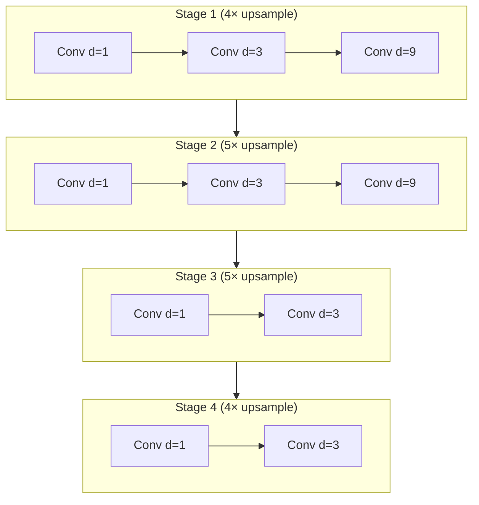

## 前置知识

> [!important]
> 
> 阅读本页前建议先读：[[4.2 Depthwise 可分离卷积]]。了解 WaveNet 的 dilation 设计会有助于理解。

---

## 4.3.0 定位

> 一句话：Dilated 1D Conv 是 Firefly-GAN 在**上采样阶段**的主要技术——代替传统 transposed Conv。它同时提供**大感受野**与**低参数量**，是高保真与轻量之间的关键平衡点。

---

## 4.3.1 传统 transposed Conv 的问题

HiFi-GAN 上采样使用 ConvTranspose1d，两个问题：

1. **Checkerboard artifacts**：stride 与 kernel 不互除时，产出有重叠/空洞。

1. **高频镜像**：stride-2 以上的 transposed Conv 在高频区产生镜像频谱。

Firefly-GAN 采用**「残差连接 + 最近邻上采样 + Dilated Conv」**组合规避。

---

## 4.3.2 Dilated Conv 公式

标准 1D Conv：

$$y_t = \sum_{k=0}^{K-1} w_k \cdot x_{t-k}$$

Dilated 1D Conv（dilation $d$）：

$$y_t = \sum_{k=0}^{K-1} w_k \cdot x_{t-d \cdot k}$$

感受野：原本 $K$，加 dilation 后 $1 + d \cdot (K-1)$。多层叠加且 dilation 指数增长（$d = 1, 3, 9, \dots$）时感受野几何增长。

---

## 4.3.3 Firefly-GAN 的 Dilation 组合

总上采样 $4 \times 5 \times 5 \times 4 \times \dots = 1140$。每阶段内部三个 Dilated Conv后接最近邻上采样。

---

## 4.3.4 与 WaveNet 的区别

|项目|WaveNet|Firefly-GAN|
|---|---|---|
|Dilated 作用|**自回归**，预测下一个采样点|**上采样**，补捡高频|
|是否因果|是（生成作用）|**双向**（可看未来）|
|推理速度|极慢|极快|
|后接|softmax 256-way|直接输出波形|

---

## 4.3.5 工程判断

> [!important]
> 
> 1. **dilation 上限 9**：超过会出现不能覆盖的「空洞」。
> 
> 1. **Conv padding mode**：选 reflect 而不是 zero，避免边界被误判为 static 表达仓的问题。
> 
> 1. **上采样顺序**：「先计算 dilated conv 再上采样」起到 anti-aliasing 作用。

---

## 延伸阅读

- [[4.4 判别器与损失函数]]

- [[4.5 firefly-gan-vq-fsq-8x1024-21hz 权重解读]]

---

## 参考文献

1. Oord et al. _WaveNet: A Generative Model for Raw Audio_. SSW 2016.

1. Donahue et al. _End-to-End Adversarial Text-to-Speech_. ICLR 2021.