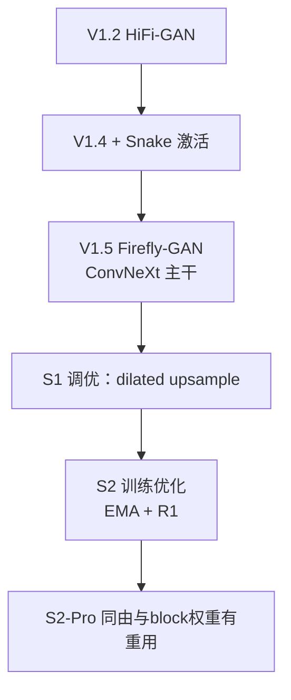

## 前置知识

> [!important]
> 
> 阅读本页前建议先读：[[1. 版本谱系与演进路线]]、[[4. 声码器：Firefly-GAN（FFGAN）]]。

---

## 4.6.0 定位

> 一句话：本页从演进角度梳理 Fish-Speech V1 到 S2 中 vocoder 的变迁，看出「为什么是 Firefly-GAN」不是一蹴而就。

---

## 4.6.1 演进时间线

|版本|Vocoder|参数量|主要问题|改进|
|---|---|---|---|---|
|V1.2|HiFi-GAN|~14 M|高频丢失|简单可用|
|V1.4|HiFi-GAN + Snake|~18 M|训练慢|高频提升|
|V1.5/1.5.1|**Firefly-GAN 第一版**|~22 M|训练不稳|ConvNeXt 主干|
|S1 (OpenAudio)|**Firefly-GAN-21Hz**|~22 M|-|默认生产版|
|S2|**Firefly-GAN 优化版**|~22 M|-|训练加速、RVQ 补补|
|S2-Pro|Firefly-GAN 同 S2|~22 M|-|对齐 backbone|

---

## 4.6.2 关键决策节点

---

## 4.6.3 为什么不选 BigVGAN

> [!important]
> 
> BigVGAN 越越胜 Firefly-GAN 的高保真，但：
> 
> 1. **参数量 5×**：推理显存例 24 GB vs 10 GB。
> 
> 1. **Snake 激活费 GPU**：RTF 从 0.02 升到 0.06。
> 
> 1. **训练不稳定**：Snake 对学习率敏感。
> 
> 1. **MOS 仅提升 0.1**：边际增益低于资源增加。

---

## 4.6.4 与 Tortoise-TTS / Vall-E 的 vocoder 对比

|项目|Tortoise-TTS|Vall-E|**Fish-Speech**|
|---|---|---|---|
|tokenizer|VQ-VAE|EnCodec|**GFSQ**|
|vocoder|Univ × Diffuser|EnCodec decoder|**Firefly-GAN**|
|推理速度|极慢|中|**极快**|

---

## 4.6.5 工程启示

> [!important]
> 
> 1. **Vocoder 与 tokenizer 联合物试**：纯插件 vocoder几乎不可能与其他架构兼容。
> 
> 1. **演进是平衡公式**：不是「合成质量唯上」，而是「资源 × 训练难度 × MOS」的三限。
> 
> 1. **学术论文 身包合 产业选型**：BigVGAN 论文优越但产品路线可能反向。

---

## 参考文献

1. Fish Audio. _Fish-Speech Release Logs_ (V1.2 — S2-Pro), 2024–2025.

1. Lee et al. _BigVGAN_. ICLR 2023.