[[5.1 Decoder-only Transformer 结构]]

## 前置知识

> [!important]
> 
> 阅读本章前建议先读：[[2. 核心架构：Dual-AR（双自回归）]]。熟悉 LLaMA、Qwen 架构会有帮助。

---

## 5.0 定位

> 一句话：Fish-Speech 不重新发明 Transformer，而是**直接复用现代 LLM 的成熟组件**：RoPE / SwiGLU / RMSNorm / GQA，同时透过 G2P-Free 设计让 LLM 能够原生处理多语种文本。

---

## 5.1 LLM Backbone 组件总览

|组件|采用原因|替代方案为何不选|
|---|---|---|
|**Decoder-only Transformer**|AR 生成、与 LLM 生态兼容|Encoder-Decoder：训练复杂、推理不对称|
|**RoPE**|相对位置、可外推|绝对位置编码：不能外推；ALiBi：在 TTS 上不加依人气|
|**SwiGLU**|性能与 GLU 及 FFN 均越|ReLU/GeLU FFN：表达力不足|
|**RMSNorm**|训练稳、计算便宜|LayerNorm：计算量高 ~10%|
|**GQA**|KV cache 压缩|MHA：KV cache 费内存；MQA：表达力下降|
|**G2P-Free**|不需音素表、多语种原生|G2P：需为每个语种独立词典|

---

## 5.2 Fish-Speech Backbone 选择路线

```mermaid
flowchart LR
	V12["V1.2 LLaMA-2 0.5B"] --> V14["V1.4 LLaMA-2 0.5B"]
	V14 --> V15["V1.5 LLaMA-2 0.5B/1.5B"]
	V15 --> S1["S1 Qwen2.5 0.5B/1.5B"]
	S1 --> S2["S2 Qwen2.5 0.5B/1.5B重训"]
	S2 --> SP["S2-Pro Qwen2.5 1.5B/3B"]
	style V12 fill:\#2a2f4a,stroke:\#5b6ea6,color:\#e0e6f7
	style V14 fill:\#3a2f4a,stroke:\#8a6ea6,color:\#e8d8f7
	style V15 fill:\#4a3a2a,stroke:\#a68a5b,color:\#f7e8d8
	style S1 fill:\#2a4a3f,stroke:\#5ba68a,color:\#d8f7e8
	style S2 fill:\#4a2a3f,stroke:\#a65b8a,color:\#f7d8e8
	style SP fill:\#4a2a3f,stroke:\#a65b8a,color:\#f7d8e8
```

> [!important]
> 
> **从 LLaMA-2 到 Qwen2.5**：S1 开始切换的核心动机是中文与中英双语环境下 Qwen2.5 体现明显优于 LLaMA-2，特别在 prompt audio 理解。

---

## 5.3 与原生 LLM 的不同

|项目|原生 Qwen2.5|**Fish-Speech 使用**|
|---|---|---|
|Vocab|15w + BPE|**添加 GFSQ token 作为 special token**|
|上下文|32k|**8k** (token rate 低足)|
|head|1（next-token）|**1 + 7× codebook heads**（Slow + Fast）|
|训练 loss|文本预测|**8× token 联合 loss**|

---

## 5.4 子页面导航

[[5.2 RoPE 旋转位置编码]]

[[5.3 SwiGLU 激活]]

[[5.4 RMSNorm]]

[[5.5 GQA 分组查询注意力]]

[[5.6 G2P-Free 文本到语音]]

---

## 5.5 常见误区

> [!important]
> 
> **误区 1**：「Fish-Speech LLM 是从零训练」——从 S1 起预训练权重是 Qwen2.5 原同仅重用 embedding + decoder。
> 
> **误区 2**：「5 个组件都是为 TTS 设计的」——错，这 5 个组件都是现代 LLM 的 SOTA选择，重用于语音。
> 
> **误区 3**：「TTS 需要中间音素表示」——G2P-Free 证明不需要。

---

## 参考文献

1. Touvron et al. _LLaMA: Open and Efficient Foundation Language Models_. arXiv 2023.

1. Qwen Team. _Qwen2.5 Technical Report_. 2024.

1. Fish Audio. _Fish-Speech Technical Report_, 2024.