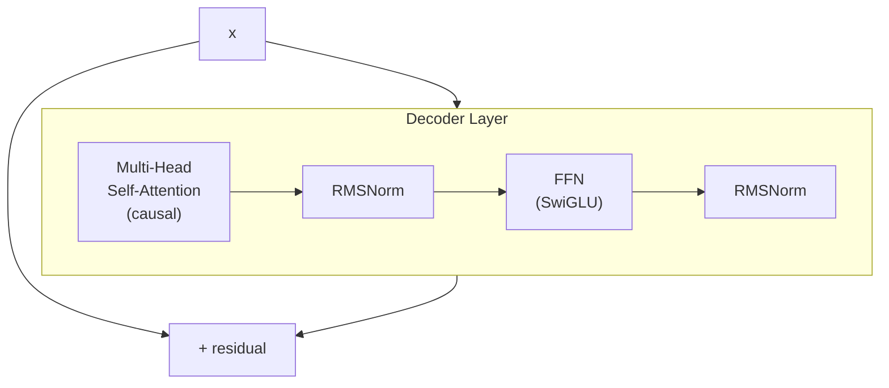

## 前置知识

> [!important]
> 
> 阅读本页前建议先读：[[2. 核心架构：Dual-AR（双自回归）]]。熟悉经典 Transformer、GPT 架构。

---

## 5.1.0 定位

> 一句话：Fish-Speech Slow 与 Fast 都是**Decoder-only Transformer**。本页说明为什么 TTS 不选 Encoder-Decoder，以及 Decoder-only 在训练/推理上的优势。

---

## 5.1.1 三种 Transformer 架构对比

|架构|代表|适用任务|TTS 上可行性|
|---|---|---|---|
|**Encoder-only**|BERT|分类、抽取表征|不可（不能生成）|
|**Encoder-Decoder**|T5 / Tacotron 2|翻译、摘要|可行但复杂|
|**Decoder-only**|GPT / LLaMA|生成、对话|**首选**|

---

## 5.1.2 为什么 TTS 选 Decoder-only

> [!important]
> 
> 1. **文本与音频同为序列**：Encoder-Decoder 需要 cross-attention，增加物件复杂度。
> 
> 1. **LLM 预训练可复用**：Qwen2.5 、LLaMA 都是 Decoder-only。可从预训练权重冷启动。
> 
> 1. **AR 生成自然**：语音生成需 token-by-token，Decoder-only 架构天生适合。
> 
> 1. **推理不对称**：Encoder-Decoder 推理时 encoder 走一次、decoder AR，额外复杂。

---

## 5.1.3 Decoder-only 的 causal mask

公式：

$$\text{Attn}(Q, K, V) = \text{softmax}\!\left(\frac{QK^\top + M}{\sqrt{d_k}}\right) V$$

其中 $M$ 是 causal mask：$M_{ij} = -\infty$ 当 $j > i$。

---

## 5.1.4 Fish-Speech 的双 Decoder-only 设计

- **Slow**：输入 [文本 token; prompt token; 已生成 token]，输出下一个隐藏 state。

- **Fast**：输入 Slow state 与已生成的 $c^{1:k-1}$，输出 $c^k$。

两者都是 Decoder-only，只是位置不同。

---

## 5.1.5 常见误区

> [!important]
> 
> **误区 1**：「Decoder-only 不能处理 prompt audio」——可以，将 audio token 作为开头拼接到序列中。
> 
> **误区 2**：「Tacotron 2 架构更合理」——在现代 LLM 生态下 Decoder-only 差不多总是胜。
> 
> **误区 3**：「VALL-E 是 Encoder-Decoder」——错，VALL-E 也是 Decoder-only。

---

## 5.1.6 工程判断

> [!important]
> 
> 1. **从 LLM 预训练权重启动能节省 70% 训练时间**：不要从零训。
> 
> 1. **KV cache 会占主要显存**：Slow + Fast 两份 KV cache，需控制列长。

---

## 参考文献

1. Radford et al. _Improving Language Understanding by Generative Pre-Training_. OpenAI 2018.

1. Touvron et al. _LLaMA_. arXiv 2023.