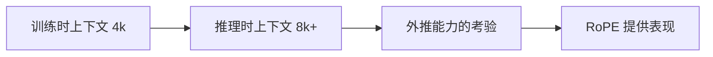

## 前置知识

> [!important]
> 
> 阅读本页前建议先读：[[5.1 Decoder-only Transformer 结构]]。熟悉复数与线性代数。

---

## 5.2.0 定位

> 一句话：**RoPE（Rotary Position Embedding）** 是现代 LLM 上事实上唯一的位置编码选择。Fish-Speech 的 Slow 与 Fast 都使用。

---

## 5.2.1 位置编码路线对比

|方案|原理|可外推|计算量|代表|
|---|---|---|---|---|
|正余 PE|绝对位置加入 embedding|差|低|Transformer 原论文|
|Learnable PE|训练参数|不能|低|BERT/GPT-2|
|ALiBi|attention bias 线性衰减|强|低|BLOOM|
|**RoPE**|**复数旋转**|**强**|中|LLaMA/Qwen|

---

## 5.2.2 RoPE 公式

对 query/key $q, k \in \mathbb{R}^d$，将每一对维度 $(q_{2i}, q_{2i+1})$ 看作复数 $q_{2i} + i \cdot q_{2i+1}$。在位置 $m$ 处乘以旋转算子：

$$q_m^{(2i, 2i+1)} = \begin{pmatrix}  
\cos m\theta_i & -\sin m\theta_i \\  
\sin m\theta_i & \cos m\theta_i  
\end{pmatrix} \begin{pmatrix} q_{2i} \\ q_{2i+1} \end{pmatrix}$$

其中 $\theta_i = 10000^{-2i/d}$。

**关键性质**：两个经 RoPE 処理后的 query/key 点积仅依赖位置差 $m - n$：

$$\langle R_m q, R_n k \rangle = \langle q, R_{m-n} k \rangle$$

这就是「相对位置」的本质。

---

## 5.2.3 为什么 TTS 环境下需要可外推

Fish-Speech 训练上下文 4k，但推理需要 8k（长文本合成）。RoPE 在未接触过的 position 上表现仍稳定。

---

## 5.2.4 NTK-aware Scaling

外推超过 2× 训练长度时，需 NTK-aware 伸展：

$$\theta_i^{new} = \theta_i \cdot \left(\frac{L_{new}}{L_{train}}\right)^{2i/(d-2)}$$

Fish-Speech S1+ 采用该技术，可外推到 4×。

---

## 5.2.5 Slow vs Fast 中 RoPE 的位置

> [!important]
> 
> - **Slow**：RoPE 用于「时间轴」（frame index）。位置与 prompt token 的实际顺序同。
> 
> - **Fast**：RoPE 用于「codebook 轴」$k = 1, 2, \dots, 8$。位置仅 0–7。
> 
> 两者 RoPE 独立计算，不干扰。

---

## 5.2.6 常见误区

> [!important]
> 
> **误区 1**：「RoPE 在 KV cache 中需重新计算」——不需，只需在创建时 apply 一次。
> 
> **误区 2**：「RoPE = sinusoidal」——错，sinusoidal 是加到 embedding，RoPE 是 rotation 作用于 Q/K。
> 
> **误区 3**：「RoPE 可任意外推」——仅 1–2×以内，超过要转 NTK 或 YaRN。

---

## 参考文献

1. Su et al. _RoFormer: Enhanced Transformer with Rotary Position Embedding_. Neurocomputing 2024.

1. NTK-aware scaling community blog posts, 2023.