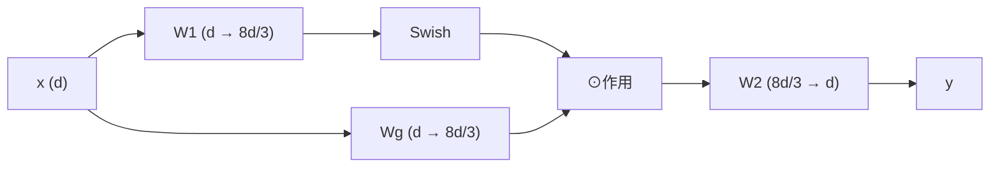

## 前置知识

> [!important]
> 
> 熟悉 FFN、GLU、Swish/SiLU 激活函数会有帮助。

---

## 5.3.0 定位

> 一句话：**SwiGLU** 是现代 LLM（LLaMA、PaLM、Qwen）FFN 层的默认选择，提供比 ReLU/GeLU FFN 更强的表达能力。

---

## 5.3.1 三种 FFN 的对比

|FFN|公式|参数量倍数|表达力|
|---|---|---|---|
|**ReLU FFN**|$W_2 \text{ReLU}(W_1 x)$|$2 \cdot d \cdot 4d$|中|
|**GeLU FFN**|$W_2 \text{GeLU}(W_1 x)$|$2 \cdot d \cdot 4d$|中-高|
|**SwiGLU**|$W_2 \big(\text{Swish}(W_1 x) \odot W_g x\big)$|$3 \cdot d \cdot \frac{8d}{3}$|**高**|

为保持总参数不变，SwiGLU 隐藏层从 $4d$ 调为 $\frac{8d}{3}$。

---

## 5.3.2 SwiGLU 公式

Swish（又名 SiLU）：

$$\text{Swish}(x) = x \cdot \sigma(x), \quad \sigma(x) = \frac{1}{1+e^{-x}}$$

GLU 路线：

$$\text{GLU}(x) = (W_1 x) \odot \sigma(W_g x)$$

组合：

$$\text{SwiGLU}(x) = \big(\text{Swish}(W_1 x)\big) \odot (W_g x)$$

最后由 $W_2$ 投影回维度 $d$。

---

## 5.3.3 为什么优于 ReLU FFN

> [!important]
> 
> 1. **Gating**：GLU 带来动态选择能力，选择什么维度参与计算。
> 
> 1. **Smooth**：Swish 连续可微，ReLU 在 0 点不可微。
> 
> 1. **表现**：Shazeer (2020) 在 transformer 实验中发现 SwiGLU 几乎总是赢。

---

## 5.3.4 计算图

---

## 5.3.5 参数量调整逻辑

反询：为什么 SwiGLU 隐藏层为 $\frac{8d}{3}$？逻辑如下：

- ReLU FFN 参数 = $2 d \cdot 4d = 8 d^2$。

- SwiGLU 参数 = $3 d \cdot h$（三个权重矩阵）。

- 令 $3 d h = 8 d^2 \Rightarrow h = \frac{8d}{3}$。

这保证 「同参数量下 SwiGLU 表现优于 ReLU FFN」是公平对比。

---

## 5.3.6 Fish-Speech 上的使用

- **Slow Transformer**：SwiGLU FFN。

- **Fast Transformer**：SwiGLU FFN。

- $d$ 取与 Qwen2.5 一致（0.5B 为 1024，1.5B 为 1536）。

---

## 5.3.7 常见误区

> [!important]
> 
> **误区 1**：「SwiGLU 使用三个矩阵计算量多 50%」——不是，同参数量下计算量相近。
> 
> **误区 2**：「Swish = SiLU」——是同一函数不同名称，不要被代码里两种命名迷惑。
> 
> **误区 3**：「GLU 中门控需为 Sigmoid」——可以是 Sigmoid (GLU)、ReLU (ReGLU)、Swish (SwiGLU) 等。

---

## 参考文献

1. Shazeer. _GLU Variants Improve Transformer_. arXiv:2002.05202, 2020.

1. Touvron et al. _LLaMA_. arXiv 2023.