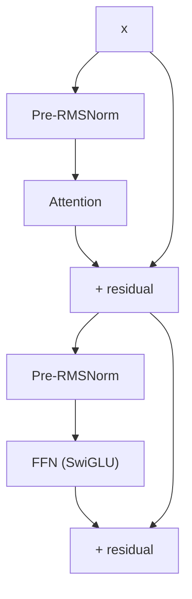

## 前置知识

> [!important]
> 
> 熟悉 LayerNorm 与 BatchNorm 的区别。

---

## 5.4.0 定位

> 一句话：**RMSNorm（Root Mean Square Normalization）** 是 LLaMA 提出、在现代 LLM 中取代 LayerNorm 的变体。计算量低 ~10%，训练表现不下降。

---

## 5.4.1 LayerNorm vs RMSNorm

|项目|LayerNorm|**RMSNorm**|
|---|---|---|
|公式|$\frac{x - \mu}{\sqrt{\sigma^2 + \epsilon}}\gamma + \beta$|$\frac{x}{\sqrt{\mathbb{E}[x^2] + \epsilon}}\gamma$|
|需计算均值 $\mu$|**是**|否|
|需偏置 $\beta$|是|否|
|计算量|较高|**低 ~10%**|
|表现|基准|跨 LLaMA/Qwen 上**几乎同等**|

---

## 5.4.2 RMSNorm 公式推导

定义 RMS：

$$\text{RMS}(x) = \sqrt{\frac{1}{d} \sum_{i=1}^{d} x_i^2}$$

则 RMSNorm：

$$\text{RMSNorm}(x) = \frac{x}{\text{RMS}(x)} \cdot \gamma$$

其中 $\gamma \in \mathbb{R}^d$ 是可学习参数。与 LayerNorm 相比只丢了三件：均值中心化、偏置 $\beta$、方差计算。

---

## 5.4.3 为什么丢掉均值不损表现

> [!important]
> 
> Zhang & Sennrich (2019) 论文发现：
> 
> 1. 中心化在 LLM 上对表现贡献微。
> 
> 1. 背后原因：residual stream 本身均值在训练中接近 0，中心化微现实。
> 
> 1. 丢掉均值后，梯度计算更隐，训练贡献不变。

---

## 5.4.4 Fish-Speech 上的使用位置

**采用 pre-norm**：训练稳，需加 final RMSNorm。

---

## 5.4.5 与 Layer-Scale 的区别

> [!important]
> 
> **不要混淆 RMSNorm 与 Layer-Scale**：
> 
> - RMSNorm 是 norm 层。
> 
> - Layer-Scale 是 residual 路上的可学 × × × ×，主要用于深度 ConvNet。

---

## 5.4.6 工程启示

> [!important]
> 
> 1. **fp32 中计算 RMS**：x^2 在 fp16/bf16 下可能 overflow，需 cast 到 fp32。
> 
> 1. $\epsilon$ **取 1e-6**：太小会除零，太大会损失表达。
> 
> 1. $\gamma$ **初始化为 1**：让 RMSNorm 初始接近 identity。

---

## 5.4.7 常见误区

> [!important]
> 
> **误区 1**：「RMSNorm 计算低 10% 表现低 10%」——不是，表现几乎不变。
> 
> **误区 2**：「RMSNorm 在 BatchNorm 位置加」——错，RMSNorm 是 LayerNorm 的替代，不是 BatchNorm。

---

## 参考文献

1. Zhang & Sennrich. _Root Mean Square Layer Normalization_. NeurIPS 2019.

1. Touvron et al. _LLaMA_. arXiv 2023.