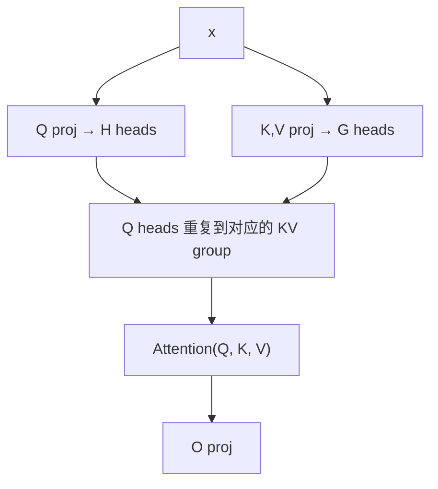

## 前置知识

> [!important]
> 
> 熟悉 Multi-Head Attention (MHA)、Multi-Query Attention (MQA)、KV cache 与推理显存。

---

## 5.5.0 定位

> 一句话：**GQA（Grouped-Query Attention）** 是 MHA 与 MQA 的折中方案，掌握了 KV cache 压缩与表达能力的平衡。在 Fish-Speech S1 起使用。

---

## 5.5.1 MHA / MQA / GQA 对比

|方案|Q head 数|KV head 数|KV cache|表达力|
|---|---|---|---|---|
|**MHA**|$H$|$H$|$2 H d_k L$|**高**|
|**MQA**|$H$|1|$2 d_k L$|低|
|**GQA**|$H$|$G$ (1 < G < H)|$2 G d_k L$|**中-高**|

其中 $L$ 为序列长度。Fish-Speech S1 取 $H = 16, G = 4$，KV cache 压缩 4×。

---

## 5.5.2 GQA 计算流程

公式：

$$\text{head}_h = \text{Attn}\!\left(Q_h, K_{g(h)}, V_{g(h)}\right), \quad g(h) = \lfloor h \cdot G / H \rfloor$$

$Q$ 仍为 $H$ 头，但 $K, V$ 仅 $G$ 头，多个 $Q$ 头共享同一对 $K, V$。

---

## 5.5.3 为什么不选 MQA

> [!important]
> 
> 1. **MQA 训练不稳**：H 头 Q 只一对 KV，表达不足。
> 
> 1. **MQA 需重训练**：从 MHA 检查点 fine-tune 为 MQA 表现会下降。
> 
> 1. **GQA 是折中**：$G \in [4, 8]$ 是公认甜点，压缩 KV 同时保留表达。

---

## 5.5.4 KV Cache 压缩收益

> [!important]
> 
> Fish-Speech S1 0.5B：H = 16, d_k = 64, L = 8k
> 
> - MHA KV cache：$2 \cdot 16 \cdot 64 \cdot 8192 \cdot 2$ bytes (fp16) = **32 MB / 层**
> 
> - GQA (G=4) KV cache：$2 \cdot 4 \cdot 64 \cdot 8192 \cdot 2$ bytes = **8 MB / 层**
> 
> - 24 层隐藏总压缩：768 MB → 192 MB 节省 576 MB

---

## 5.5.5 与 RoPE 的交互

RoPE 需对每个 head 独立应用。在 GQA 下：

- $Q_h$ 应用以 head $h$ 的位置计算 RoPE。

- $K_g$ 应用以 group $g$ 的位置计算 RoPE。

- 两者在点积时需保证 RoPE 计算一致。

---

## 5.5.6 常见误区

> [!important]
> 
> **误区 1**：「GQA 是 Multi-Group Attention」——G 是 Grouped，不是 Multi-Group。
> 
> **误区 2**：「GQA 代表推理加速**表达**下降」——仅 KV cache 压缩，表达与 MHA 几乎同。
> 
> **误区 3**：「MHA 转 GQA 需重训」——不需，可通过 mean-pool KV heads 转接。

---

## 参考文献

1. Ainslie et al. _GQA: Training Generalized Multi-Query Transformer Models from Multi-Head Checkpoints_. EMNLP 2023.

1. Shazeer. _Fast Transformer Decoding: One Write-Head is All You Need_. arXiv 2019.