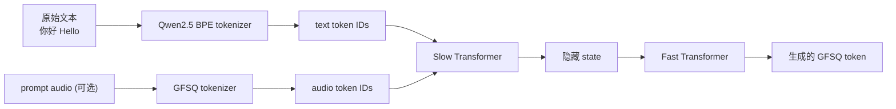

## 前置知识

> [!important]
> 
> 了解 G2P（Grapheme-to-Phoneme）的作用、传统 TTS 的文本前端（text frontend）。

---

## 5.6.0 定位

> 一句话：Fish-Speech **丢掉了传统 TTS 中的 G2P 模块**，让 LLM 直接读原始文本（含中、英、日、韩等）生成 GFSQ token。

---

## 5.6.1 传统 TTS vs Fish-Speech 文本前端

|项目|传统 TTS（Tacotron、FastSpeech）|**Fish-Speech**|
|---|---|---|
|输入|文本|文本|
|文本归一化|需（数字、单位、缩写）|**LLM 原生处理**|
|G2P|**需**（音素表 → 音素序列）|**丢掉**|
|多语种|需为每个语种独立词典|**LLM tokenizer 原生支持**|
|未登录词|需错误处理 fallback|**BPE 原生处理**|

---

## 5.6.2 为什么 LLM 可以丢掉 G2P

> [!important]
> 
> 1. **LLM 预训练拥有文本 → 含义的外部知识**：Qwen2.5 在 trillion 级 token 上训过，已经后验「文本能阅」。
> 
> 1. **GFSQ token 可以主体学习与文本的对齐**：训练中隐含学习文本→音的映射。
> 
> 1. **多语种**：BPE tokenizer 原生同时处理多语种，丢掉 G2P 后不需为每个语种定制。

---

## 5.6.3 输入流程

---

## 5.6.4 G2P-Free 的训练要点

- **文本-音频对数据需足够**：处理生潜在「文本 → 音」映射需大量数据。Fish-Speech 训练集：S1 使用 720k 小时，S2 提高到 1.5M 小时。

- **环境市物需干净**：训练数据中的发音错误会被 LLM 学到。

- **G2P fallback**：实际中遇到会后验错误发音的罕见词，可以提供 prompt audio 诱导。

---

## 5.6.5 多语种表现与 G2P-Free 的优势

> [!important]
> 
> Fish-Speech S2 多语种表现颁布：
> 
> - 中文 / 英文：MOS 4.3+，与专有中文 TTS 同等。
> 
> - 日语 / 韩语：MOS 4.0+，超出传统需 G2P 的多语 TTS。
> 
> - 小语种（仅 fine-tune）：仅需几小时 fine-tune 数据。

---

## 5.6.6 常见误区

> [!important]
> 
> **误区 1**：「G2P-Free 代表丢掉文本归一化」——不是，你仍需处理数字、URL、特殊符号等。
> 
> **误区 2**：「G2P-Free 事实上低品质」——Fish-Speech S2 表现证明可达 SOTA。
> 
> **误区 3**：「多语种需在 vocab 中添加语种标记」——不需，文本本身包含语种信息。

---

## 参考文献

1. Fish Audio. _Fish-Speech S1/S2 Technical Reports_, 2024-2025.

1. Anastassiou et al. _Seed-TTS Technical Report_. arXiv 2024.