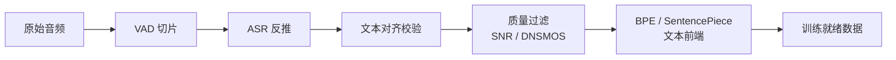

## 0. 定位

> 一句话：Fish-Speech 的能力跃迁很大程度上来自**数据工程**：从 V1.5 的 720k 小时多语种平行音频，到 S2-Pro 的 ~10M 小时，规模翻 14×；同时通过严格清洗 Pipeline、ASR 反推对齐与统一文本前端，保证了 token 化质量。

---

## 1. 核心要点

---

## 2. 子页面导航

[[6.1 多语种数据分布]]

[[6.2 数据量级跃迁（720k→10M 小时）]]

---

## 3. 同级模块对比

|系统|训练时长|语种数|清洗策略|
|---|---|---|---|
|GPT-SoVITS V4|~50k 小时|3|简单 VAD + ASR|
|CosyVoice 2|~170k 小时|5|多阶段过滤|
|**Fish-Speech S2-Pro**|**~10M 小时**|**13+**|**Pipeline + DNSMOS + RL 反馈**|

> [!important]
> 
> 数据规模是 Fish-Speech 相对开源同行的最大「护城河」。

---

## 4. 参考文献

1. Fish Audio. _Fish-Speech Data Pipeline Whitepaper_, 2024.

[[6.3 数据清洗 Pipeline]]

1. Reddy et al. _DNSMOS P.835_. ICASSP 2022.

[[6.4 ASR 反推与文本对齐校验]]

[[6.5 文本前端：BPE - SentencePiece]]