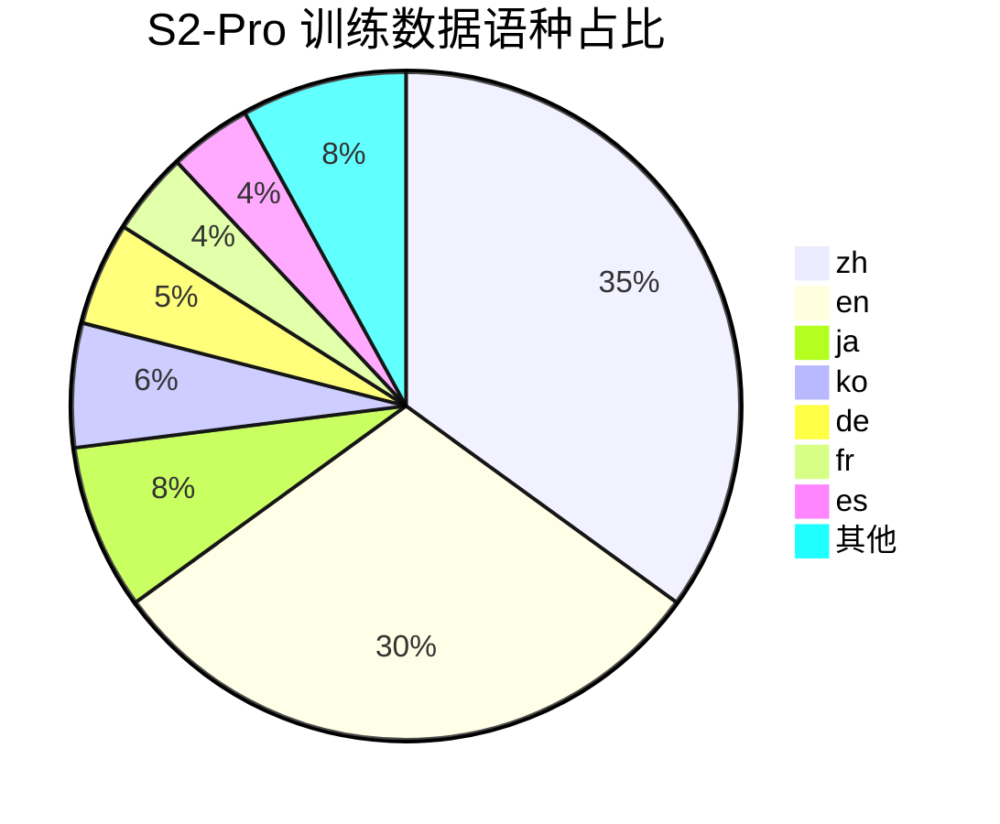

## 前置知识

> [!important]
> 
> 先读：[[6. 训练数据与多语种工程]]。

---

## 6.1.0 定位

> 一句话：Fish-Speech 从 V1 的中英双语逐步扩展到 S2-Pro 的 13+ 语种，与 CosyVoice 2 / VALL-E 2 相比在**多语种覆盖上领先**。

---

## 6.1.1 语种谱系

|版本|语种|主要高资源语|
|---|---|---|
|V1.x|2|zh, en|
|V1.5|8|zh, en, ja, ko, de, fr, es, ar|
|S1|10|• pt, ru|
|**S2-Pro**|**13+**|• it, nl, pl|

---

## 6.1.2 语种占比

> [!important]
> 
> 中英两语占 65%，反映了市场需求与公开数据可得性。低资源语种依靠采集与数据增广。

---

## 6.1.3 同类方法对比

|系统|语种|zh 占比|
|---|---|---|
|VALL-E 2|2 (zh, en)|50%|
|CosyVoice 2|5|60%|
|**Fish-Speech S2-Pro**|**13+**|35%|

---

## 6.1.4 工程判断

> [!important]
> 
> **为什么不走「超级多语种」（如 100+）**：
> 
> 1. 低资源语数据量不足以支撑十十 GB 的 LLM。
> 
> 1. token 词表过大会拆弱高资源语能力。
> 
> 1. 13 语是质量 / 覆盖的平衡点。

---

## 参考文献

1. Fish Audio. _Fish-Speech Multilingual Coverage Report_, 2024.

1. Common Voice Project. _Mozilla Common Voice Statistics_, 2024.