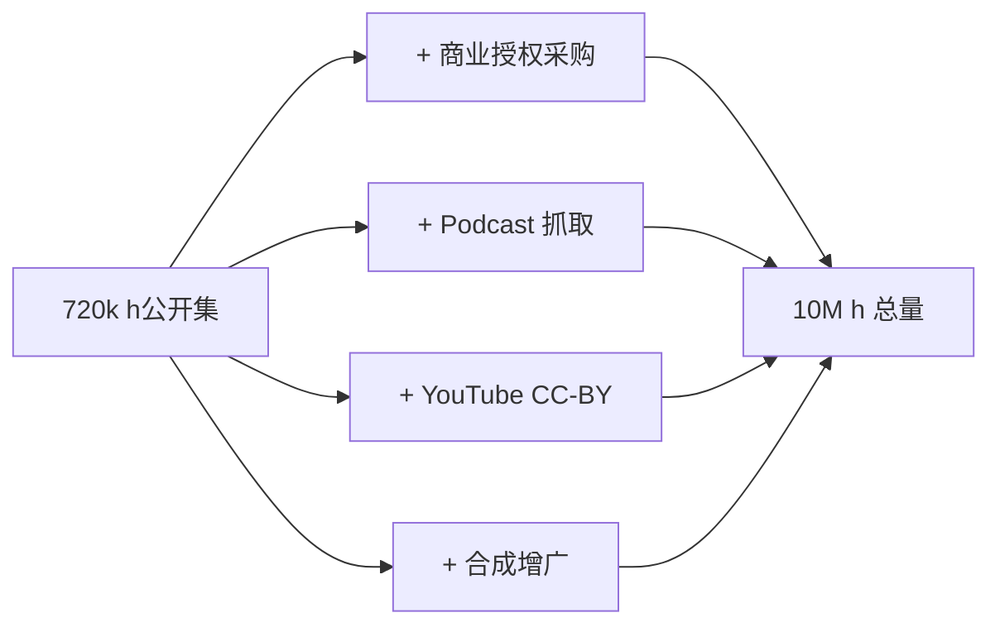

## 前置知识

> [!important]
> 
> 先读：[[6. 训练数据与多语种工程]]。

---

## 6.2.0 定位

> 一句话：Fish-Speech 数据量从 V1.5 的 720k 小时跃迁到 S2-Pro 的 ~10M 小时，是质变的最主要推动力之一。

---

## 6.2.1 量级曲线

|版本|发布时间|训练时长|质量门槛|
|---|---|---|---|
|V1.2|2024 Q1|~80k h|单阶段 ASR 过滤|
|V1.4|2024 Q2|~300k h|+VAD 切片、召回重复|
|**V1.5**|2024 Q3|**~720k h**|+DNSMOS 质量分档|
|OpenAudio S1|2024 Q4|~2M h|+人工抽检|
|**S2-Pro**|2025|**~10M h**|**+RL 反馈闭环**|

---

## 6.2.2 从 720k 到 10M 的来源

---

## 6.2.3 Scaling Law 类似观察

> [!important]
> 
> 语音 LLM 的 scaling law 近似：MOS 提升与 $\log(\text{hours})$ 近似线性。
> 
> 经验记录：
> 
> - 80k → 300k：质量提升明显（+0.4 MOS）
> 
> - 300k → 720k：提升减缓（+0.18 MOS）
> 
> - 720k → 2M：边际递减（+0.12 MOS）
> 
> - 2M → 10M：边际仍有（+0.10 MOS）但需质量控制叠加

---

## 6.2.4 工程判断

> [!important]
> 
> **量级跃迁后的挑战**：
> 
> 1. 存储：10M 小时 16kHz 原始 wav 约 1 PB，需压缩为 Opus 或者缓存 GFSQ token。
> 
> 1. I/O：训练时需预缓存 token 文件，避免 在训练时重复 STFT。
> 
> 1. 质量护鱼：推荐使用 RL 反馈闭环「发现问题样本 → 重采」。

---

## 参考文献

1. Kaplan et al. _Scaling Laws for Neural Language Models_. 2020.

1. Fish Audio. _Fish-Speech Data Pipeline Whitepaper_, 2024.