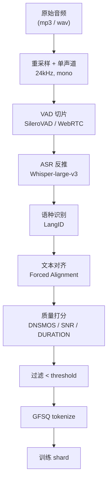

## 前置知识

> [!important]
> 
> 先读：[[6. 训练数据与多语种工程]]。了解 VAD、ASR、DNSMOS。

---

## 6.3.0 定位

> 一句话：原始音频 → 可训练 token 之间需走完 **VAD → ASR → 对齐 → 质量过滤 → token 化** 五阶段 Pipeline。

---

## 6.3.1 Pipeline 总览



---

## 6.3.2 各阶段详解

### VAD 切片

- 工具：SileroVAD（高精度）、WebRTC VAD（快但粗糙）。

- 输出：严格中间口吼的语句（3-30 秒）。

- Fish-Speech 默认选 SileroVAD + 0.5s padding。

### ASR 反推

- 工具：Whisper-large-v3。

- 为什么选 Whisper：**统一多语种**，98+语，输出本地脚本。

- 越高信心度「使用「重采重语」过滤。

### 文本对齐

- 工具：Montreal Forced Aligner (MFA) 或 wav2vec CTC。

- 输出：每字符的起止时间抱。

- 用途：检查「名语枪口的语片」，过滤多说话人、背景人语。

### 质量打分

- **DNSMOS**：预测 MOS，阈值 ≥ 3.0。

- **SNR**：信噪比，阈值 ≥ 15 dB。

- **语句长度**：3-30s。

- **重复检测**：MinHash，阈值 jaccard ≤ 0.8。

---

## 6.3.3 过滤率经验值

|阶段|保留率|说明|
|---|---|---|
|VAD|~70%|去静音、静音越零|
|ASR 过滤|~85%|删除低信心、乱码|
|质量打分|~60%|去噪、去多说话|
|重复过滤|~95%|去近重复|
|**总保留**|**~34%**|**~3:1 压缩**|

---

## 6.3.4 工程实现要点

```python
import torch
from silero_vad import load_silero_vad, get_speech_timestamps
import whisper

vad_model = load_silero_vad()
asr_model = whisper.load_model("large-v3")

def process_audio(audio_path: str):
    wav = load_audio(audio_path, sr=24000)
    segments = get_speech_timestamps(wav, vad_model, sampling_rate=24000)
    results = []
    for seg in segments:
        chunk = wav[seg['start']:seg['end']]
        if len(chunk) < 3 * 24000 or len(chunk) > 30 * 24000:
            continue
        asr = asr_model.transcribe(chunk.numpy())
        if asr['avg_logprob'] < -1.0:
            continue
        if dnsmos(chunk) < 3.0:
            continue
        results.append({"audio": chunk, "text": asr['text'], "lang": asr['language']})
    return results
```

---

## 6.3.5 踩坑记录

> [!important]
> 
> **坑 1：VAD 报 padding=0** → 语句首尾切断。padding=0.5s 是经验值。
> 
> **坑 2：Whisper 默认采样率 16kHz** → Fish-Speech 训 24kHz，需二重重采样。
> 
> **坑 3：DNSMOS 需 ONNX 本地推理** → 调用 API 太慢，量产需本地。

---

## 参考文献

1. Silero Team. _Silero VAD_, GitHub, 2024.

1. Radford et al. _Robust Speech Recognition via Large-Scale Weak Supervision (Whisper)_. ICML 2023.

1. McAuliffe et al. _Montreal Forced Aligner_. INTERSPEECH 2017.