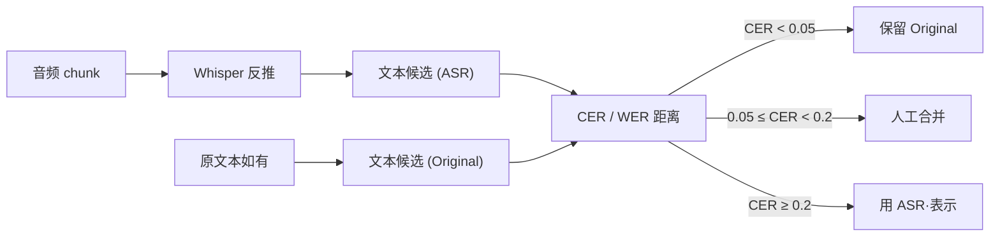

## 前置知识

> [!important]
> 
> 先读：[[6.3 数据清洗 Pipeline]]。了解 Whisper ASR、CER/WER。

---

## 6.4.0 定位

> 一句话：高质量 TTS 训练需要 **音频 ↔ 文本** 严格对齐；当原始文本不可靠或不存在时，采用 **ASR 反推 + 校验一致性** 生成训练对。

---

## 6.4.1 为什么需要反推校验

> [!important]
> 
> 原始数据中的文本可能有五种问题：
> 
> 1. 缺失（如原生 Podcast）。
> 
> 1. 不对齐（字幕 vs 实际说话偏移 2-5s）。
> 
> 1. 误拼（人名、专业术语）。
> 
> 1. 多说话人多背景语。
> 
> 1. 背景音乐、噪声。
> 
> ASR 反推提供「与音频同源」的文本，彻底避免偏移。

---

## 6.4.2 对齐流程



---

## 6.4.3 CER / WER 对比阈值

|CER 阈值|处理策略|场景|
|---|---|---|
|$\le$ 0.05|保留 Original|高质量字幕|
|0.05 - 0.2|人工合并或丢弃|中等质量|
|$\ge$ 0.2|用 ASR 表示|原文本不可靠|

> [!important]
> 
> CER 适合中文（字符粒度），WER 适合英文（词粒度）。Fish-Speech 默认在中文使用 CER，拉丁语系使用 WER。

---

## 6.4.4 强制对齐（Forced Alignment）

在 ASR 反推后，使用 MFA / wav2vec2 CTC 计算字粒度时间抱：

```python
from wav2vec2_alignment import align

timings = align(audio=wav, text=transcript)
# [("你好", 0.10, 0.42), ("世界", 0.45, 0.83), ...]
```

用途：

1. **检测静音过长**：字间间隔 > 1s 可能是部分静音、背景语。

1. **检测语速异常**：字/秒 < 1 或 > 8 都是异常。

1. **辅助 LoRA 微调**：为某些任务提供「字不间隔」标签。

---

## 6.4.5 踩坑记录

> [!important]
> 
> **坑 1：CER 计算去除了标点** → 误以为 CER 低但语义偏。建议保留标点计算。
> 
> **坑 2：Whisper 对中文输出繁简体不一** → 需统一转简体。
> 
> **坑 3：MFA 在 GPU 上不够快** → 量产需用 wav2vec2 CTC，1-2 个数量级提速。

---

## 参考文献

1. Radford et al. _Whisper_. ICML 2023.

1. Kahn et al. _Self-Training with Pseudo-Labels for ASR_. 2020.