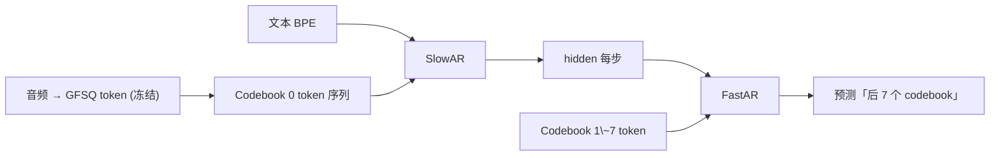

---

## 7.2.6 验证与早停

- 每 5k step 估估 ASR-RTF 与 CER。

- 如果 CER 连续 3 个 checkpoint 不下降，手动减半 LR。

- 200k step 后间隔 50k checkpoint 作为阶段三 RL 初始。

---

## 7.2.7 踩坑记录

> [!important]
> 
> **坑 1：高 LR + 无 warmup** → 前 1000 step 损失爆炸。必须 warmup。
> 
> **坑 2：FastAR 过拟合** → 需采用 dropout=0.1 与更小参数量。
> 
> **坑 3：训练中期 loss 震荡** → 检查是否有超长样本损坏 attention mask。

---

## 参考文献

[[7.2.3 Mixed Precision（BF16 - FP16）]]

## 前置知识

> [!important]
> 
> 先读：[[5. LLM Backbone（Llama-3 风格）]]、[[7.1 阶段一：Tokenizer + Vocoder 预训练]]。

---

## 7.2.0 定位

> 一句话：阶段二冻结 Tokenizer + Vocoder，训练 Dual-AR 主体（SlowAR + FastAR）按 next-token 交叉熵损失拟合 token 序列。

---

## 7.2.1 训练范式

---

## 7.2.2 损失函数

$$\mathcal{L} = \sum_{t=1}^{T} \Big[ \text{CE}(s_t^{(0)}, \hat{s}_t^{(0)}) + \frac{1}{7}\sum_{k=1}^{7} \text{CE}(s_t^{(k)}, \hat{s}_t^{(k)}) \Big]$$

为了避免 Codebook 0 被其他 7 个渉藠，需加 $\frac{1}{7}$ 正规化。

---

## 7.2.3 训练超参

|参数|值|
|---|---|
|训练数据|~10M h 多语种|
|SlowAR 参数|~0.5B|
|FastAR 参数|~0.1B|
|context length|4096|
|batch token 总量|~2M|
|优化器|AdamW (详见 7.2.1)|
|学习率|2e-4 → 1e-5 (Cosine)|
|warmup|2000 step|
|训练步数|~300k|
|机器|64×H100|
|时长|~3 周|

---

## 7.2.4 加速实践

> [!important]
> 
> - **Flash-Attention 2**：SlowAR 推训提速 2x。
> 
> - **Activation checkpointing**：以 10% 推理时间换 30% 显存。
> 
> - **混精度 BF16**：H100 本身支持，训练稳定且提速 1.8x。
> 
> - **ZeRO-2 分片**：参数 + 梯度 于 GPU 间分片。

---

## 7.2.5 子页

1. Fish Audio. _Dual-AR Pretraining Logbook_, 2024.

[[7.2.1 AdamW 优化器]]

1. Loshchilov & Hutter. _Decoupled Weight Decay (AdamW)_. ICLR 2019.

[[7.2.2 Cosine Annealing + Warmup]]