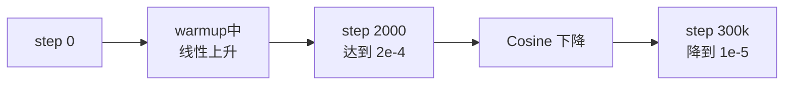

## 前置知识

> [!important]
> 
> 先读：[[7.2 阶段二：Dual-AR 大规模预训练]]、[[7.2.1 AdamW 优化器]]。

---

## 7.2.2.0 定位

> 一句话：Cosine Annealing + Linear Warmup 是 LLM 预训练的「默认」学习率调度器，Fish-Speech 采用。

---

## 7.2.2.1 全调度公式

$$\eta_t = \begin{cases}  
\eta_{\max} \cdot \frac{t}{T_w} & t \le T_w \quad \text{(Linear Warmup)} \\  
\eta_{\min} + \frac{1}{2}(\eta_{\max} - \eta_{\min})\Big(1 + \cos\big(\frac{t - T_w}{T - T_w}\pi\big)\Big) & T_w < t \le T \quad \text{(Cosine)}  
\end{cases}$$

---

## 7.2.2.2 参数设定

|参数|Fish-Speech 值|说明|
|---|---|---|
|$\eta_{\max}$|2e-4|峰值 LR|
|$\eta_{\min}$|1e-5 (~5%)|末期 LR|
|$T_w$ (warmup)|2000 step|~0.7% 总步数|
|$T$ (总)|300k step|~3 周训练|

---

## 7.2.2.3 为什么需要 Warmup

> [!important]
> 
> **初始阶段**：参数随机初始化，梯度方差表面。直接高 LR 会造成 loss 爆炸 (NaN)。
> 
> **Warmup 作用**：
> 
> - 让 LR 从 0 线性增加到 $\eta_{\max}$
> 
> - 让 momentum buffer 逐渐填充为含的状态
> 
> - 避免 Adam 中 $\sqrt{\hat{v}_t}$ 异常小引入 LR 隐含放大

---

## 7.2.2.4 为什么选 Cosine

> [!important]
> 
> **Cosine vs Linear vs Step**：
> 
> - **Linear**：LR 线性下降。后期 LR 仍高，不能精调。
> 
> - **Step**：阶段性限水。需人为设调。
> 
> - **Cosine**：前期下降慢（探索）、后期下降快（精调）。实验上优于其他。

---

## 7.2.2.5 实现示例

```python
from torch.optim.lr_scheduler import LambdaLR
import math

def cosine_warmup(optimizer, warmup_steps=2000, total_steps=300000,
                  min_ratio=0.05):
    def lr_lambda(step):
        if step < warmup_steps:
            return step / warmup_steps
        progress = (step - warmup_steps) / (total_steps - warmup_steps)
        return min_ratio + 0.5 * (1 - min_ratio) * (1 + math.cos(math.pi * progress))
    return LambdaLR(optimizer, lr_lambda)

scheduler = cosine_warmup(optimizer, 2000, 300_000)
for step in range(300_000):
    loss.backward()
    optimizer.step()
    scheduler.step()
    optimizer.zero_grad()
```

---

## 7.2.2.6 可视化 LR 曲线



---

## 7.2.2.7 踩坑

> [!important]
> 
> - **warmup_steps 太少**：< 500 步会引发训练不稳定。
> 
> - **总步数不准**：如 estimate 错 total_steps，后期 LR 会到 负。需加 `max(0, ...)`。
> 
> - **中途加训**：需从原步数重启，不从 0。
> 
> - **快速收敛容易引发 LR 太高**：需检 NaN。

---

## 参考文献

1. Loshchilov & Hutter. _SGDR: Stochastic Gradient Descent with Warm Restarts_. ICLR 2017.

1. Goyal et al. _Accurate Large Minibatch SGD: Training ImageNet in 1 Hour_. arXiv 2017.