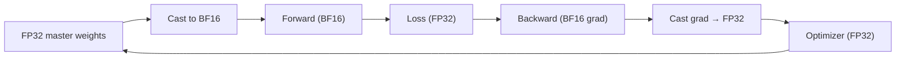

## 前置知识

> [!important]
> 
> 先读：[[7.2 阶段二：Dual-AR 大规模预训练]]。了解 IEEE 754 浮点表示。

---

## 7.2.3.0 定位

> 一句话：混合精度训练 (Mixed Precision) 使用 BF16 绑随 FP32 master weights，在保证训练稳定的同时双倍吞吐、减半忆存。

---

## 7.2.3.1 浮点格式对比

|格式|指数位|尾数位|总位数|表示范围|
|---|---|---|---|---|
|FP32|8|23|32|$\sim 10^{\pm 38}$|
|FP16|5|10|16|$\sim 10^{\pm 5}$|
|**BF16**|**8**|**7**|**16**|$\sim 10^{\pm 38}$|
|FP8 (E4M3)|4|3|8|$\sim 10^{\pm 4}$|

> [!important]
> 
> BF16 = "Brain Float 16"，由 Google Brain 提出。与 FP16 不同，BF16 保留 FP32 的 8 位指数，代价是尾数变短 (精度降低)。适合梯度范围广的训练。

---

## 7.2.3.2 BF16 vs FP16

|场景|FP16|BF16|
|---|---|---|
|梯度范围|易上溢/下溢|**不溢**|
|Loss Scaling|需要|**不需**|
|精度|高 (10-bit)|低 (7-bit)|
|硬件支持|V100+|A100/H100+|
|LLM 训练|需调|**默认**|

---

## 7.2.3.3 Mixed Precision 工作流



> [!important]
> 
> **要点**：
> 
> 1. **Master weights 存 FP32**：避免小梯度重叠丢失。
> 
> 1. **Forward/Backward 用 BF16**：提速、减半忆存。
> 
> 1. **Optimizer states 存 FP32**：AdamW 的 m, v 需高精度。

---

## 7.2.3.4 PyTorch 实现

```python
import torch

# 选择 1: torch.autocast
for batch in dataloader:
    with torch.autocast("cuda", dtype=torch.bfloat16):
        out = model(batch)
        loss = compute_loss(out)
    loss.backward()
    optimizer.step()
    optimizer.zero_grad()

# 选择 2: 手动 cast
model = model.to(torch.bfloat16)
for batch in dataloader:
    out = model(batch)
    loss = compute_loss(out).float()  # loss 仍 FP32
    loss.backward()
    optimizer.step()
```

---

## 7.2.3.5 性能增益

|配置|吞吐|忆存|
|---|---|---|
|FP32|1.0x|1.0x|
|FP16 (需 loss scaling)|1.6x|0.5x|
|**BF16**|**1.8x**|**0.5x**|
|FP8 (H100)|2.5x|0.25x|

> [!important]
> 
> Fish-Speech 采用 BF16，选理由：
> 
> - A100/H100 原生支持 BF16 Tensor Core。
> 
> - 不需 loss scaling，训练稳定。
> 
> - 与 Llama-3 默认一致。

---

## 7.2.3.6 踩坑

> [!important]
> 
> - **FP16 梯度下溢**：使用 `torch.cuda.amp.GradScaler`。BF16 无此问题。
> 
> - **LayerNorm 在 BF16 下不稳**：LayerNorm 需计算中间量，需保持 FP32。`torch.autocast` 自动处理。
> 
> - **Optimizer state 重载错误**：检查是否 master weights 仍在 FP32。
> 
> - **A100 之前的 V100**：V100 不支持 BF16，需退回 FP16。

---

## 参考文献

1. Micikevicius et al. _Mixed Precision Training_. ICLR 2018.

1. Kalamkar et al. _A Study of BFLOAT16 for Deep Learning Training_. arXiv 2019.

1. NVIDIA. _Train With Mixed Precision_, 2024.