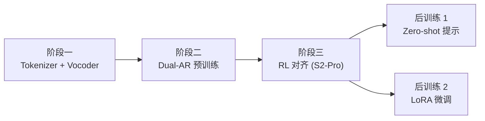

## 0. 定位

> 一句话：Fish-Speech 采用**三阶段训练 + 两阶段后训练**：先训 Tokenizer/Vocoder，再训 Dual-AR LLM，S2-Pro 阶段加入 RL 对齐；推理期再叠加 Zero-shot Voice Cloning 与 LoRA 微调。

---

## 1. 三阶段训练流程

---

## 2. 子页面导航

[[7.1 阶段一：Tokenizer + Vocoder 预训练]]

[[7.2 阶段二：Dual-AR 大规模预训练]]

[[7.3 阶段三：RL 对齐（S2-Pro 首次引入）]]

---

## 3. 各阶段对比

|阶段|训练目标|数据|时长|
|---|---|---|---|
|1. Tokenizer+Vocoder|GAN + Mel L1 + FM|1M 小时高质|~2 周（8×A100）|
|2. Dual-AR 预训练|Cross-Entropy（NTP）|10M 小时|~4 周（64×H100）|
|3. RL 对齐|DPO / RLHF|~10k 偏好对|~3 天|

> [!important]
> 
> RL 对齐是 S2-Pro 与 S2 的关键差异点，主要解决「拼读」「情感失真」「停顿不自然」三类长尾问题。

---

## 4. 参考文献

1. Ouyang et al. _Training language models to follow instructions with human feedback_. NeurIPS 2022.

[[7.4 Zero-shot Voice Cloning]]

1. Rafailov et al. _Direct Preference Optimization_. NeurIPS 2023.

[[7.5 Few-shot - LoRA 微调]]