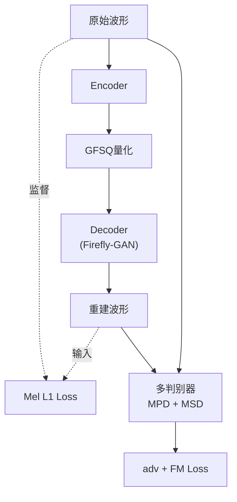

## 前置知识

> [!important]
> 
> 先读：[[7. 训练策略与后训练]]、[[3. 语音 Tokenizer：GFSQ]]、[[4. 声码器：Firefly-GAN（FFGAN）]]。

---

## 7.1.0 定位

> 一句话：训练第一阶段同时训 GFSQ tokenizer 与 Firefly-GAN vocoder，为 Dual-AR LLM 提供「稳定、可復现」的 token 、波形互转接口。

---

## 7.1.1 训练目标

---

## 7.1.2 总损失

$$\mathcal{L} = \lambda_{\text{mel}} \mathcal{L}_{\text{mel}} + \lambda_{\text{adv}} \mathcal{L}_{\text{adv}} + \lambda_{\text{fm}} \mathcal{L}_{\text{fm}} + \lambda_{\text{cb}} \mathcal{L}_{\text{cb}}$$

其中 $\mathcal{L}_{\text{cb}}$ 是 Codebook commitment loss（FSQ 不需，仅 VQ 后兼营场景）。

---

## 7.1.3 训练超参

|参数|值|
|---|---|
|数据|~1M 小时高质|
|batch_size|16 (每 GPU)|
|训练步数|~500k|
|优化器|AdamW|
|学习率 G|2e-4|
|学习率 D|1e-4 (减半)|
|warmup|10k step|
|训练机器|8×A100 80G|
|时长|~2 周|

---

## 7.1.4 为什么 G 与 D 学习率不同

> [!important]
> 
> HiFi-GAN / Firefly-GAN 经验：D 学习率定为 G 的一半，以防 D 在训练初期过强导致 G 梯度消失。
> 
> 在 100k step 之后，二者可以同步。但低 D lr 是「稳定起点」。

---

## 7.1.5 质量验证

训练期间每 10k step 进行一次 hold-out 验证：

|指标|阈值|说明|
|---|---|---|
|Mel L1|$<$ 0.2|200k step 后|
|VUV F1|$>$ 0.95|静/有声区阶|
|F0 RMSE|$<$ 25 Hz|基频保真|
|UTMOS|$>$ 4.0|自动 MOS 代理|

---

## 7.1.6 踩坑记录

> [!important]
> 
> **坑 1：作为 tokenizer 训练时 codebook collapse** → 需采用 FSQ 代 VQ。
> 
> **坑 2：D 太强导致 mode collapse** → 随机关他中的一个判别器（0.5 概率）可提高稳定性。
> 
> **坑 3：训练后期 Mel L1 震荡** → 减半 learning rate，并增加 mel loss 权重。

---

## 参考文献

1. Kong et al. _HiFi-GAN_. NeurIPS 2020.

1. Mentzer et al. _Finite Scalar Quantization_. ICLR 2024.