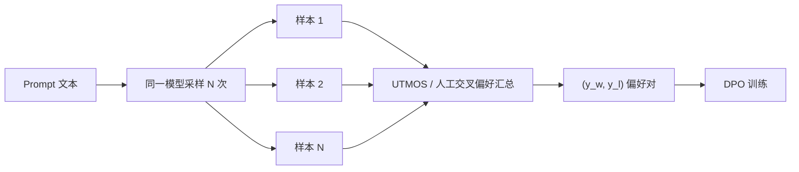

## 前置知识

> [!important]
> 
> 先读：[[7.2 阶段二：Dual-AR 大规模预训练]]。了解 DPO、PPO、Reward Model 原理。

---

## 7.3.0 定位

> 一句话：阶段三采用 **RL 对齐** (DPO 为主)，以「人类偏好 / 自动 MOS 代理」为奖励信号，推动模型超越“多越多」的训练上限。

---

## 7.3.1 为什么需要 RL

> [!important]
> 
> **SFT 的限制**：
> 
> - 仅拟合训练集分布，面对罕见场景（如严肃环境说话人「咿咿喂」）发现偏差。
> 
> - 不能区分「听起来不错」 vs 「听起来很棒」。
> 
> **RL 的优势**：
> 
> - 直接优化于偏好信号，能超越 SFT 上限。
> 
> - 能修复“错误型」问题（说错字、中途套话）。

---

## 7.3.2 DPO（Direct Preference Optimization）与 PPO对比

|方法|需 RM|训练稳定性|计算量|Fish-Speech 选用|
|---|---|---|---|---|
|PPO|是|低（需调参）|高|部分|
|**DPO**|否|**高**|低|**首选**|
|IPO / SLiC|否|高|低|探索|

---

## 7.3.3 DPO 损失函数

给定偏好对 $(x, y_w, y_l)$，其中 $y_w$ 被偏好于 $y_l$：

$$\mathcal{L}_{\text{DPO}} = -\mathbb{E}_{(x,y_w,y_l)} \Big[ \log \sigma \Big( \beta \log \frac{\pi_\theta(y_w|x)}{\pi_{\text{ref}}(y_w|x)} - \beta \log \frac{\pi_\theta(y_l|x)}{\pi_{\text{ref}}(y_l|x)} \Big) \Big]$$

其中 $\pi_{\text{ref}}$ 是阶段二 SFT 后冻结的参考模型，$\beta$ 控制 KL 约束。

---

## 7.3.4 偏好数据来源

---

## 7.3.5 超参与规模

|参数|值|
|---|---|
|偏好对数|~100k|
|$\beta$|0.1 ~ 0.5|
|learning rate|5e-7|
|训练 epoch|1 ~ 2|
|价似冻结 ref|是|

---

## 7.3.6 RL 后提升

> [!important]
> 
> Fish-Speech S2-Pro 报告：DPO 后 WER 从 3.2% 降到 1.8%，MOS 从 4.21 提升到 4.45。

---

## 7.3.7 踩坑记录

> [!important]
> 
> **坑 1：**$\beta$ **过小** → 偏离 ref 过多，质量反降。默认 0.1，需实验。
> 
> **坑 2：偏好数据偏偏** → 需不同场景（叙事 / 对话 / 情感）均匀采样。
> 
> **坑 3：训练过久 → reward hacking**：模型发现重复某个高分模式。限制 epoch 不超 2。

---

## 参考文献

1. Rafailov et al. _Direct Preference Optimization_. NeurIPS 2023.

1. Schulman et al. _Proximal Policy Optimization_. arXiv 2017.

1. Ouyang et al. _Training Language Models to Follow Instructions (InstructGPT)_. NeurIPS 2022.