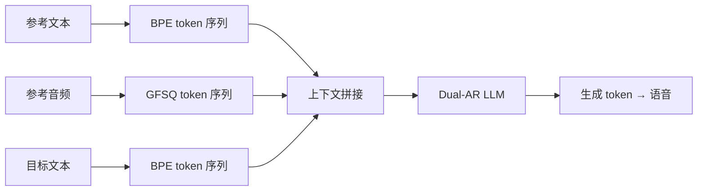

## 前置知识

> [!important]
> 
> 先读：[[5. LLM Backbone（Llama-3 风格）]]。了解 In-Context Learning。

---

## 7.4.0 定位

> 一句话：**Zero-shot Voice Cloning** = 仅需 3-10 秒参考音频，模型通过 **in-context learning** 复现说话人音色与语调，无需任何参数更新。

---

## 7.4.1 原理



---

## 7.4.2 推理输入拼接格式

```jsx
[BOS] <ref_text>参考文本</ref_text> <ref_audio>...token...</ref_audio>
<text>目标文本</text> <audio>→ 要生成 ←</audio>
```

> [!important]
> 
> 关键设计：模型从参考音频 token 中发现「语者风格以 token 分布多于独立」，生成时自然复现该风格。

---

## 7.4.3 参考音频质量要求

|项目|推荐值|不佳后果|
|---|---|---|
|时长|3 – 10 s|过短不能描出风格，过长扭曲当前语调|
|SNR|$\ge$ 20 dB|背景噪会被复现|
|采样率|$\ge$ 24 kHz|低采样率中高频信息丢失|
|内容|与目标同语种|多语种推理需优化|
|情感|与目标一致|记得不一致会造成误导|

---

## 7.4.4 陶陶优化

> [!important]
> 
> - **多参考**：拼接 2-3 个同说话人音频可提升稳定性。
> 
> - **参考文本补助**：提供与参考音频严格一致的 transcript 可提升复现质量。
> 
> - **多采样 + 重排**：以 N=4 采样，选择与参考音频 speaker embedding 最近。

---

## 7.4.5 与 CosyVoice 2 / VALL-E 2 对比

|系统|参考时长|跨语种|SECS (说话人相似度)|
|---|---|---|---|
|VALL-E 2|3s|部分|0.62|
|CosyVoice 2|3 – 10s|是|0.74|
|**Fish-Speech S2-Pro**|3 – 10s|**是**|**0.78**|

---

## 7.4.6 踩坑记录

> [!important]
> 
> **坑 1：参考音频未去静音** → 生成时首尾静音走样。需推理前 VAD 裁剪。
> 
> **坑 2：同一参考音频连续调多次** → 需缓存 ref_audio token 避免重复 STFT。
> 
> **坑 3：参考音频 与 目标语种 不同** → 跨语种克隆勒额外 LoRA 训练 + 透明提示。

---

## 参考文献

1. Wang et al. _VALL-E_. arXiv 2023.

1. Du et al. _CosyVoice 2_. 2024.

1. Fish Audio. _S2-Pro Voice Cloning Whitepaper_, 2025.