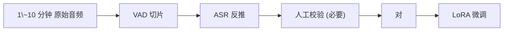

## 前置知识

> [!important]
> 
> 先读：[[7.4 Zero-shot Voice Cloning]]。了解 LoRA 、 PEFT 原理。

---

## 7.5.0 定位

> 一句话：当 Zero-shot 不够稳定（8个场景、老师引語、多说话人互动）时，**Few-shot + LoRA** 提供「低成本、低参数」的个性化定制。

---

## 7.5.1 Zero-shot vs Few-shot+LoRA

|方法|数据|参数|训练时间|质量|
|---|---|---|---|---|
|Zero-shot|3-10 秒|0|0|中-高|
|**Few-shot + LoRA**|**1-10 分钟**|**~10M**|**~30 min**|**高**|
|全参数微调|$\ge$ 1 小时|~0.6B|$\ge$ 4 h|最高|

---

## 7.5.2 LoRA 原理回顶

原参数 $W \in \mathbb{R}^{d \times d}$，LoRA 补企为：

$$W' = W + \Delta W = W + B \cdot A, \quad A \in \mathbb{R}^{r \times d}, B \in \mathbb{R}^{d \times r}, r \ll d$$

只训练 $A, B$，节省参数 $\frac{d}{r} - 1$ 个数量级。

---

## 7.5.3 Fish-Speech 的 LoRA 配置

|项目|推荐值|
|---|---|
|作用于|SlowAR 的 Q/K/V/O|
|rank $r$|32 ~ 64|
|alpha|2r|
|dropout|0.05|
|可训参数|~10 M / 0.6B 总参|
|learning rate|1e-4|
|训练 epoch|5 ~ 20|

---

## 7.5.4 数据准备

---

## 7.5.5 部署与级联

> [!important]
> 
> - LoRA 权重**文件 ~40 MB**，可以热加载 / 热卸载。
> 
> - 一个服务可同时加载多个 LoRA（不同说话人）。
> 
> - 推理时需指定使用哪个 LoRA 适配器。

---

## 7.5.6 适用场景

- **说话人**：主播 / Vtuber / 读书者。

- **风格**：新闻播报 / 摆龙门阵 / 广告。

- **领域**：医学术语、专业词汇。

- **严肃语者**：Zero-shot 可能不加护的说话人。

---

## 7.5.7 踩坑记录

> [!important]
> 
> **坑 1：rank 太高** → 过拟合、劣势难以发现。需从 r=16 调起。
> 
> **坑 2：alpha 不与 r 同步缩放** → alpha=2r 是经验值。
> 
> **坑 3：训练集太少 (< 1 分钟)** → 需增广或者退回 Zero-shot。

---

## 参考文献

1. Hu et al. _LoRA: Low-Rank Adaptation_. ICLR 2022.

1. Fish Audio. _Fish-Speech LoRA Tutorial_, 2024.