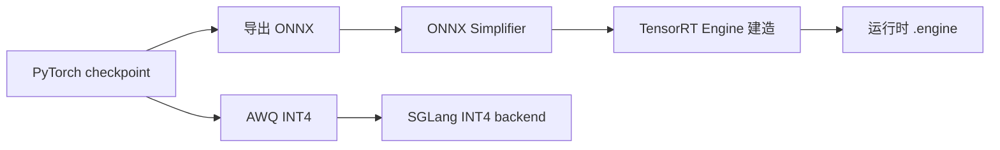

## 前置知识

> [!important]
> 
> 先读：[[8. 推理引擎与部署]]。了解量化、推理加速原理。

---

## 8.4.0 定位

> 一句话：通过 **量化 (INT8/INT4)** 与 **TensorRT/ONNX 导出**，Fish-Speech 可以在消费级 GPU（6GB 显存）甚至 CPU 上运行，质量损失轻微。

---

## 8.4.1 量化方案对比

|方案|量化粒度|质量损失|推理提速|显存节省|
|---|---|---|---|---|
|BF16 (原生)|16-bit|0|1.0x|0|
|**INT8 PTQ**|8-bit|轻微|**1.8x**|**50%**|
|**INT4 AWQ**|4-bit|轻微~中|**3.0x**|**75%**|
|FP8 (H100/H200)|8-bit|0|2.0x|50%|

---

## 8.4.2 PTQ vs QAT

> [!important]
> 
> - **PTQ (Post-Training Quantization)**：训练后直接量化，使用样本 calibration。简单、保质。
> 
> - **QAT (Quantization-Aware Training)**：训练时加入伪量化节点，质量较高但训练费用高。
> 
> Fish-Speech 推荐默认用 PTQ（INT8 or INT4 AWQ）。QAT 仅面向严苛质量要求场景。

---

## 8.4.3 TensorRT / ONNX 导出流程

---

## 8.4.4 性能结果（RTX 4090, batch=1）

|配置|RTF|显存|UTMOS|
|---|---|---|---|
|BF16|0.18|14 GB|4.32|
|INT8 PTQ|0.10|8 GB|4.30|
|**INT4 AWQ**|**0.06**|**4 GB**|**4.27**|

> [!important]
> 
> INT4 AWQ 能让 Fish-Speech 在消费级 GPU (4090 24G 仅用 6GB) 以 RTF=0.06 运行，质量损失 < 0.06 UTMOS。

---

## 8.4.5 子页

[[8.4.1 Quantization (PTQ-QAT)]]

[[8.4.2 TensorRT - ONNX 导出]]

---

## 8.4.6 踩坑记录

> [!important]
> 
> **坑 1：INT8 后 Mel spectrogram 震荡** → 需仅量化 SlowAR，避免对 vocoder 量化。
> 
> **坑 2：ONNX 不支持动态 KV cache** → 需使用 SGLang/TensorRT-LLM 路线。
> 
> **坑 3：AWQ calibration 集不足** → 质量明显下降。推荐使用 1000+ 样本。

---

## 参考文献

1. Lin et al. _AWQ: Activation-aware Weight Quantization_. MLSys 2024.

1. NVIDIA. _TensorRT Developer Guide_, 2024.

1. ONNX Team. _ONNX Specification v1.16_, 2024.