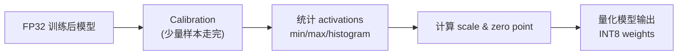
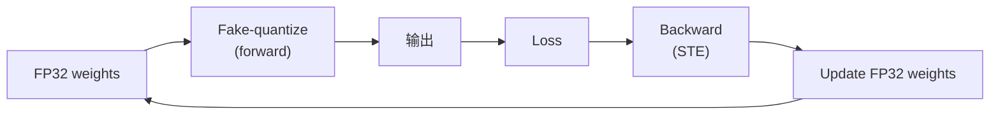

## 前置知识

> [!important]
> 
> 先读：[[8.4 推理量化与加速]]。了解 BF16 / FP16 / INT8 浮点表示。

---

## 8.4.1.0 定位

> 一句话：量化 (Quantization) 是「用低位数表示权重 / 激活」，在保证质量的同时加速推理、减少显存。Fish-Speech 主要采用 INT8 PTQ 与 INT4 AWQ。

---

## 8.4.1.1 量化数学

给定 FP32 张量 $x$，量化为 INT-N：

$$q = \text{round}\Big(\frac{x}{s}\Big) + z, \quad s = \frac{x_{\max} - x_{\min}}{2^N - 1}, \quad z = -\text{round}\Big(\frac{x_{\min}}{s}\Big)$$

反量化：

$$\hat{x} = (q - z) \cdot s$$

> [!important]
> 
> - $s$：scale (每个张量 / 通道 / 组 一个)
> 
> - $z$：zero point (不对称量化需，对称量化 z=0)
> 
> - $N$：量化位数 (4/8/16)

---

## 8.4.1.2 PTQ (Post-Training Quantization)



> [!important]
> 
> **优点**：
> 
> - 不需重训，几分钟调试。
> 
> - Calibration 需 100-1000 样本。
> 
> **缺点**：
> 
> - INT4 以下质量下降明显。
> 
> - 需 calibration 样本与训练集分布一致。

---

## 8.4.1.3 QAT (Quantization-Aware Training)



> [!important]
> 
> QAT 在训练中插入 fake-quant 节点，模拟量化后的梯度。Backward 使用 STE (Straight-Through Estimator)。优点质量高，但训练代价高。

---

## 8.4.1.4 AWQ (Activation-aware Weight Quantization)

> [!important]
> 
> **核心思路**：
> 
> 1. 发现大逻辑 (LLM) 中，少量 1% “key” weights 决定质量。
> 
> 1. 使用 activation magnitude 识别这些重要 weights。
> 
> 1. 对重要 weights 使用 per-channel scaling，对他们使用 INT4。
> 
> **结果**：Fish-Speech INT4 AWQ 质量损失仅 0.05 UTMOS，额外 75% 显存节省。

---

## 8.4.1.5 PTQ 代码示例

```python
import torch
from torch.quantization import quantize_dynamic

# 动态 INT8 (最简单)
model_int8 = quantize_dynamic(
    model, {torch.nn.Linear}, dtype=torch.qint8
)
```

```python
# AWQ (使用 awq 库)
from awq import AutoAWQForCausalLM

model = AutoAWQForCausalLM.from_pretrained("openaudio-s2-pro")
model.quantize(
    tokenizer,
    quant_config={"q_group_size": 128, "w_bit": 4, "version": "GEMM"},
)
model.save_quantized("openaudio-s2-pro-awq")
```

---

## 8.4.1.6 对 Fish-Speech 的量化策略

|部件|量化|原因|
|---|---|---|
|SlowAR|INT4 AWQ|质量很似 FP32|
|FastAR|INT8 PTQ|参量少、INT4 质量下降|
|**Vocoder**|**不量化**|高频重现需要 FP。INT8 后 Mel spectrogram 震荡。|
|Embedding|FP16|表示词表，量化损失明显|

---

## 8.4.1.7 踩坑

> [!important]
> 
> - **对 Vocoder 量化**：量化后 Mel 谱震荡、高频丢。**请不要量化 Vocoder**。
> 
> - **Calibration 集不足**：< 100 样本造成量化偏误大。推荐 1000+。
> 
> - **使用 SmoothQuant**：Fish-Speech 逻辑含 outliers 高，需先 SmoothQuant 再 INT8。
> 
> - **INT8 后 batch=1 推理反而慢**：仅 batch>=2 才获加速。

---

## 参考文献

1. Lin et al. _AWQ: Activation-aware Weight Quantization_. MLSys 2024.

1. Xiao et al. _SmoothQuant_. ICML 2023.

1. Jacob et al. _Quantization and Training of Neural Networks for Efficient Integer-Arithmetic-Only Inference_. CVPR 2018.