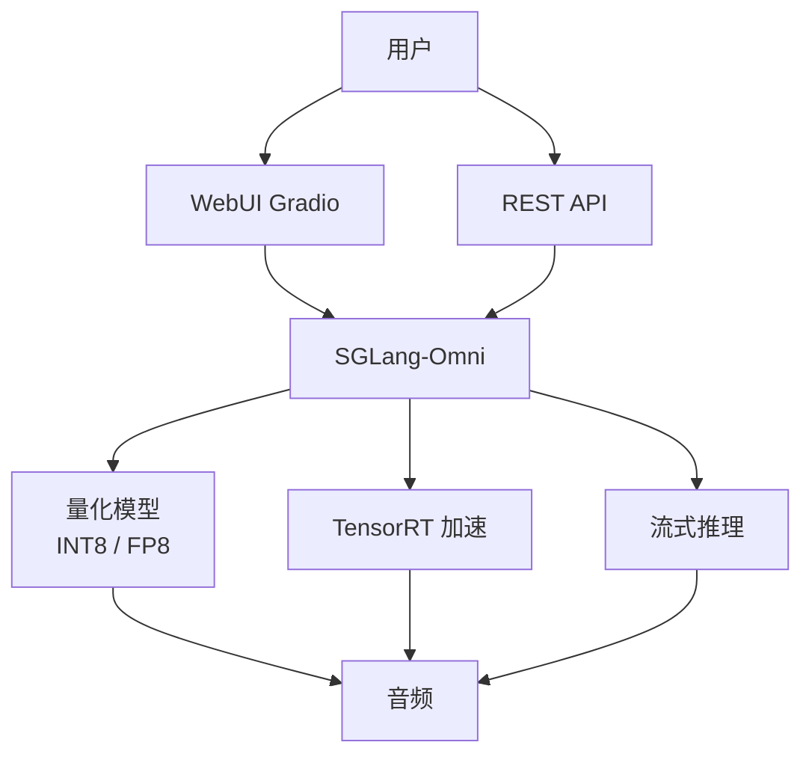

## 0. 定位

> 一句话：Fish-Speech 的部署栈以 **SGLang-Omni** 为核心，对外提供 Gradio WebUI 与 REST API；通过量化、TensorRT、流式推理把 TTFB 压到 ~150 ms。

---

## 1. 部署堆栈

---

## 2. 子页面导航

[[8.1 SGLang-Omni Serving]]

[[8.2 WebUI（Gradio）]]

[[8.3 REST API 与端点设计]]

[[8.4 推理量化与加速]]

[[8.5 流式推理]]

---

## 3. 性能对比

|配置|TTFB|RTF|显存|
|---|---|---|---|
|BF16 原版|~300 ms|0.20|~12 GB|
|INT8 量化|~180 ms|0.12|~6 GB|
|**TensorRT + 流式**|**~150 ms**|**0.08**|**~5 GB**|

> [!important]
> 
> 对话场景下 TTFB 比 RTF 更重要；流式推理的本质是把首 chunk 的延迟从「整段合成完毕」缩短到「首 token 通过 vocoder」。

---

## 4. 参考文献

1. Zheng et al. _SGLang_. arXiv 2024.

1. NVIDIA. _TensorRT-LLM Documentation_, 2024.