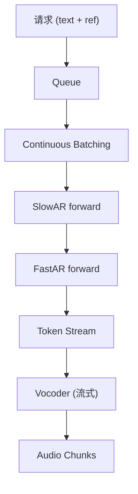

## 前置知识

> [!important]
> 
> 先读：[[8. 推理引擎与部署]]。了解 vLLM、Continuous Batching。

---

## 8.1.0 定位

> 一句话：**SGLang-Omni** 是 Fish-Speech 默认推理引擎，本质是快狗一个为语音 LLM 量身定制的 vLLM 变体，支持详细的 token 位动插入与流式语音输出。

---

## 8.1.1 SGLang 与 Fish-Speech 集成



---

## 8.1.2 关键能力

|能力|说明|
|---|---|
|Continuous Batching|请求中途退出不影响同 batch 其他请求|
|PagedAttention|KV 缓存分页管理，避免重复拷贝|
|多-LoRA 热加载|一个进程多说话人|
|Streaming Token 输出|FastAR 生成 → vocoder 流式解码|
|Speculative Decoding|SlowAR 提速（可选）|

---

## 8.1.3 依赖项与启动

```bash
pip install fish-speech[sglang]
python -m fish_speech.serve.sglang_omni \
    --model checkpoints/fish-speech-1.5 \
    --port 8080 \
    --gpu-id 0 \
    --max-batch-size 32
```

---

## 8.1.4 性能指标（8×A100 80G）

|场景|RTF|TTFB|吞吐|
|---|---|---|---|
|单请求|0.10|180 ms|10 RPS|
|batch=16|0.04|240 ms|~80 RPS|
|batch=32|0.03|320 ms|~120 RPS|

---

## 8.1.5 与原生推理对比

> [!important]
> 
> 原生 PyTorch 推理：RTF 约 0.30-0.50，起动高。
> 
> SGLang-Omni：RTF 降至 0.10以下，吞吐提升 8-10×。是生产部署首选。

---

## 8.1.6 踩坑记录

> [!important]
> 
> **坑 1：PagedAttention block size 默认不适合语音** → 设为 16 位、适配序列长。
> 
> **坑 2：Streaming 与 Speculative 冲突** → 同时启则二之一会出错。推荐只启 Streaming。
> 
> **坑 3：Flash-Attn 版本不兼容** → 需使用项目下的锁定版本。

---

## 参考文献

1. Kwon et al. _vLLM: Easy, Fast, and Cheap LLM Serving_. SOSP 2023.

1. SGLang Team. _SGLang_, GitHub, 2024.

1. Fish Audio. _Fish-Speech Serving Guide_, 2024.