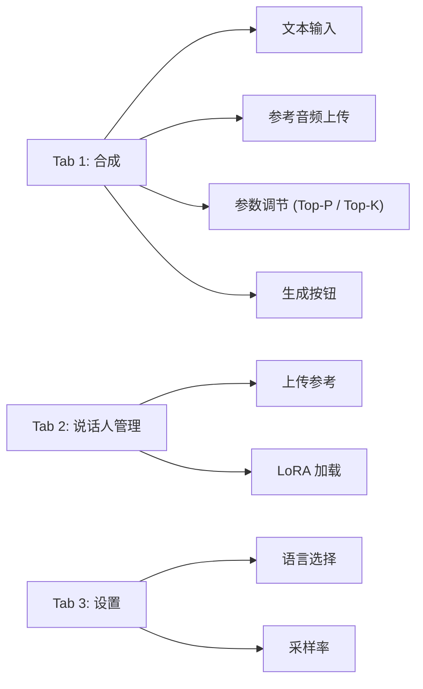

## 前置知识

> [!important]
> 
> 先读：[[8. 推理引擎与部署]]。

---

## 8.2.0 定位

> 一句话：Fish-Speech 提供基于 Gradio 的 **WebUI 交互面板**，面向个人用户（玩者、创作者、研究者）提供一点击克隆与合成体验。

---

## 8.2.1 面板布局



---

## 8.2.2 启动命令

```bash
python -m fish_speech.webui \
    --checkpoint checkpoints/fish-speech-1.5 \
    --device cuda:0 \
    --port 7860 \
    --share False
```

---

## 8.2.3 参数面板关键项

|参数|范围|默认|作用|
|---|---|---|---|
|Top-P|0.5 – 0.95|0.7|越高越多样|
|Top-K|10 – 100|50|限制采样范围|
|Temperature|0.5 – 1.5|0.8|越高越多样|
|Repetition Penalty|1.0 – 1.5|1.1|防重复|
|Max Tokens|200 – 4096|1500|控制生成长度|

---

## 8.2.4 推荐预设

> [!important]
> 
> - **默认 (新闻 / 文档)**：Top-P=0.7, Temp=0.8。稳。
> 
> - **情感 / 叙事**：Top-P=0.85, Temp=1.0。更富谈。
> 
> - **严肃 / 医学**：Top-P=0.5, Temp=0.6。更准。

---

## 8.2.5 限制与注意事项

> [!important]
> 
> - Gradio 面板不适合生产环境高吞吐，生产请用 8.3 REST API。
> 
> - 调起 `--share True` 会生成公网链接，注意权限与计费。
> 
> - 面板默认不启用 SGLang 后端，需用 `--use-sglang` 启用。

---

## 8.2.6 与其他面板对比

|项目|UI|集成难度|
|---|---|---|
|GPT-SoVITS|Gradio|低|
|CosyVoice 2|Streamlit|中|
|**Fish-Speech**|**Gradio**|**低**|
|ChatTTS|Gradio|低|

---

## 参考文献

1. Abid et al. _Gradio: Hassle-Free Sharing_. JOSS 2019.

1. Fish Audio. _Fish-Speech WebUI Documentation_, 2024.