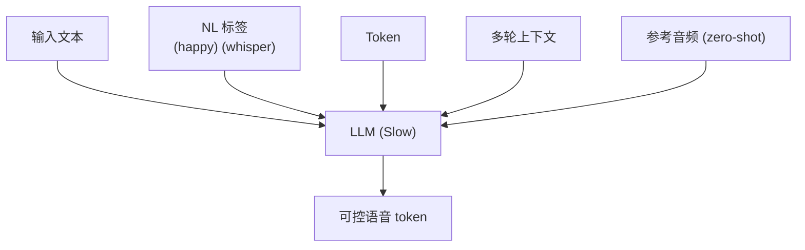

## 0. 定位

> 一句话：Fish-Speech 的可控性能力是在 LLM 上**复用文本提示 + 特殊 token** 实现的：情感、说话人、多轮对话、Prompt 风格都不需要额外模型头，是「语音 LLM 的天然礼物」。

---

## 1. 可控能力面

---

## 2. 子页面导航

[[9.1 自然语言情感标签（NL Tags）]]

[[9.2 多说话人 Token]]

---

## 3. 可控范式对比

|能力|传统 TTS 方案|**Fish-Speech**|
|---|---|---|
|情感|独立 emotion classifier head|**文本中插入 NL Tag**|
|说话人|speaker embedding lookup|**词表 <spk_id> token**|
|风格迁移|style encoder|**zero-shot 提示参考**|
|多轮|独立 dialog manager|**话轮都拼接在 prompt 中**|

> [!important]
> 
> 门槛低、并且可以**组合叠加**：「你用 spk_5 带着 (happy) 交付这句」是合法的。

---

## 4. 参考文献

1. Fish Audio. _Fish-Speech Controllability Guide_, 2024.

[[9.3 多轮对话生成]]

1. Hsu et al. _PromptTTS_. ICASSP 2023.

[[9.4 Prompt 工程实践]]