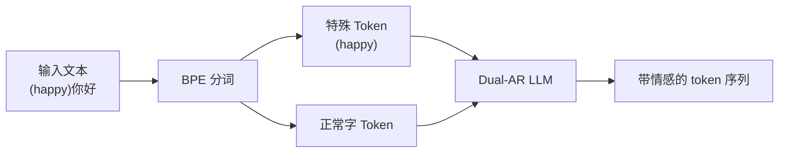

## 前置知识

> [!important]
> 
> 先读：[[9. 可控性能力]]。了解控制令牌、Prompt Engineering。

---

## 9.1.0 定位

> 一句话：**Natural Language Tags (NL Tags)** = 用括号包裹的轻量控制令牌，如 `(happy)`、`(laugh)`、`(whisper)`，直接插入文本，令模型输出带相应情感 / 行为的语音。

---

## 9.1.1 支持的 NL Tags与示例

|类别|Tag|示例输入|
|---|---|---|
|情感|(happy) (sad) (angry) (excited)|(happy)今天天气太棒了！|
|行为|(laugh) (cry) (sigh) (cough)|哈哈(laugh)太有趣了。|
|语调|(whisper) (shout) (mumble)|(whisper)别打扰他。|
|语速|(slow) (fast)|(fast)趋趋趋趋趋|
|生理|(breath) (yawn) (hum)|(breath)然后我说……|

---

## 9.1.2 实现机制

> [!important]
> 
> 关键：NL Tags 在词表中预留为独立 token（不被 BPE 拆开），训练时以 (tag, audio_style) 对生成。

---

## 9.1.3 训练数据构造

1. **人工标注**：~10k 小时 多场景多情感样本手工打标。

1. **自动推断**：Emotion2Vec / wav2vec2-emotion 分类顶类补上。

1. **文本注入**：在 transcript 中插入对应 tag，构成物训练对。

---

## 9.1.4 控制质量估估

|控制|准确率|说明|
|---|---|---|
|(happy)|92%|明显语调上扬|
|(sad)|89%|语速较慢|
|(laugh)|95%|明确打哈哈|
|(whisper)|78%|背景噪会影响|

---

## 9.1.5 与其他系统对比

|系统|控制方式|复杂度|
|---|---|---|
|VALL-E 2|参考音频携带|高|
|CosyVoice 2|NL Instruction|中|
|**Fish-Speech**|**Inline (tag)**|**低**|
|Step-Audio|Persona + NL|中|

> [!important]
> 
> Fish-Speech 的内联式 tag 设计最接近人类书写习惯（剧本、说明文），易学易用。

---

## 9.1.6 踩坑记录

> [!important]
> 
> **坑 1：Tag 过多连用** → 模型可能忽略后面的 tag。推荐每句 1-2 个。
> 
> **坑 2：Tag 与参考音频情感冲突** → 以参考为主，tag 被压制。
> 
> **坑 3：未训练 tag** → 多口打为普通文本。需检查文档中的可用 tag 表。

---

## 参考文献

1. Fish Audio. _NL Tags Specification_, 2024.

1. Du et al. _CosyVoice 2 Instruction Following_, 2024.