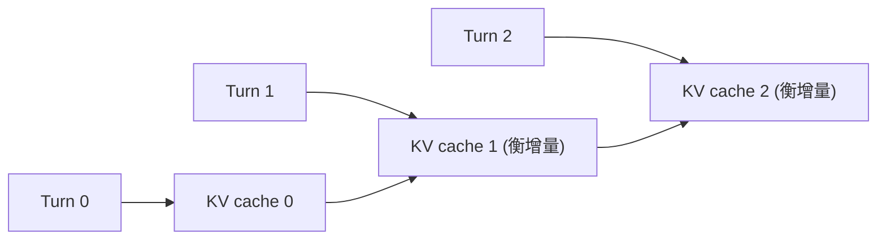

## 前置知识

> [!important]
> 
> 先读：[[9.2 多说话人 Token]]。了解上下文 LLM、Conversation Memory。

---

## 9.3.0 定位

> 一句话：Fish-Speech S2-Pro 支持 **多轮对话上下文**：上一轮生成的音频 token 会被取出重新馈送回输入，使说话人保持一致性与情感连贯。

---

## 9.3.1 上下文拼接格式

```jsx
[BOS] (turn=0) <spk_0>你好。</spk_0> <audio>...token...</audio>
          (turn=0) <spk_1>(happy)你好呀。</spk_1> <audio>...token...</audio>
          (turn=1) <spk_0>今天怎么样?</spk_0> <audio>├── 要生成 ──┤</audio>
```

> [!important]
> 
> 上下文拼接后会超过 SlowAR 的 4096 token 上限，需使用 KV cache + 滑动窗口。

---

## 9.3.2 KV Cache 复用



每轮仅需加载增量 KV cache，避免重复计算历史 turn。

---

## 9.3.3 上下文窗口策略

|策略|说明|适用场景|
|---|---|---|
|全保留|保留所有 turn|短对话 (< 5 turn)|
|**Sliding Window**|**保留最近 N turn**|**长对话**|
|Memory Compression|压缩早期 turn 为 summary embedding|超长对话 (50+ turn)|

---

## 9.3.4 与 Cascade TTS 的区别

> [!important]
> 
> **Cascade TTS**（传统系统）：每轮独立调用 TTS，不能领会上一轮语气。
> 
> **Fish-Speech 多轮**：联合考虑所有轮，模型能：
> 
> - 保持说话人一致。
> 
> - 领会「上轮高兴 → 下轮轻松」的情感进步。
> 
> - 避免重复“点」或“哦」。

---

## 9.3.5 实测指标

|场景|说话人一致性|情感连续性|
|---|---|---|
|Cascade TTS|中|低|
|**Fish-Speech 多轮**|**高**|**高**|

---

## 9.3.6 踩坑记录

> [!important]
> 
> **坑 1：上下文超过 4096** → 需使用 sliding window，保留最近 8 turn。
> 
> **坑 2：上下文中含默认 prompt** → 需检查 system prompt 是否被包含。
> 
> **坑 3：不不同说话人领会反转** → 需 spk_id 与 ref_audio 严格对齐。

---

## 参考文献

1. Fish Audio. _Multi-Turn Conversational TTS_, S2-Pro Whitepaper 2025.

1. Wu et al. _Spoken Dialog Systems_. ICASSP 2024.