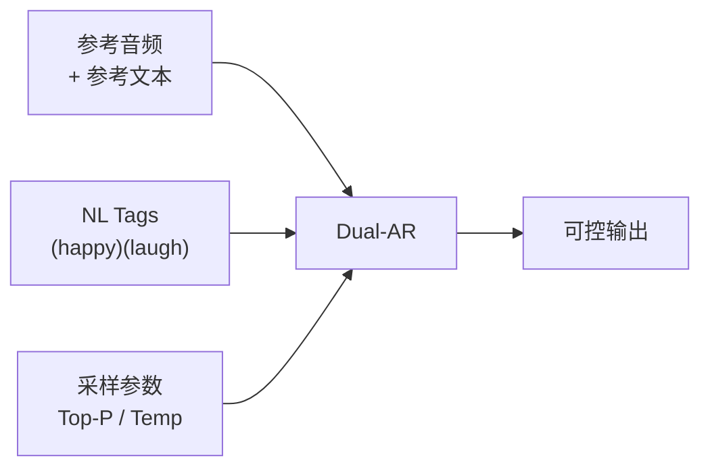

## 前置知识

> [!important]
> 
> 先读：[[9.1 自然语言情感标签（NL Tags）]]、[[9.2 多说话人 Token]]。

---

## 9.4.0 定位

> 一句话：Prompt 工程是「在不微调的前提下，通过调整输入结构来引导模型输出」的技巧集合，是 Fish-Speech 发挥可控性的最低成本手段。

---

## 9.4.1 Prompt 三要素



|要素|影响|
|---|---|
|参考音频|音色 / 说话者底色|
|参考文本|语调、语速底色|
|NL Tags|情感、行为变量|
|采样参数|创造性 vs 稳定性|
|文本标点|语动节奏|

---

## 9.4.2 常见技巧

> [!important]
> 
> 1. **标点算作语动提示**：句号全停顿，逗号轻顿，依号進顿，问号语调上扬。
> 
> 1. **NL Tags 放在句首**：质量较高。该句中不要连用多个 tag。
> 
> 1. **参考文本语种与目标同**：以中说中、以英说英；跨语种需 LoRA。
> 
> 1. **变量 语速**：(slow) (fast) 仅适合短句，长句会造成上下文不一致。
> 
> 1. **Temperature 按场景调**：严肃类 0.6，叙事类 0.9，起高创造类 1.2。

---

## 9.4.3 Anti-Pattern (该避免)

> [!important]
> 
> - **连用 (happy)(angry)(sad)**：模型会迷惑。
> 
> - **参考音频 30s+**：連 (laugh) 只取前 10s 的风格，后面被忽略。
> 
> - **文本不加标点**：模型可能吃字、扭丰语动。
> 
> - **temperature=2.0**：起句魔魔获获，不可用。

---

## 9.4.4 示例：一句调 5 种风格

```jsx
# 正常
你好，今天天气不错。

# 高兴
(happy) 你好，今天天气不错！

# 追伤
(sad) 你好……今天天气不错。

# 耧耧
(whisper) 你好，今天天气不错。

# 哦哦哈
你好 (laugh) 今天天气不错 (laugh)。
```

---

## 9.4.5 Prompt 工程 vs LoRA

|需求|推荐|
|---|---|
|临时情感切换|**Prompt**|
|说话人个性化|LoRA|
|领域术语|LoRA|
|多说话人剧本|**Prompt**|

---

## 参考文献

1. Fish Audio. _Prompt Engineering Cookbook_, 2024.

1. Liu et al. _Prompt Engineering for TTS_. INTERSPEECH 2024.