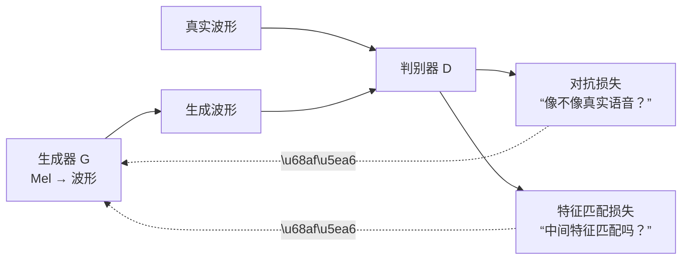

## 前置知识

> [!important]
> 
> 本页展开 [[1.1 声码器共性基础（Vocoder Fundamentals）]] 中的判别器部分。需要 GAN 基础概念。

---

## 1. 判别器在声码器中的角色



判别器提供两种梯度信号：

1. **对抗梯度**：整体真实感的粗糙反馈

1. **特征匹配梯度**：中间层的细粒度感知反馈

---

## 2. 四大判别器架构

|**判别器**|**全称**|**输入预处理**|**捕获特征**|**代表工作**|
|---|---|---|---|---|
|**MSD**|Multi-Scale Discriminator|×1, ×2, ×4 平均池化下采样|不同时间尺度的结构|MelGAN, HiFi-GAN|
|**MPD**|Multi-Period Discriminator|reshape 为 2D（period=2,3,5,7,11）|不同周期的谐波结构|**HiFi-GAN**|
|**MRD**|Multi-Resolution Discriminator|多窗长 STFT 幅度谱|不同时频分辨率的结构|UnivNet, **BigVGAN**|
|**STFT-D**|STFT-based Discriminator|复数 STFT（实部+虚部）|幅度+相位的联合结构|**SoundStream**, EnCodec|

---

## 3. MSD：多尺度判别器

对原始波形应用不同的平均池化下采样，然后分别送入子判别器：

```python
import torch.nn as nn

class MSD(nn.Module):
    """Multi-Scale Discriminator"""
    def __init__(self):
        super().__init__()
        self.discriminators = nn.ModuleList([
            SubDiscriminator(),  # 原始分辨率
            SubDiscriminator(),  # ×2 下采样
            SubDiscriminator(),  # ×4 下采样
        ])
        self.pools = nn.ModuleList([
            nn.Identity(),
            nn.AvgPool1d(4, 2, padding=2),
            nn.AvgPool1d(4, 2, padding=2),
        ])
    
    def forward(self, x):
        outputs = []
        for pool, disc in zip(self.pools, self.discriminators):
            x_pooled = pool(x)
            outputs.append(disc(x_pooled))
        return outputs
```

---

## 4. MPD：多周期判别器

HiFi-GAN 的核心创新。将 1D 波形 reshape 为 2D 张量，行数 = period：


使用互质的 period = {2, 3, 5, 7, 11}，确保捕获**不同基频的谐波模式**。

```python
class PeriodSubDiscriminator(nn.Module):
    def __init__(self, period):
        super().__init__()
        self.period = period
        self.convs = nn.ModuleList([
            nn.Conv2d(1, 32, (5, 1), (3, 1), padding=(2, 0)),
            nn.Conv2d(32, 128, (5, 1), (3, 1), padding=(2, 0)),
            nn.Conv2d(128, 512, (5, 1), (3, 1), padding=(2, 0)),
            nn.Conv2d(512, 1024, (5, 1), (3, 1), padding=(2, 0)),
            nn.Conv2d(1024, 1024, (5, 1), 1, padding=(2, 0)),
        ])
        self.final = nn.Conv2d(1024, 1, (3, 1), 1, padding=(1, 0))
    
    def forward(self, x):
        # x: [B, 1, T]
        B, C, T = x.shape
        # Pad to make T divisible by period
        if T % self.period != 0:
            pad = self.period - (T % self.period)
            x = torch.nn.functional.pad(x, (0, pad))
            T = T + pad
        # Reshape to 2D: [B, 1, T/p, p]
        x = x.view(B, C, T // self.period, self.period)
        fmaps = []
        for conv in self.convs:
            x = torch.nn.functional.leaky_relu(conv(x), 0.1)
            fmaps.append(x)
        x = self.final(x)
        return x, fmaps  # fmaps 用于特征匹配损失
```

> [!important]
> 
> **思辨：为什么周期判别器比尺度判别器更有效？**
> 
> MSD 通过下采样观察不同时间尺度，但下采样会**平滑掉高频细节**。MPD 通过 reshape 将波形按不同周期折叠，2D 卷积沿周期方向滑动时天然地比较相邻周期的一致性——这精确对应了谐波的定义。You et al. (2021) 实验证明，**判别器架构对质量的影响远大于生成器架构**。

---

## 5. MRD：多分辨率判别器

BigVGAN 用 MRD 替换 MSD，在 STFT 域而非波形域判别：

- 使用 3 个不同窗长的 STFT（如 1024, 2048, 512）

- 输入是 STFT 幅度谱，而非原始波形

- 直接在时频域判断结构一致性

---

## 6. STFT-D：复数 STFT 判别器

SoundStream 使用的判别器，输入是 STFT 的**实部和虚部**（而非幅度），因此保留了相位信息。

---

## 7. 判别器组合策略

|**模型**|**判别器组合**|
|---|---|
|MelGAN|MSD ×3|
|HiFi-GAN|**MPD ×5 + MSD ×3**|
|BigVGAN|**MPD ×5 + MRD ×3**|
|SoundStream|**MSD + STFT-D**|
|Vocos|**MPD + MRD**|

---

## 子页面

> [!important]
> 
> - → 1.1.2.1 MSD 多尺度判别器详解
> 
> - → 1.1.2.2 MPD 多周期判别器详解
> 
> - → 1.1.2.3 MRD 多分辨率判别器详解
> 
> - → 1.1.2.4 STFT-D 复数 STFT 判别器详解

[[1.1.2.1 MSD 多尺度判别器详解]]

[[1.1.2.2 MPD 多周期判别器详解]]

[[1.1.2.3 MRD 多分辨率判别器详解]]

[[1.1.2.4 STFT-D 复数 STFT 判别器详解]]