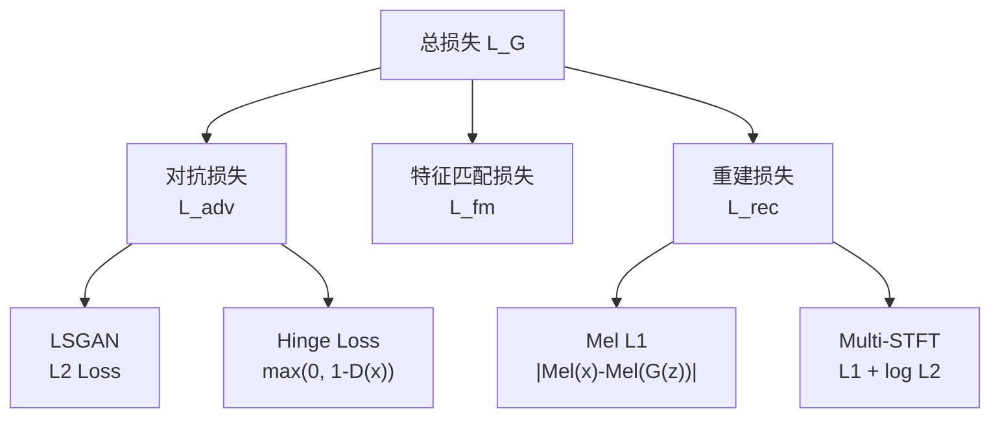

## 前置知识

> [!important]
> 
> 本页展开 [[1.1 声码器共性基础（Vocoder Fundamentals）]] 中的损失函数部分。

---

## 1. 损失函数全景



$$\mathcal{L}_G = \lambda_{\text{adv}} \mathcal{L}_{\text{adv}} + \lambda_{\text{fm}} \mathcal{L}_{\text{fm}} + \lambda_{\text{rec}} \mathcal{L}_{\text{rec}}$$

---

## 2. 对抗损失

### 2.1 LSGAN（Least Squares GAN）

HiFi-GAN 使用：

$$\mathcal{L}_{\text{adv}}^G = \mathbb{E}\left[(D(G(z)) - 1)^2\right]$$

$$\mathcal{L}_{\text{adv}}^D = \mathbb{E}\left[(D(x) - 1)^2 + D(G(z))^2\right]$$

### 2.2 Hinge Loss

SoundStream / BigVGAN 使用：

$$\mathcal{L}_{\text{adv}}^G = -\mathbb{E}\left[D(G(z))\right]$$

$$\mathcal{L}_{\text{adv}}^D = \mathbb{E}\left[\max(0, 1-D(x)) + \max(0, 1+D(G(z)))\right]$$

> [!important]
> 
> **思辨：LSGAN vs Hinge Loss。** LSGAN 对远离决策边界的样本给予更强惩罚（L2 平方增长），但训练后期可能过度惩罚已经很好的样本。Hinge Loss 对判别器设置了 margin（“足够好就停”），训练更稳定。BigVGAN 从 LSGAN 切换到 Hinge Loss 后训练更稳定。

---

## 3. 特征匹配损失（Feature Matching）

从判别器每一层提取特征，计算真实与生成样本的 L1 距离：

$$\mathcal{L}_{\text{fm}} = \sum_{k=1}^{K} \sum_{l=1}^{L_k} \frac{1}{N_{k,l}} \left\| D_k^{(l)}(x) - D_k^{(l)}(G(z)) \right\|_1$$

$K$ 为子判别器数，$L_k$ 为第 $k$ 个子判别器的层数。

```python
def feature_matching_loss(real_fmaps, fake_fmaps):
    """Feature Matching Loss"""
    loss = 0
    for real_fm, fake_fm in zip(real_fmaps, fake_fmaps):
        for r, f in zip(real_fm, fake_fm):
            loss += torch.mean(torch.abs(r.detach() - f))
    return loss
```

---

## 4. 重建损失

### 4.1 Mel L1 Loss

HiFi-GAN 使用，在 Mel 域计算 L1：

$$\mathcal{L}_{\text{mel}} = \left\| \text{Mel}(x) - \text{Mel}(G(z)) \right\|_1$$

### 4.2 Multi-Resolution STFT Loss

SoundStream 使用，在多个窗长下计算 L1 + log L2：

$$\mathcal{L}_{\text{stft}} = \sum_{s} \left[ \left\| |X_s| - |\hat{X}_s| \right\|_1 + \left\| \log|X_s| - \log|\hat{X}_s| \right\|_2 \right]$$

窗长 $s \in \{2^6, 2^7, \dots, 2^{11}\}$。

---

## 5. 权重配置对比

|**模型**|$\lambda_{\text{adv}}$|$\lambda_{\text{fm}}$|$\lambda_{\text{rec}}$|**对抗类型**|
|---|---|---|---|---|
|HiFi-GAN|1|2|45 (Mel L1)|LSGAN|
|BigVGAN|1|2|45 (Mel L1)|Hinge|
|SoundStream|1|100|1 (Multi-STFT)|Hinge|

> [!important]
> 
> **思辨：为什么 HiFi-GAN 的 Mel L1 权重高达 45？** 因为对抗损失在训练早期不稳定，Mel L1 提供稳定的全局梯度信号，保证生成器输出的频谱包络正确。但 SoundStream 反过来，$\lambda_{\text{fm}}=100$ 远大于 $\lambda_{\text{rec}}=1$，说明在 Codec 场景下，判别器特征匹配比线性重建更重要——感知质量优先于像素级精确度。

---

## 子页面

> [!important]
> 
> - → 1.1.3.1 Mel L1 损失详解
> 
> - → 1.1.3.2 Multi-Resolution STFT 损失详解
> 
> - → 1.1.3.3 LSGAN 与 Hinge Loss 对比
> 
> - → 1.1.3.4 Feature Matching 损失详解

[[1.1.3.1 Mel L1 损失详解]]

[[1.1.3.2 Multi-Resolution STFT 损失详解]]

[[1.1.3.3 LSGAN 与 Hinge Loss 对比]]

[[1.1.3.4 Feature Matching 损失详解]]