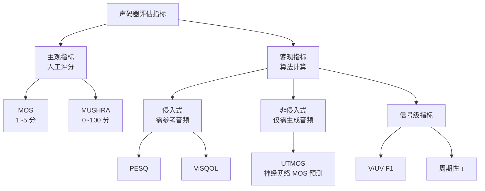

## 前置知识

> [!important]
> 
> 本页展开 [[1.1 声码器共性基础（Vocoder Fundamentals）]] 中的评估指标部分。

---

## 1. 指标分类体系



---

## 2. 主观指标

### 2.1 MOS（Mean Opinion Score）

- 评分范围：1（很差）~ 5（优秀）

- 通常需要 20+ 评分者 × 20+ 样本

- 报告方式：$\text{MOS} \pm 95\%\text{CI}$

- **金标准**，但昂贵、不可复现

### 2.2 MUSHRA（MUltiple Stimuli with Hidden Reference and Anchor）

- 评分范围：0~100

- 同时展示多个系统 + 隐藏参考 + 键

- 更精细的相对比较，SoundStream 论文采用

---

## 3. 客观指标详解

### 3.1 PESQ（Perceptual Evaluation of Speech Quality）

- ITU-T P.862 标准，范围 -0.5 ~ 4.5

- 模拟人耳的感知模型：包括召可度、响度等心理声学模型

- **侧重语音可懂度**，对音乐/歌声不太适用

### 3.2 ViSQOL（Virtual Speech Quality Objective Listener）

- 范围 1 ~ 5（对齐 MOS 刻度）

- 基于谱图相似度（NSIM）

- **对音频压缩更敏感**，SoundStream 论文主用

### 3.3 UTMOS（UTokyo-SaruLab MOS Prediction）

- 神经网络预测的 MOS，范围 1 ~ 5

- **非侵入式**：无需参考音频

- Vocos 论文主用，与人工 MOS 相关性高

### 3.4 V/UV F1

- 测量浊音/清音（Voiced/Unvoiced）分类的准确率

- F1 = 2 × Precision × Recall / (Precision + Recall)

- **衡量基频估计的可靠性**

### 3.5 周期性指标（Periodicity ↓）

- 衡量生成音频中的**周期性伪影**

- 值越低越好，越近真实音频

```python
import pesq
from pesq import pesq as pesq_score

def evaluate_pesq(ref_audio, deg_audio, sr=16000):
    """PESQ 评估（需要 16kHz）"""
    score = pesq_score(sr, ref_audio, deg_audio, 'wb')  # 宽带模式
    return score  # 范围 -0.5 ~ 4.5
```

---

## 4. 指标选择指南

|**场景**|**推荐指标**|**原因**|
|---|---|---|
|论文发表（综合）|MOS + PESQ + UTMOS|主观+客观全覆盖|
|快速迭代|UTMOS + Mel L1|无需人工评分，计算快|
|音频压缩|MUSHRA + ViSQOL|压缩场景的标准测试|
|声码器对比|MOS + PESQ + V/UV F1 + 周期性|Vocos 论文的组合|

> [!important]
> 
> **思辨：客观指标能替代 MOS 吗？** 不能完全替代。UTMOS 与人工 MOS 的 Pearson 相关系数约 0.93，但在特定场景（如非常高质量样本间的微小差异）下仍有偏差。PESQ 对语音可懂度敏感但对自然度不敏感。最稳妥的做法是多指标组合 + 关键实验做 MOS 人工评估。

---

## 子页面

> [!important]
> 
> - → 1.1.4.1 MOS 与 MUSHRA 主观评估详解
> 
> - → 1.1.4.2 PESQ 与 ViSQOL 侵入式指标详解
> 
> - → 1.1.4.3 UTMOS 神经网络 MOS 预测
> 
> - → 1.1.4.4 V/UV F1 与周期性指标

[[1.1.4.1 MOS 与 MUSHRA 主观评估详解]]

[[1.1.4.2 PESQ 与 ViSQOL 侵入式指标详解]]

[[1.1.4.3 UTMOS 神经网络 MOS 预测]]

[[1.1.4.4 V-UV F1 与周期性指标]]