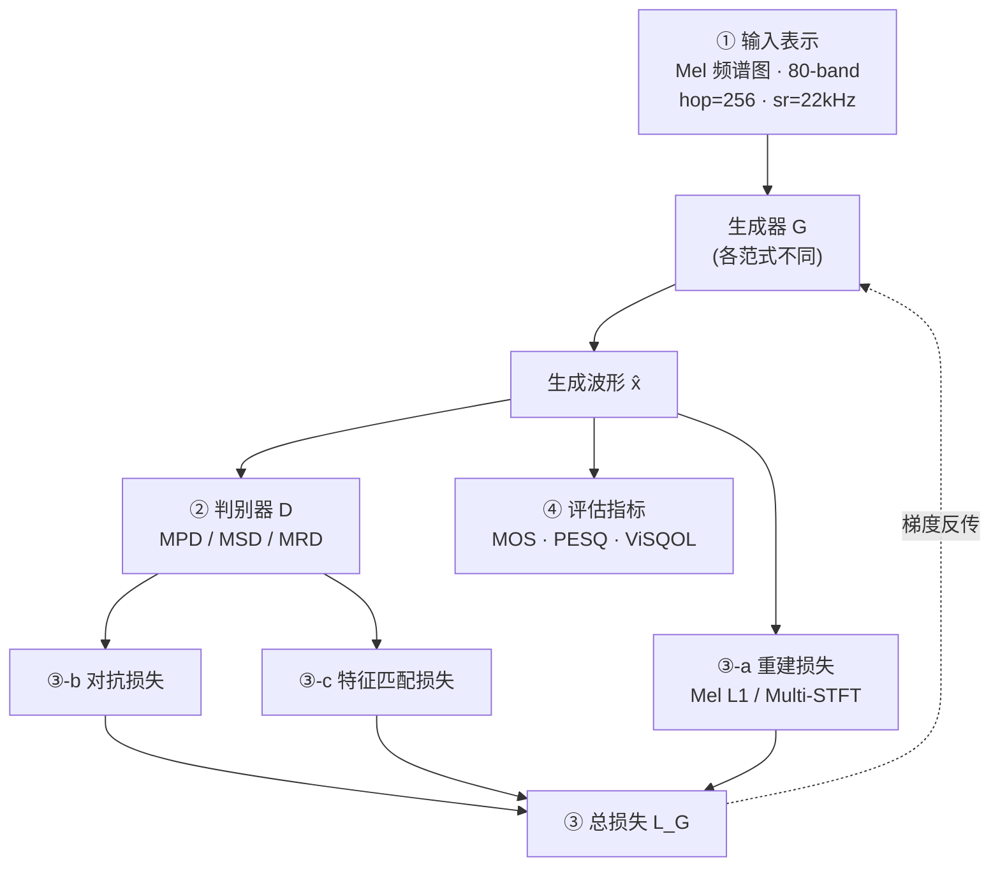
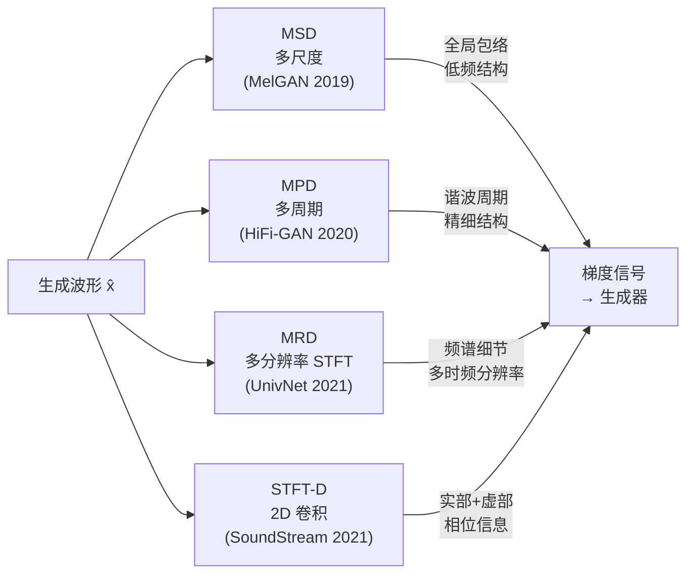
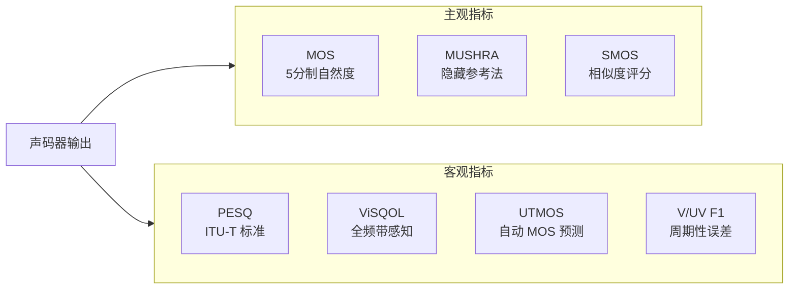

## 前置知识

> [!important]
> 
> 阅读本页前建议先了解：基本数字信号处理概念（采样率、波形、傅里叶变换）、深度学习基础（卷积神经网络、GAN 对抗训练基本概念）

---

## 0. 定位

> 所有声码器范式共享的信号处理基础与训练/评估工具箱——本页是阅读后续各范式（1.2~1.7）的**必要前置**

无论是自回归声码器（Autoregressive Vocoder, WaveNet）、流模型声码器（Flow-based Vocoder, WaveGlow）、时域 GAN 声码器（HiFi-GAN / BigVGAN）、扩散模型声码器（Diffusion Vocoder, DiffWave）、频域声码器（Fourier-based Vocoder, Vocos）还是端到端编解码器（Neural Audio Codec, SoundStream），它们的训练与评估都依赖一套**共享基础设施**。本页梳理这套基础设施的全景图，详细技术解析在各子页面展开。

---

## 1. 声码器训练 Pipeline 全景

声码器的完整训练与评估 pipeline 由四大共性模块组成：



|**模块**|**职责**|**适用范式**|**详见子页面**|
|---|---|---|---|
|① Mel 频谱图与 STFT|声码器的标准输入表示|全部范式|→ 1.1.1|
|② 判别器设计|提供对抗训练梯度信号|GAN / Codec / 部分 Diffusion|→ 1.1.2|
|③ 损失函数体系|驱动生成器优化的多元目标|全部（各有侧重）|→ 1.1.3|
|④ 评估指标|衡量生成音频质量|全部范式|→ 1.1.4|

---

## 2. 模块①：输入表示——Mel 频谱图与 STFT

声码器的输入通常是**梅尔频谱图（Mel Spectrogram）**——一种基于人耳感知特性的时频表示。它由**短时傅里叶变换（Short-Time Fourier Transform, STFT）**计算后经 Mel 滤波器组映射得到。

### 核心参数

|**参数**|**典型值**|**物理含义**|
|---|---|---|
|$n_{\text{fft}}$|1024|FFT 窗口长度，决定频率分辨率 $\Delta f = f_s / n_{\text{fft}}$|
|$\text{hop}$|256|帧移步长，决定时间分辨率与上采样倍率|
|$n_{\text{mel}}$|80~100|Mel 频带数，控制频率维度压缩程度|
|$f_s$|22050 / 24000|采样率|

STFT 将时域信号 $x[n]$ 变换为复数时频表示：

$$\text{STFT}_x[m, k] = \sum_{n=0}^{N-1} x[n] \cdot w[n - m] \cdot e^{-j2\pi kn/N}$$

其中 $w[\cdot]$ 是窗函数（通常 Hann 窗），$m$ 是帧索引，$k$ 是频率索引。Mel 频谱图只保留**幅度** $|S[m,k]|$ 并经 Mel 滤波器组加权，**丢弃了相位信息** $\angle S[m,k]$——这正是声码器必须「幻视」的部分。

> [!important]
> 
> **思辨：丢弃相位真的无所谓吗？**
> 
> 传统观点认为人耳对相位不敏感 [Wang & Lim, 1982]，但后来的研究表明，**精确的相位估计可以显著减少感知损伤** [Saratxaga et al., 2012]。这正是频域声码器（如 Vocos，见 1.6）的核心动机：与其让时域 GAN 隐式学习相位，不如在频域**显式参数化幅度和相位**，让 ISTFT 负责波形重建。

```python
import torch
import torchaudio

def compute_mel_spectrogram(wav_path, n_fft=1024, hop=256, n_mels=80):
    """计算 Mel 频谱图——声码器的标准输入"""
    waveform, sr = torchaudio.load(wav_path)  # 加载音频
    mel_transform = torchaudio.transforms.MelSpectrogram(
        sample_rate=sr,
        n_fft=n_fft,         # FFT 窗口长度
        hop_length=hop,      # 帧移步长 → 上采样倍率
        n_mels=n_mels,       # Mel 频带数
        power=1.0,           # 幅度谱（非功率谱）
    )
    mel = mel_transform(waveform)                       # [1, n_mels, T]
    log_mel = torch.log(torch.clamp(mel, min=1e-5))     # 对数压缩
    return log_mel
    # 声码器任务：从 log_mel [1, 80, T] 恢复 waveform [1, 1, T*256]
```

---

## 3. 模块②：判别器设计范式

GAN 声码器的质量飞跃，很大程度上归功于**判别器（Discriminator）**的创新。不同判别器从不同视角审视音频，形成互补的梯度信号：



|**判别器**|**输入域**|**核心机制**|**捕获特征**|**提出者**|
|---|---|---|---|---|
|MSD（多尺度判别器）|时域波形|原始/×2/×4 下采样后三路并行判别|全局包络、低频结构|MelGAN [Kumar et al., 2019]|
|MPD（多周期判别器）|时域波形|按周期 {2,3,5,7,11} reshape 为 2D 后卷积|谐波周期结构|HiFi-GAN [Kong et al., 2020]|
|MRD（多分辨率判别器）|STFT 幅度谱|多组 (n_fft, hop) 的 STFT 幅度谱输入|多时频分辨率下的频谱细节|UnivNet [Jang et al., 2021]|
|STFT-D（STFT 判别器）|复数 STFT|实部+虚部拼接为双通道，2D 残差卷积|幅度 + 相位联合信息|SoundStream [Zeghidour et al., 2021]|

> [!important]
> 
> **直觉：为什么需要多种判别器？**
> 
> 音频信号同时具有**时域周期性**（基频及其谐波）和**频域结构**（共振峰、频谱包络）。单一判别器只能捕获一个维度的模式。HiFi-GAN 的突破正是因为 MPD 专攻周期结构 + MSD 覆盖全局包络，两者互补。Vocos 则使用 MPD + MRD 的组合。

---

## 4. 模块③：损失函数三元框架

几乎所有现代 GAN 声码器都采用**三元损失体系**：

$$\mathcal{L}_G = \lambda_{\text{adv}} \cdot \mathcal{L}_{\text{adv}} + \lambda_{\text{fm}} \cdot \mathcal{L}_{\text{fm}} + \lambda_{\text{rec}} \cdot \mathcal{L}_{\text{rec}}$$

直觉解释：对抗损失让生成音频「听起来像」真实音频，重建损失确保频谱级匹配，特征匹配损失则在判别器的特征空间中拉近两者。

|**损失组件**|**作用**|**典型形式**|**HiFi-GAN λ**|**SoundStream λ**|
|---|---|---|---|---|
|对抗损失 $\mathcal{L}_{\text{adv}}$|驱动生成器欺骗判别器，提升感知质量|LSGAN / Hinge Loss|1|1|
|特征匹配损失 $\mathcal{L}_{\text{fm}}$|匹配判别器中间层特征，稳定训练|$\frac{1}{KL}\sum_{k,l} \\|D_k^{(l)}(x) - D_k^{(l)}(\hat{x})\\|_1$|2|100|
|重建损失 $\mathcal{L}_{\text{rec}}$|约束频谱级重建精度，防止训练发散|Mel L1 / Multi-Scale STFT|45|1|

> [!important]
> 
> **思辨：λ 配比为什么差异这么大？**
> 
> HiFi-GAN 的 $\lambda_{\text{rec}}=45$ 远大于 SoundStream 的 $\lambda_{\text{rec}}=1$。这是因为 HiFi-GAN 使用单一分辨率的 **Mel L1 损失**，需要较大权重才能有效约束；而 SoundStream 使用 6 种窗长的**多尺度频谱重建损失**，叠加后梯度信号已经很强，$\lambda=1$ 就足够。λ 配比本质上反映的是**各损失项的梯度量级平衡**，不同实现需重新调参。

---

## 5. 模块④：评估指标工具箱

声码器输出质量通过**主观指标**（人工听评）和**客观指标**（算法评估）两条线衡量：



|**指标**|**类型**|**评估维度**|**优势**|**局限**|
|---|---|---|---|---|
|MOS|主观|自然度 1~5 分|金标准，最接近真实感知|昂贵、耗时、不可复现|
|MUSHRA|主观|隐藏参考对比 0~100|区分度高于 MOS|需要专业听评者|
|PESQ|客观|窄带语音质量|ITU-T 标准，广泛采用|仅限语音，16kHz|
|ViSQOL|客观|全频带感知质量|开源、支持音频模式|与 MOS 相关性因数据集而异|
|UTMOS|客观|自动 MOS 预测|快速、免费|仅支持 16kHz|
|V/UV F1|客观|浊音/清音分类精度|直接量化周期性伪影|无法反映音质全貌|

> [!important]
> 
> **常见误区：「客观指标高 = 质量好」**
> 
> PESQ、ViSQOL 等客观指标与 MOS 仅呈**中等相关**（Pearson r ≈ 0.7~0.85）。SoundStream 论文发现，EnCodec 在 PESQ 和周期性误差上与 Vocos 接近，但在 UTMOS（感知分数）上差距巨大。**客观指标应作为开发阶段的快速筛选工具，最终结论必须依赖 MOS/MUSHRA 主观评测。**

---

## 6. 思辨：共性基础如何决定声码器的上限

> [!important]
> 
> **核心洞察：判别器决定质量上限，生成器决定速度下限。**
> 
> 回顾声码器的演进：
> 
> 1. **判别器创新**带来最显著的质量跃升——MelGAN（仅 MSD）MOS 3.79 → HiFi-GAN（MPD+MSD）MOS 4.36
> 
> 1. **损失函数的精心配比**决定训练稳定性——Parallel WaveGAN 引入 Multi-STFT Loss 就是为了稳定 GAN 训练
> 
> 1. **生成器架构**主要影响推理速度和参数效率——Vocos 通过消除转置卷积实现 ×13 加速
> 
> 1. **评估指标的选择**影响优化方向——如果只看 PESQ，可能错过周期性伪影
> 
> 这正是本页将这四大模块作为「共性基础」独立出来的原因：理解它们，才能理解每个范式的设计动机。

---

## 延伸阅读

> [!important]
> 
> **子页面详解：**
> 
> - → 1.1.1 Mel 频谱图与 STFT 基础
> 
> - → 1.1.2 判别器设计范式总览
> 
> - → 1.1.3 声码器损失函数体系
> 
> - → 1.1.4 声码器评估指标
> 
> **后续范式页面（建议按顺序阅读）：**
> 
> - → 1.2 自回归声码器（WaveNet / WaveRNN）
> 
> - → 1.3 Flow-based 声码器（WaveGlow / WaveFlow）
> 
> - → 1.4 时域 GAN 声码器概述
> 
> - → 1.5 扩散模型声码器（DiffWave）
> 
> - → 1.6 频域声码器（Vocos）
> 
> - → 1.7 端到端编解码器（SoundStream / EnCodec）
> 
> - → 1.8 范式对比与选型指南

## 参考文献

- [1] Kumar, K. et al. (2019). "MelGAN: Generative Adversarial Networks for Conditional Waveform Synthesis." NeurIPS 2019.

- [2] Kong, J., Kim, J., & Bae, J. (2020). "HiFi-GAN: Generative Adversarial Networks for Efficient and High Fidelity Speech Synthesis." NeurIPS 2020.

- [3] Jang, W. et al. (2021). "UnivNet: A Neural Vocoder with Multi-Resolution Spectrogram Discriminators." arXiv:2106.07889.

- [4] Zeghidour, N. et al. (2021). "SoundStream: An End-to-End Neural Audio Codec." IEEE/ACM TASLP.

- [5] Siuzdak, H. (2024). "Vocos: Closing the Gap Between Time-Domain and Fourier-Based Neural Vocoders." ICLR 2024.

- [6] Wang, D. & Lim, J. (1982). "The Unimportance of Phase in Speech Enhancement." IEEE TASSP.

- [7] Saratxaga, I. et al. (2012). "Perceptual Importance of the Phase Related Information in Speech." Interspeech 2012.

[[1.1.1 Mel 频谱图与 STFT 基础]]

[[1.1.2 判别器设计范式总览]]

[[1.1.3 声码器损失函数体系]]

[[1.1.4 声码器评估指标体系]]