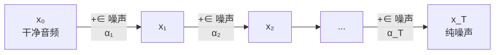

## 前置知识

> [!important]
> 
> 本页是 [[1.5 扩散模型声码器（DiffWave - WaveGrad）]] 的深入展开。需要概率论、贝叶斯基础。

---

## 1. 前向扩散过程（Forward Diffusion）

给定干净数据 $x_0$，前向过程逐步添加高斯噪声：

$$q(x_t | x_{t-1}) = \mathcal{N}(x_t; \sqrt{1-\beta_t}\, x_{t-1},\; \beta_t \mathbf{I})$$

**关键性质：任意步的闭形解**：

$$q(x_t | x_0) = \mathcal{N}(x_t; \sqrt{\bar{\alpha}_t}\, x_0,\; (1-\bar{\alpha}_t) \mathbf{I})$$

其中 $\alpha_t = 1-\beta_t$，$\bar{\alpha}_t = \prod_{s=1}^{t} \alpha_s$。

这意味着可以**一步采样**任意时刻的噪声样本：

$$x_t = \sqrt{\bar{\alpha}_t}\, x_0 + \sqrt{1-\bar{\alpha}_t}\, \epsilon, \quad \epsilon \sim \mathcal{N}(0, \mathbf{I})$$

```python
import torch
import numpy as np

def linear_beta_schedule(T=200, beta_min=1e-4, beta_max=0.02):
    """线性 beta 调度"""
    return torch.linspace(beta_min, beta_max, T)

def get_alpha_cumprod(betas):
    alphas = 1.0 - betas
    alpha_cumprod = torch.cumprod(alphas, dim=0)
    return alpha_cumprod

def forward_diffusion(x0, t, alpha_cumprod):
    """Q(x_t | x_0) 的采样：一步到位"""
    sqrt_alpha_bar = torch.sqrt(alpha_cumprod[t]).view(-1, 1)  # [B, 1]
    sqrt_one_minus = torch.sqrt(1 - alpha_cumprod[t]).view(-1, 1)
    epsilon = torch.randn_like(x0)  # 采样噪声
    x_t = sqrt_alpha_bar * x0 + sqrt_one_minus * epsilon
    return x_t, epsilon  # 返回噪声样本和噪声真值
```



---

## 2. 反向去噪过程（Reverse Denoising）

反向过程用神经网络近似 $q(x_{t-1}|x_t, x_0)$：

$$p_\theta(x_{t-1}|x_t) = \mathcal{N}(x_{t-1}; \mu_\theta(x_t, t),\; \sigma_t^2 \mathbf{I})$$

其中均值的参数化：

$$\mu_\theta(x_t, t) = \frac{1}{\sqrt{\alpha_t}} \left( x_t - \frac{\beta_t}{\sqrt{1-\bar{\alpha}_t}} \epsilon_\theta(x_t, t) \right)$$

---

## 3. 训练目标：ELBO 与 $\epsilon$-prediction

简化后的训练损失：

$$\mathcal{L}_{\text{simple}} = \mathbb{E}_{t, x_0, \epsilon} \left[ \left\| \epsilon - \epsilon_\theta(x_t, t) \right\|^2 \right]$$

> [!important]
> 
> **思辨：为什么预测噪声而不是直接预测** $x_0$**？** Ho et al. (2020) 实验发现 $\epsilon$-prediction 显著优于 $x_0$-prediction。直觉理解：预测噪声相当于预测「当前样本和干净样本的差异」，这是一个更「平坦」的目标（噪声接近各向同性），比直接预测复杂的音频波形容易得多。且 $\epsilon$-prediction 与 score matching 等价。

---

## 4. 采样算法

```python
@torch.no_grad()
def ddpm_sample(model, shape, T, betas, alpha_cumprod):
    """DDPM 采样：T 步反向去噪"""
    alphas = 1.0 - betas
    x_t = torch.randn(shape)  # x_T ~ N(0, I)
    
    for t in reversed(range(T)):
        eps_pred = model(x_t, t)  # 预测噪声
        # 计算均值
        mu = (1 / torch.sqrt(alphas[t])) * (
            x_t - betas[t] / torch.sqrt(1 - alpha_cumprod[t]) * eps_pred
        )
        if t > 0:
            sigma = torch.sqrt(betas[t])
            x_t = mu + sigma * torch.randn_like(x_t)
        else:
            x_t = mu  # 最后一步不加噪声
    return x_t  # 生成的干净样本
```

---

## 子页面

> [!important]
> 
> - → 1.5.1.1 前向扩散过程与噪声调度
> 
> - → 1.5.1.2 反向去噪与 ELBO 推导
> 
> - → 1.5.1.3 ε-prediction 与 score matching 等价性

[[1.5.1.1 前向扩散过程与噪声调度]]

[[1.5.1.2 反向去噪与 ELBO 推导]]

[[1.5.1.3 ε-prediction 与 score matching 等价性]]