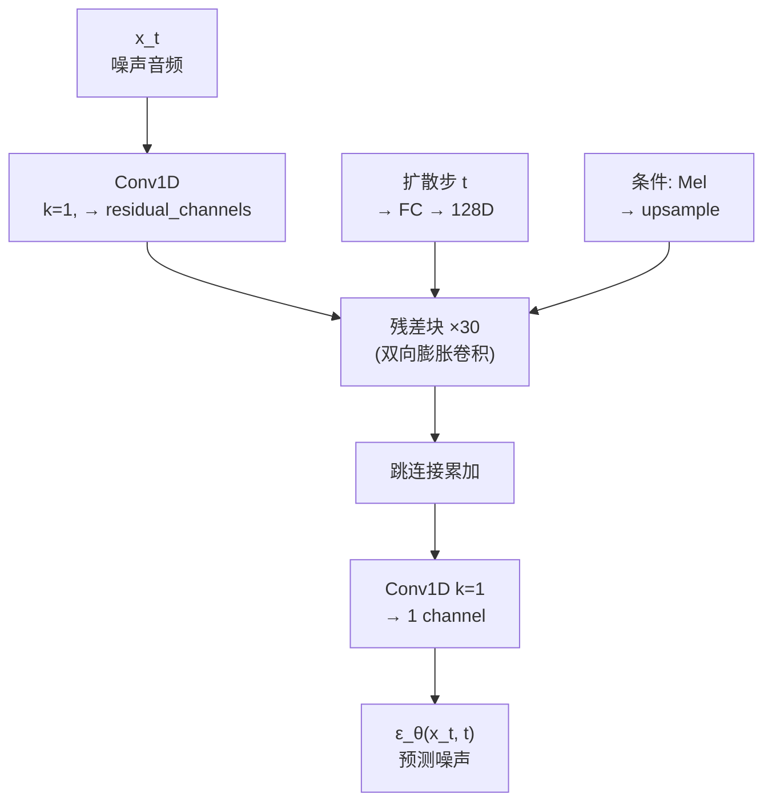

## 前置知识

> [!important]
> 
> 本页是 [[1.5 扩散模型声码器（DiffWave - WaveGrad）]] 的架构详解。建议先读 1.5.1 DDPM 原理。

---

## 1. 整体架构



---

## 2. 双向膨胀卷积（Bidirectional Dilated Convolution）

DiffWave 使用双向膨胀卷积替代 WaveNet 的因果卷积，因为**扩散模型是全序列可见的**。

30 层分为 3 个 cycle，每 cycle 10 层，dilation = [1, 2, 4, ..., 512]：

$$\text{receptive field} = 3 \times \sum_{i=0}^{9} 2^i = 3 \times 1023 = 3069 \text{ samples} \approx 139\text{ms}$$

```python
import torch
import torch.nn as nn

class DiffWaveResBlock(nn.Module):
    def __init__(self, channels, dilation, diffusion_dim=128):
        super().__init__()
        self.dilated_conv = nn.Conv1d(
            channels, 2 * channels,  # 门控机制：一半 tanh，一半 sigmoid
            kernel_size=3, dilation=dilation,
            padding=dilation  # 双向！不是因果填充
        )
        self.diffusion_proj = nn.Linear(diffusion_dim, channels)
        self.cond_conv = nn.Conv1d(80, 2 * channels, 1)  # Mel 条件
        self.res_conv = nn.Conv1d(channels, channels, 1)
        self.skip_conv = nn.Conv1d(channels, channels, 1)
    
    def forward(self, x, diff_step_emb, conditioner):
        # x: [B, C, T]
        h = x + self.diffusion_proj(diff_step_emb).unsqueeze(-1)
        h = self.dilated_conv(h) + self.cond_conv(conditioner)
        # 门控机制（Gated Activation）
        gate = torch.sigmoid(h[:, h.size(1)//2:])
        h = torch.tanh(h[:, :h.size(1)//2]) * gate
        residual = self.res_conv(h) + x  # 残差连接
        skip = self.skip_conv(h)          # 跳连接
        return residual, skip
```

---

## 3. 扩散步嵌入（Diffusion-Step Embedding）

使用与 Transformer 相同的正弦位置编码：

$$e_{2i}(t) = \sin\left(\frac{t}{10000^{2i/d}}\right), \quad e_{2i+1}(t) = \cos\left(\frac{t}{10000^{2i/d}}\right)$$

然后通过两层 FC + Swish 激活映射到 $d$ 维。

> [!important]
> 
> **思辨：为什么扩散模型不需要因果卷积？** WaveNet 的因果卷积是因为自回归生成需要保证 $x_t$ 只依赖 $x_{<t}$。但扩散模型是**去噪**任务，输入是完整的噪声序列，每个位置都可以看到全部上下文。双向卷积提供了×2 的感受野，且参数量相同——这是扩散范式相对于 AR 的结构性优势。

---

## 4. 快速采样（Fast Sampling）

训练时 $T=200$ 步，但推理时可以用子序列采样 $T_{\text{infer}} = 6$ 步：

$$\{t_1, t_2, \dots, t_6\} \subset \{1, 2, \dots, 200\}$$

操作只需重新计算子序列对应的 $\bar{\alpha}$ 和 $\beta$，即可复用同一个模型。

DiffWave 报告 $T=6$ 时 MOS 从 4.44 降到 4.07，仍然远超 WaveGlow（3.81）。

---

## 子页面

> [!important]
> 
> - → 1.5.2.1 双向膨胀卷积与门控机制
> 
> - → 1.5.2.2 扩散步嵌入与条件注入
> 
> - → 1.5.2.3 快速采样策略

[[1.5.2.1 双向膨胀卷积与门控机制]]

[[1.5.2.2 扩散步嵌入与条件注入]]

[[1.5.2.3 快速采样策略]]