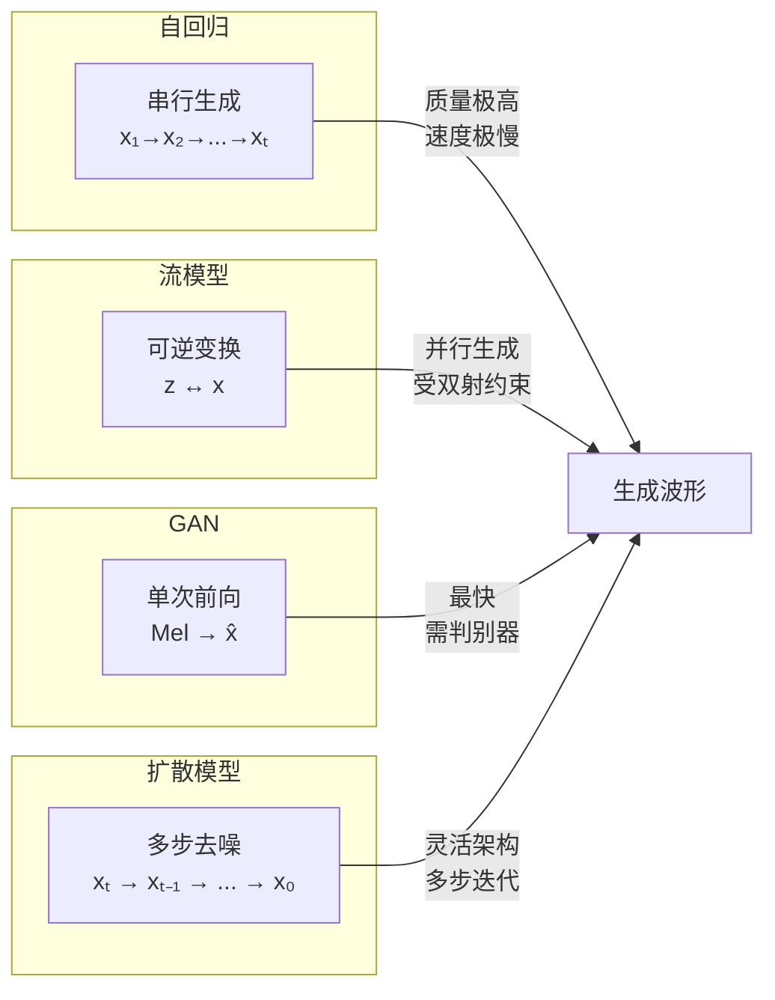
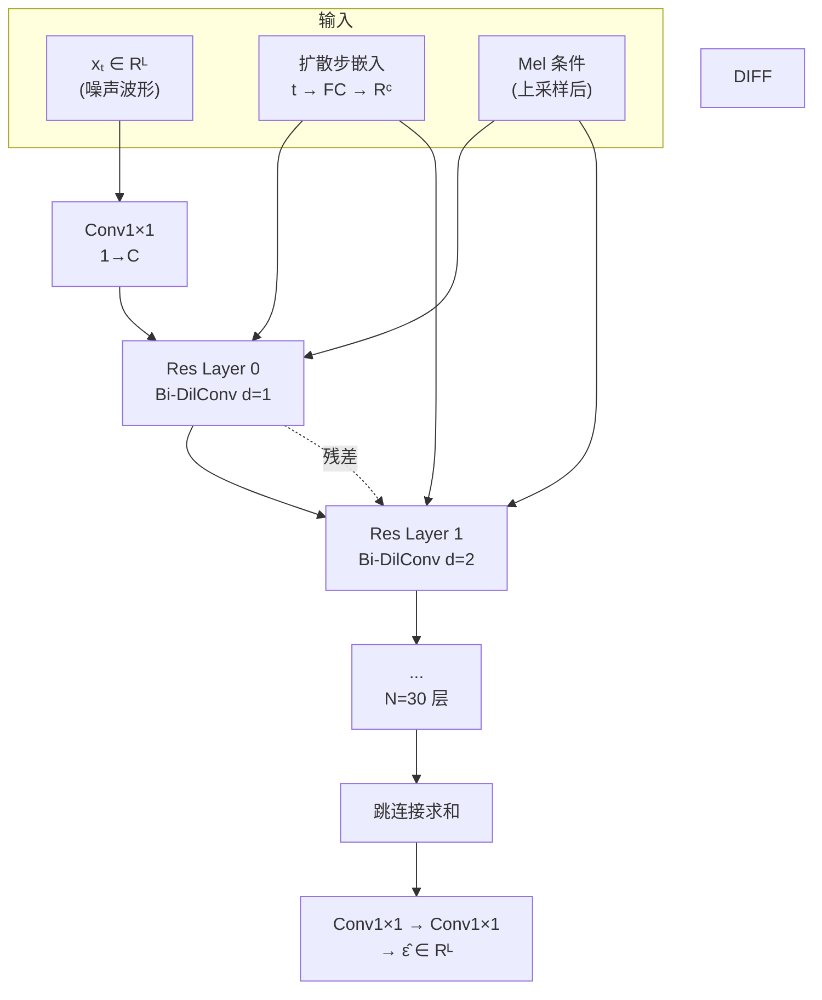

## 前置知识

> [!important]
> 
> 阅读本页前建议先读：
> 
> - [[1.1 声码器共性基础（Vocoder Fundamentals）]]（损失函数、判别器、评估指标）
> 
> - 概率论基础（贝叶斯规则、KL 散度、变分下界 ELBO）

---

## 0. 定位

> 扩散概率模型应用于波形生成的范式——非自回归 + 单 ELBO 目标 + 质量匹敌 WaveNet

**扩散模型声码器（Diffusion Vocoder）**是继自回归（AR）、流模型（Flow）、对抗生成网络（GAN）之后的**第四范式**。其核心思想是通过一个马尔可夫链（Markov Chain）将高斯白噪声逐步转化为结构化波形。代表工作包括 **DiffWave** [Kong et al., ICLR 2021] 和 **WaveGrad** [Chen et al., 2020]。

### 与其他范式的本质区别



|**特性**|**AR (WaveNet)**|**Flow (WaveGlow)**|**GAN (HiFi-GAN)**|**Diffusion (DiffWave)**|
|---|---|---|---|---|
|生成方式|串行、逐样本|并行、单次|并行、单次|并行、多步迭代|
|架构约束|因果卷积|可逆变换|无约束|**无约束**|
|训练目标|最大似然|最大似然|对抗 + 辅助损失|**单一 ELBO**|
|推理步数|T 次（T=采样点数）|1 次|1 次|6~200 步|
|额外网络|无|无|判别器|**无**|

> [!important]
> 
> **扩散模型的独特价值：** 不需要判别器（避免了 GAN 的模式崩溃和训练不稳定），不需要可逆性约束（架构设计自由），只用单一 ELBO 目标就能生成高质量音频。代价是推理需要多步迭代，速度介于 AR 和 GAN 之间。

---

## 1. 扩散概率模型核心思想

扩散模型由两个过程组成：**前向扩散过程**（加噪）和**逆向去噪过程**（生成）。


### 1.1 前向扩散过程（固定，不可学习）

每一步向数据添加少量高斯噪声，经过 $T$ 步后数据完全变为白噪声：

$$q(x_t \mid x_{t-1}) = \mathcal{N}\left(x_t;\, \sqrt{1 - \beta_t}\, x_{t-1},\; \beta_t I\right)$$

其中 $\beta_t$ 是噪声调度（Variance Schedule），控制每步加噪量。利用重参数化技巧，可以直接从 $x_0$ 跳转到任意 $x_t$：

$$q(x_t \mid x_0) = \mathcal{N}\left(x_t;\, \sqrt{\bar{\alpha}_t}\, x_0,\; (1 - \bar{\alpha}_t) I\right)$$

其中 $\alpha_t = 1 - \beta_t$，$\bar{\alpha}_t = \prod_{s=1}^{t} \alpha_s$。这意味着训练时不需要逐步模拟扩散，可以直接采样任意时间步的噪声版本。

|**符号**|**含义**|**范围**|
|---|---|---|
|$\beta_t$|第 $t$ 步的噪声方差|小正数（如 $10^{-4}$ 到 $0.02$）|
|$\alpha_t$|$1 - \beta_t$，信号保留率|$(0, 1)$|
|$\bar{\alpha}_t$|$\prod_{s=1}^{t} \alpha_s$，累积信号保留率|从 1 衰减至 ≈0|
|$T$|总扩散步数|20~200（DiffWave）|

### 1.2 逆向去噪过程（可学习）

逆向过程用神经网络 $\epsilon_\theta$ 在每一步预测并移除噪声：

$$\mu_\theta(x_t, t) = \frac{1}{\sqrt{\alpha_t}} \left( x_t - \frac{\beta_t}{\sqrt{1 - \bar{\alpha}_t}} \epsilon_\theta(x_t, t) \right)$$

直觉解释：$\epsilon_\theta$ 预测「当前 $x_t$ 中混入了多少噪声」，然后用这个预测值去掉噪声，得到更干净的 $x_{t-1}$。

### 1.3 训练目标：简化的 ELBO

训练时最小化以下无权变分下界：

$$\mathcal{L}_{\text{simple}} = \mathbb{E}_{x_0,\, \epsilon,\, t} \left\| \epsilon - \epsilon_\theta\left(\sqrt{\bar{\alpha}_t}\, x_0 + \sqrt{1 - \bar{\alpha}_t}\, \epsilon,\; t\right) \right\|^2$$

直觉解释：随机采样一个时间步 $t$ 和一份噪声 $\epsilon$，网络尝试从加噪后的信号中预测出这份噪声。这个目标令人惊讶地简单——它本质上就是一个噪声预测的 MSE 损失。

```python
import torch
import torch.nn.functional as F

def diffusion_training_step(model, x_0, alpha_bar, T):
    """扩散模型单步训练——核心逻辑仅 5 行"""
    batch_size = x_0.shape[0]
    # 1. 随机采样时间步 t ∈ [1, T]
    t = torch.randint(1, T + 1, (batch_size,), device=x_0.device)
    # 2. 随机采样噪声 ε ~ N(0, I)
    epsilon = torch.randn_like(x_0)
    # 3. 前向扩散：直接计算 x_t = √ā_t * x_0 + √(1-ā_t) * ε
    a_bar_t = alpha_bar[t].view(-1, 1, 1)  # [B, 1, 1]
    x_t = torch.sqrt(a_bar_t) * x_0 + torch.sqrt(1 - a_bar_t) * epsilon
    # 4. 网络预测噪声
    epsilon_pred = model(x_t, t)  # ε_θ(x_t, t)
    # 5. MSE 损失
    loss = F.mse_loss(epsilon_pred, epsilon)
    return loss
```

> [!important]
> 
> **思辨：为什么如此简单的目标就能生成高质量音频？**
> 
> 答案在于扩散过程的「免费午餐」——前向加噪是固定的（不需要学习），它自动提供了覆盖所有噪声级别的训练数据。网络只需要学习一个任务：在给定噪声级别 $t$ 下，从 $x_t$ 中拆分出噪声 $\epsilon$。相比 GAN 需要联合训练判别器（易崩溃）、VAE 需要联合训练编码器（易后验崩溃），扩散模型只训练一个网络，从根本上避免了双网络联合训练的不稳定性。

---

## 2. DiffWave 架构概览

DiffWave 的神经网络 $\epsilon_\theta$ 采用**双向膨胀卷积（Bidirectional Dilated Convolution）**架构，与 WaveNet 的因果卷积不同——因为扩散模型是非自回归的，不需要因果性约束。



### 架构要点

|**组件**|**设计**|**动机**|
|---|---|---|
|卷积类型|**双向**膨胀卷积（kernel=3）|非 AR，无需因果性，双向信息提升质量|
|膨胀率循环|[1, 2, 4, ..., 512] × 3 块 = 30 层|感受野 r = (k-1)Σdᵢ + 1 = 6139|
|时间步嵌入|正弦编码 → 共享 FC → 层独立 FC|网络需对不同 t 输出不同的 ε̂|
|条件输入|Mel 转置卷积上采样 → 层独立 Conv1×1|作为 bias 加入各残差层|
|门控激活|tanh ⊙ sigmoid|沿用 WaveNet 门控设计|
|参数量|BASE 2.64M / LARGE 6.91M|远小于 WaveGlow 87.88M|

> [!important]
> 
> **感受野放大效应：** DiffWave 的一个独特优势是，通过逆向过程的 $T$ 次迭代，有效感受野可以放大至 $T \times r$。例如 $T=200$、$r=6139$ 时，等效感受野达到 120 万个采样点（约75秒 @16kHz）。这使得 DiffWave 尤其适合**无条件生成**——模型需要在没有任何条件信息的情况下生成连贯的语音。

---

## 3. DiffWave 关键实验结果

### 3.1 神经声码器任务（条件生成）

|**模型**|**T / T_infer**|**参数量**|**MOS ↑**|**速度**|
|---|---|---|---|---|
|WaveNet|—|4.57M|4.43 ± 0.10|×0.003 实时|
|WaveGlow|—|87.88M|4.33 ± 0.12|×22 实时|
|WaveFlow|—|22.25M|4.40 ± 0.07|×40+ 实时|
|**DiffWave BASE**|50/50|**2.64M**|**4.38 ± 0.08**|×1.1 实时|
|**DiffWave LARGE**|200/200|**6.91M**|**4.44 ± 0.07**|—|
|DiffWave BASE (Fast)|50/6|2.64M|4.37 ± 0.07|×5.6 实时|
|Ground-truth|—|—|4.52 ± 0.06|—|

数据来源：[Kong et al., ICLR 2021, Table 1]

### 3.2 无条件生成任务

DiffWave 在 SC09 数据集上的无条件生成中碾压了 WaveNet 和 WaveGAN：

|**模型**|**FID ↓**|**IS ↑**|**MOS ↑**|
|---|---|---|---|
|WaveNet-256|2.947|2.84|1.43|
|WaveGAN|1.349|4.53|2.03|
|**DiffWave**|**1.287**|**5.30**|**3.39**|
|Test set|0.011|8.47|3.72|

数据来源：[Kong et al., ICLR 2021, Table 2]

> [!important]
> 
> **常见误区：「扩散模型比 GAN 慢太多，没有实用价值」**
> 
> DiffWave 的快速采样算法（$T_{\text{infer}}=6$）可以在 MOS 仅降 0.07 的情况下实现 ×5.6 实时。而且扩散模型的真正价值不在于替代 GAN 做声码器，而在于：
> 
> 1. **无条件生成**（GAN 在此任务上表现很差）
> 
> 1. **零样本语音去噪**（无需专门训练）
> 
> 1. **与 LLM-based TTS 的融合**（如与离散 token 的结合）

---

## 4. 思辨：扩散模型声码器的定位与未来

> [!important]
> 
> **扩散模型不是 GAN 的替代者，而是互补者。**
> 
> 在**条件生成**（如 Mel → 波形）场景下，GAN 声码器（HiFi-GAN/BigVGAN/Vocos）仍是最佳选择：单次前向、极快推理、质量优秀。
> 
> 扩散模型的**不可替代优势**在于：
> 
> - **训练稳定性**：无判别器、无模式崩溃、单目标函数
> 
> - **无条件生成能力**：感受野放大使其能生成连贯长序列
> 
> - **架构自由度**：无双射约束，模型可以做得极小（BASE 仅 2.64M）
> 
> - **零样本能力**：学到的数据先验可直接用于去噪等下游任务
> 
> 未来趋势是两者融合：如用扩散模型做粗糒生成 + GAN 做精细化，或在 Codec 框架中用扩散模型做解码器。

---

## 延伸阅读

> [!important]
> 
> **子页面详解：**
> 
> - → 1.5.1 扩散概率模型（DDPM）原理
> 
> - → 1.5.2 DiffWave 架构详解
> 
> - → 1.5.3 DiffWave 实验与范式分析
> 
> **相关范式对比：**
> 
> - → [[1.2 自回归声码器（WaveNet - WaveRNN）]]（DiffWave 质量匹敌的对标）
> 
> - → 1.8 范式对比与选型指南

## 参考文献

- [1] Kong, Z., Ping, W., Huang, J., Zhao, K., & Catanzaro, B. (2021). "DiffWave: A Versatile Diffusion Model for Audio Synthesis." ICLR 2021.

- [2] Chen, N., Zhang, Y., Zen, H., et al. (2020). "WaveGrad: Estimating Gradients for Waveform Generation." arXiv:2009.00713.

- [3] Ho, J., Jain, A., & Abbeel, P. (2020). "Denoising Diffusion Probabilistic Models." NeurIPS 2020.

- [4] Song, Y. & Ermon, S. (2019). "Generative Modeling by Estimating Gradients of the Data Distribution." NeurIPS 2019.

[[1.5.1 DDPM 原理：前向扩散与反向去噪]]

[[1.5.2 DiffWave 架构详解]]

[[1.5.3 DiffWave 实验分析与局限思辨]]