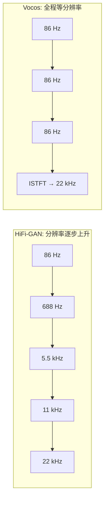

## 前置知识

> [!important]
> 
> 本页展开 [[1.6 频域声码器（Vocos - iSTFTNet）]] 的架构核心。建议先读 1.6.1 动机。

---

## 1. 等分辨率设计（Isotropic Architecture）

Vocos 的所有层都在 $f_s / \text{hop}$ 分辨率下操作（22kHz, hop=256 → 约 86 帧/秒），无需任何分辨率变化：



---

## 2. ConvNeXt Block 1D

每个 block 包含：

1. **Depthwise Conv**（k=7, groups=dim）：大 kernel 捕获长程依赖

1. **LayerNorm**

1. **Inverted Bottleneck**：1×1 升维 → GELU → 1×1 降维

1. **残差连接**

```python
import torch.nn as nn

class ConvNeXtBlock1D(nn.Module):
    def __init__(self, dim, intermediate_dim, kernel_size=7):
        super().__init__()
        self.dwconv = nn.Conv1d(dim, dim, kernel_size,
                                padding=kernel_size//2, groups=dim)
        self.norm = nn.LayerNorm(dim)
        self.pwconv1 = nn.Linear(dim, intermediate_dim)
        self.act = nn.GELU()
        self.pwconv2 = nn.Linear(intermediate_dim, dim)
    
    def forward(self, x):  # x: [B, C, T]
        residual = x
        x = self.dwconv(x).transpose(1, 2)  # → [B, T, C]
        x = self.norm(x)
        x = self.pwconv2(self.act(self.pwconv1(x)))  # inverted bottleneck
        return x.transpose(1, 2) + residual
```

> [!important]
> 
> **思辨：为什么 ConvNeXt 比 ResBlock 更适合频域？** HiFi-GAN 的 ResBlock 用膨胀卷积 (dilation 1,3,5) 模拟多尺度感受野，这是为**逐步上升的时间分辨率**设计的。Vocos 全程等分辨率，需要的是**固定分辨率下的大感受野**——ConvNeXt 的 7×1 depthwise conv 正好满足这个需求，且 inverted bottleneck 提供了更高效的通道混合。

---

## 3. ISTFT Head

### 3.1 幅度参数化

$$\mathbf{M} = \exp(\mathbf{m}) \quad \text{（对数域预测 → 指数保证非负）}$$

### 3.2 相位参数化：单位圆映射

$$\mathbf{x} = \cos(\mathbf{p}), \quad \mathbf{y} = \sin(\mathbf{p})$$

$$\text{STFT} = \mathbf{M} \cdot (\mathbf{x} + j\mathbf{y})$$

任意实数 $p$ 都映射到单位圆上合法的相位角，**无需担心边界问题**。

```python
class ISTFTHead(nn.Module):
    def __init__(self, hidden_dim, n_fft=1024, hop_length=256):
        super().__init__()
        self.n_fft = n_fft
        self.hop_length = hop_length
        self.proj = nn.Linear(hidden_dim, n_fft + 2)  # n_fft/2+1 幅度 + n_fft/2+1 相位
    
    def forward(self, x):  # x: [B, T, D]
        h = self.proj(x)
        n_freq = self.n_fft // 2 + 1
        magnitude = torch.exp(h[..., :n_freq])
        cos_p = torch.cos(h[..., n_freq:])
        sin_p = torch.sin(h[..., n_freq:])
        stft = torch.complex(magnitude * cos_p, magnitude * sin_p).transpose(1, 2)
        window = torch.hann_window(self.n_fft, device=stft.device)
        return torch.istft(stft, self.n_fft, hop_length=self.hop_length, window=window)
```

---

## 子页面

> [!important]
> 
> - → 1.6.2.1 ConvNeXt 1D 详解
> 
> - → 1.6.2.2 ISTFT Head 与相位参数化
> 
> - → 1.6.2.3 iSTFTNet 对比：部分替换 vs 全替换

[[1.6.2.1 ConvNeXt 1D 详解]]

[[1.6.2.2 ISTFT Head 与相位参数化]]

[[1.6.2.3 iSTFTNet 对比：部分替换 vs 全替换]]