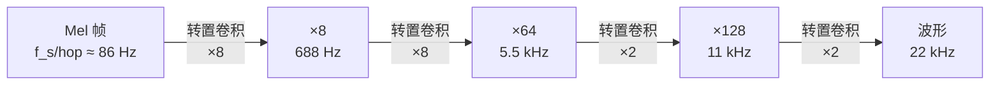
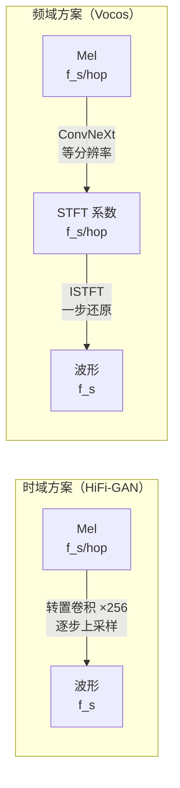
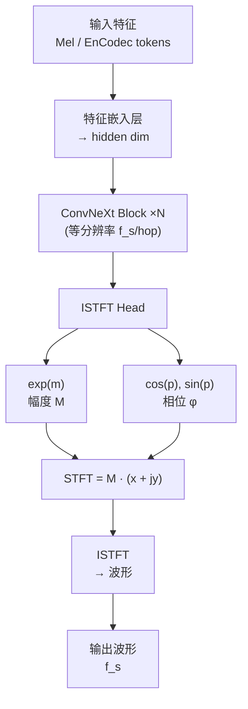

## 前置知识

> [!important]
> 
> 阅读本页前建议先读：
> 
> - [[1.1 声码器共性基础（Vocoder Fundamentals）]]（STFT/Mel 基础、判别器、损失函数）
> 
> - [[1.4 时域 GAN 声码器概述（MelGAN → HiFi-GAN → BigVGAN）]]（理解频域方案要解决的问题）

---

## 0. 定位

> 在 STFT 频域直接生成幅度+相位、用 ISTFT 替代转置卷积上采样、实现速度数量级突破

**频域声码器（Fourier-based Vocoder）**代表了声码器设计的一次范式转换：不再在时域逐步上采样波形，而是**直接生成 STFT 频谱系数（幅度 + 相位）**，再用快速逆傅里叶变换（ISTFT）一步还原波形。代表工作包括 **Vocos** [Siuzdak, ICLR 2024] 和 **iSTFTNet** [Kaneko et al., ICASSP 2022]。

---

## 1. 从时域到频域：范式转换的动机

### 1.1 时域上采样的三大痛点

传统时域 GAN 声码器（HiFi-GAN / BigVGAN）使用**转置卷积（Transposed Convolution）**将 Mel 帧逐步上采样到波形分辨率：



这带来三个问题：

|**痛点**|**原因**|**后果**|
|---|---|---|
|① 棋盘格伪影|转置卷积的 stride 与 kernel 不匹配|频谱中出现规律性噪声|
|② 混叠失真|上采样过程中高频信号折叠|高频谐波缺失或畸变|
|③ 计算冗余|网络在高分辨率下做大量卷积|GPU 速度受限于高分辨率层|

### 1.2 频域方案的结构性优势

Vocos 的核心洞察：**声码器的上采样本质上就是 ISTFT**——既然最终目的是从频域表示恢复时域波形，为什么不直接在频域操作？



> [!important]
> 
> **关键区别：等时间分辨率（Isotropic Architecture）。** Vocos 的所有层都在 $f_s / \text{hop}$ 的低分辨率下操作，无需任何转置卷积。上采样完全由数学确定的 ISTFT 完成——这是一个 $O(N \log N)$ 的快速算法，不引入任何可学习参数或伪影。

---

## 2. Vocos 架构详解



### 2.1 ConvNeXt 骨干网络（Backbone）

Vocos 采用 **ConvNeXt** [Liu et al., CVPR 2022] 的 1D 变体作为骨干网络，替代了 HiFi-GAN 的残差块 + 膨胀卷积设计：

|**组件**|**ConvNeXt Block**|**HiFi-GAN ResBlock**|
|---|---|---|
|卷积类型|7×1 Depthwise Conv|3×1 Dilated Conv|
|通道混合|1×1 Pointwise Conv (Inverted Bottleneck)|1×1 Conv|
|激活函数|GELU|LeakyReLU|
|归一化|LayerNorm|无|

```python
import torch
import torch.nn as nn

class ConvNeXtBlock1D(nn.Module):
    """Vocos 使用的 1D ConvNeXt Block"""
    def __init__(self, dim, intermediate_dim, kernel_size=7):
        super().__init__()
        # 1. 深度可分离卷积（Depthwise Conv）：大 kernel 捕获长程依赖
        self.dwconv = nn.Conv1d(
            dim, dim, kernel_size,
            padding=kernel_size // 2, groups=dim  # groups=dim → depthwise
        )
        self.norm = nn.LayerNorm(dim)
        # 2. 逆瓶颈（Inverted Bottleneck）：先升维再降维
        self.pwconv1 = nn.Linear(dim, intermediate_dim)  # 升维
        self.act = nn.GELU()
        self.pwconv2 = nn.Linear(intermediate_dim, dim)   # 降维
    
    def forward(self, x):
        # x: [B, C, T]
        residual = x
        x = self.dwconv(x)           # [B, C, T] → depthwise conv
        x = x.transpose(1, 2)        # [B, T, C] → for LayerNorm
        x = self.norm(x)
        x = self.pwconv1(x)           # [B, T, C] → [B, T, C*h]
        x = self.act(x)
        x = self.pwconv2(x)           # [B, T, C*h] → [B, T, C]
        x = x.transpose(1, 2)        # [B, C, T]
        return x + residual           # 残差连接
```

### 2.2 ISTFT Head：幅度与相位参数化

这是 Vocos 最核心的创新。网络输出 $n_{\text{fft}} + 2$ 个通道，拆分为幅度部分 $\mathbf{m}$ 和相位部分 $\mathbf{p}$：

**幅度估计**——对数域预测后取指数，保证非负：

$$\mathbf{M} = \exp(\mathbf{m})$$

**相位估计**——映射到单位圆，自动保证相位缠绕在 $(-\pi, \pi]$：

$$\mathbf{x} = \cos(\mathbf{p}), \quad \mathbf{y} = \sin(\mathbf{p})$$

$$\text{STFT} = \mathbf{M} \cdot (\mathbf{x} + j\mathbf{y})$$

$$\varphi = \text{atan2}(\mathbf{y}, \mathbf{x}) \in (-\pi, \pi]$$

> [!important]
> 
> **思辨：为什么单位圆映射优于直接预测相位？**
> 
> 消融实验（Vocos with absolute phase）显示，使用 tanh 直接缩放到 $[-\pi, \pi]$ 的方式导致质量显著下降（UTMOS 3.734 → 3.590）。原因在于：**相位本质上是周期的**（$\pi$ 和 $-\pi$ 是同一个角度），tanh 映射没有这个归纳偏置。而 $\cos/\sin$ 单位圆映射天然具有周期性——任意实数 $p$ 都会被映射到合法的相位角，无需担心边界问题。

```python
import torch
import torch.nn as nn

class ISTFTHead(nn.Module):
    """Vocos ISTFT Head：从隐藏特征生成 STFT 系数"""
    def __init__(self, hidden_dim, n_fft=1024, hop_length=256):
        super().__init__()
        self.n_fft = n_fft
        self.hop_length = hop_length
        # 输出 n_fft+2 通道：前 n_fft/2+1 为幅度，后 n_fft/2+1 为相位
        self.proj = nn.Linear(hidden_dim, n_fft + 2)
    
    def forward(self, x):
        # x: [B, T, hidden_dim]
        h = self.proj(x)  # [B, T, n_fft+2]
        n_freq = self.n_fft // 2 + 1
        m = h[..., :n_freq]       # 幅度（对数域）
        p = h[..., n_freq:]       # 相位（任意实数）
        
        magnitude = torch.exp(m)   # 幅度 = exp(m)，保证非负
        cos_p = torch.cos(p)       # 单位圆 x 分量
        sin_p = torch.sin(p)       # 单位圆 y 分量
        
        # 构造复数 STFT：M * (cos + j*sin)
        stft_real = magnitude * cos_p
        stft_imag = magnitude * sin_p
        stft = torch.complex(stft_real, stft_imag)  # [B, T, n_freq]
        stft = stft.transpose(1, 2)  # [B, n_freq, T]
        
        # ISTFT 一步还原波形
        window = torch.hann_window(self.n_fft, device=stft.device)
        audio = torch.istft(stft, self.n_fft,
                           hop_length=self.hop_length,
                           window=window)
        return audio  # [B, T_samples]
```

---

## 3. iSTFTNet 对比：部分替换 vs 全频域

**iSTFTNet** [Kaneko et al., 2022] 是最早尝试用 ISTFT 替代转置卷积的工作，但它只替换了**最后两层**上采样，前面仍用转置卷积。论文发现替换更多层会导致质量骤降。

Vocos 的突破在于**完全消除转置卷积**：

|**特性**|**iSTFTNet**|**Vocos**|
|---|---|---|
|ISTFT 替换范围|仅最后 2 层上采样|**全部上采样**（零转置卷积）|
|骨干网络|HiFi-GAN ResBlock|**ConvNeXt Block**|
|时间分辨率|逐步上升|**全程等分辨率**|
|相位建模|tanh 缩放到 $[-\pi,\pi]$|**单位圆 cos/sin 映射**|
|GPU xRT|1045.94|**6696.52**|
|PESQ ↑|2.942|**3.70**|

> [!important]
> 
> **思辨：为什么 iSTFTNet 替换更多层就崩了，而 Vocos 全替换反而成功？**
> 
> 关键在于 **骨干网络的匹配**。iSTFTNet 沿用 HiFi-GAN 的 ResBlock + 膨胀卷积，这些组件是为逐步上升的时间分辨率设计的。当强行保持低分辨率时，膨胀卷积的感受野模式不再适配。Vocos 换用 ConvNeXt Block（大 kernel depthwise conv + inverted bottleneck），这种 isotropic 架构天然适合等分辨率操作。此外，单位圆相位参数化也比 tanh 更适合频域建模。

---

## 4. Vocos 关键实验结果

### 4.1 客观指标

|**模型**|**UTMOS ↑**|**VISQOL ↑**|**PESQ ↑**|**V/UV F1 ↑**|**周期性 ↓**|
|---|---|---|---|---|---|
|HiFi-GAN|3.669|4.57|3.093|0.9457|0.129|
|iSTFTNet|3.564|4.56|2.942|0.9372|0.141|
|BigVGAN|3.749|4.65|3.693|0.9557|0.108|
|**Vocos**|**3.734**|**4.66**|**3.70**|**0.9582**|**0.101**|

数据来源：[Siuzdak, ICLR 2024, Table 1]

### 4.2 推理速度

|**模型**|**GPU xRT ↑**|**CPU xRT ↑**|**参数量**|
|---|---|---|---|
|HiFi-GAN|495.54|5.84|14.0M|
|BigVGAN|98.61|0.40|14.0M|
|iSTFTNet|1045.94|14.44|13.3M|
|**Vocos**|**6696.52**|**169.63**|**13.5M**|

数据来源：[Siuzdak, ICLR 2024, Table 6]

> [!important]
> 
> **常见误区：「频域方法牺牲质量换速度」**
> 
> Vocos 在**几乎所有客观指标上超越或持平 BigVGAN**（VISQOL 4.66 vs 4.65、PESQ 3.70 vs 3.693、周期性 0.101 vs 0.108），同时 GPU 速度是 BigVGAN 的 **×68 倍**、HiFi-GAN 的 **×13 倍**。频域方案不是速度-质量的 trade-off，而是**帕累托最优**——速度和质量同时提升。

### 4.3 消融实验关键发现

|**变体**|**UTMOS ↑**|**PESQ ↑**|**结论**|
|---|---|---|---|
|Vocos（完整）|3.734|3.70|基线|
|w/ absolute phase（tanh 相位）|3.590 ↓|3.565 ↓|**单位圆映射至关重要**|
|w/ Snake 激活|3.699 ↓|3.629 ↓|**频域已内建周期性，Snake 无增益**|
|w/o ConvNeXt（用 ResBlock）|3.658 ↓|3.528 ↓|**ConvNeXt 块对频域架构不可或缺**|

> [!important]
> 
> **思辨：为什么 Snake 在 Vocos 中无效？**
> 
> Snake 激活函数（$x + \frac{1}{\alpha}\sin^2(\alpha x)$）的核心目的是为时域 GAN 引入**周期性归纳偏置**，解决时域模型难以建模谐波的问题。但 Vocos 在频域操作，**傅里叶基函数本身就是周期的**——STFT 的每个频率 bin 天然对应一个正弦/余弦分量。因此，频域架构已经通过 ISTFT 隐式获得了周期性归纳偏置，无需额外的 Snake 激活。这正是频域方案的结构性优势。

---

## 5. Vocos 与 Neural Codec：EnCodec 解码器替换

Vocos 不仅可以做 Mel → 波形的声码器，还可以作为**神经音频编解码器的解码器**。实验显示，Vocos 替换 EnCodec 的解码器后，在所有带宽下 MOS 均大幅提升：

|**带宽**|**Vocos MOS ↑**|**EnCodec MOS ↑**|
|---|---|---|
|1.5 kbps|**2.73**|1.09|
|3 kbps|**3.50**|1.71|
|6 kbps|**3.84**|2.41|
|12 kbps|**4.00**|3.08|

数据来源：[Siuzdak, ICLR 2024, Table 5]

Vocos 还可以直接作为 **Bark TTS**（基于 GPT + EnCodec token 的 TTS 系统）的 drop-in 替换解码器，无需重新训练 TTS 模型。

---

## 6. 思辨：频域声码器的定位与边界

> [!important]
> 
> **频域 ≠ 万能，但它改变了速度-质量的帕累托前沿。**
> 
> **Vocos 的核心启示：**
> 
> 1. **上采样应该是数学的，不是学习的。** ISTFT 是精确的、无参数的、O(N log N) 的——没有理由用可学习的转置卷积去「近似」一个已知的数学变换
> 
> 1. **骨干网络必须匹配操作分辨率。** ConvNeXt 的 isotropic 设计天然适配等分辨率操作，而 HiFi-GAN 的 ResBlock 是为逐步上升的分辨率设计的
> 
> 1. **归纳偏置应来自表示，而非激活函数。** 傅里叶基函数天然是周期的，比 Snake 激活更根本地解决了周期性建模问题
> 
> **但频域方案也有边界：** MDCT 变体实验表明，**STFT 的过完备性（冗余表示）反而有利于 GAN 训练** [Gritsenko et al., 2020]——临界采样的 MDCT 因为缺少冗余，训练更困难、质量更差。这说明频域方案的成功不仅依赖频域本身，还依赖于 STFT 这一特定表示的冗余性。

---

## 延伸阅读

> [!important]
> 
> **子页面详解：**
> 
> - → 1.6.1 从时域到频域：范式转换的动机
> 
> - → 1.6.2 Vocos 架构详解
> 
> - → 1.6.3 Vocos 消融实验与设计启示
> 
> - → 1.6.4 Vocos 性能：速度×质量帕累托最优
> 
> - → 1.6.5 MDCT 变体与频域冗余性分析
> 
> **相关页面：**
> 
> - → [[1.4 时域 GAN 声码器概述（MelGAN → HiFi-GAN → BigVGAN）]]（Vocos 要解决的问题）
> 
> - → 1.7 端到端编解码器（SoundStream / EnCodec）（Vocos 作为 Codec 解码器替换）

## 参考文献

- [1] Siuzdak, H. (2024). "Vocos: Closing the Gap Between Time-Domain and Fourier-Based Neural Vocoders for High-Quality Audio Synthesis." ICLR 2024.

- [2] Kaneko, T. et al. (2022). "iSTFTNet: Fast and Lightweight Mel-Spectrogram Vocoder Incorporating Inverse Short-Time Fourier Transform." ICASSP 2022.

- [3] Liu, Z. et al. (2022). "A ConvNet for the 2020s." CVPR 2022.

- [4] Gritsenko, A. et al. (2020). "A Spectral Energy Distance for Parallel Speech Synthesis." NeurIPS 2020.

- [5] Kong, J. et al. (2020). "HiFi-GAN." NeurIPS 2020.

- [6] Lee, S. et al. (2022). "BigVGAN." arXiv:2206.04658.

[[1.6.1 从时域到频域：范式转换的动机]]

[[1.6.2 Vocos 架构详解：ConvNeXt + ISTFT Head]]

[[1.6.3 Vocos 消融实验与设计启示]]

[[1.6.4 Vocos 性能：速度×质量帕累托最优]]

[[1.6.5 MDCT 变体与频域冗余性分析]]