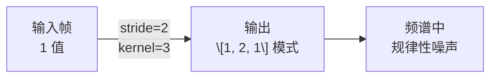

## 前置知识

> [!important]
> 
> 本页是 [[1.6 频域声码器（Vocos - iSTFTNet）]] 的深入展开。

---

## 1. 转置卷积上采样的三大问题

### 1.1 棋盘格伪影（Checkerboard Artifacts）

当转置卷积的 kernel_size 不能被 stride 整除时，输出的相邻元素接收到**不均匀的贡献**：

$$\text{overlap}(i) = \text{kernel\_size} - \gcd(\text{kernel\_size}, \text{stride})$$



HiFi-GAN 通过 **kernel_size = 2 × stride** 缓解但无法完全消除。

### 1.2 混叠失真（Aliasing）

上采样引入的高频分量超过 Nyquist 频率时会折叠到低频：

$$f_{\text{alias}} = f_s - f_{\text{true}}$$

BigVGAN 引入抗混叠模块（AMP）部分解决，但增加了计算量。

### 1.3 高分辨率计算瓶颈

```python
# HiFi-GAN 的计算分布（估算）
# 输入: [B, 512, T_mel]  → T_mel ≈ 86 帧/秒
# 上采样 ×8:  [B, 256, T×8]    ← 7% FLOPs
# 上采样 ×8:  [B, 128, T×64]   ← 14% FLOPs  
# 上采样 ×2:  [B, 64, T×128]   ← 28% FLOPs
# 上采样 ×2:  [B, 32, T×256]   ← 51% FLOPs  ← 最慢！
# 大量 FLOPs 花在最高分辨率层
```

> [!important]
> 
> **思辨：上采样是声码器速度的核心瓶颈。** HiFi-GAN 超过 50% 的计算量花在最后一层（最高分辨率）上。Vocos 通过在低分辨率（$f_s/\text{hop}$）下完成所有计算，然后用 O(N log N) 的 ISTFT 一步上采样，从根本上消除了这个瓶颈。

---

## 2. ISTFT 的数学确定性优势

ISTFT 是 STFT 的精确逆变换：

$$x(n) = \frac{\sum_m w(n - mH) \cdot \text{Re}\left[\sum_{k=0}^{N-1} X(m,k) e^{j2\pi kn/N}\right]}{\sum_m w^2(n - mH)}$$

- **精确**：数学上无误差

- **无参数**：不引入可学习参数

- **快速**：$O(N \log N)$ FFT 算法

- **无伪影**：不会产生棋盘格或混叠

> [!important]
> 
> **核心洞察：** 既然声码器的目标就是从频域表示还原时域波形，而 ISTFT 就是这个精确的数学变换——为什么要用可学习的转置卷积去「近似」一个已知的精确变换？