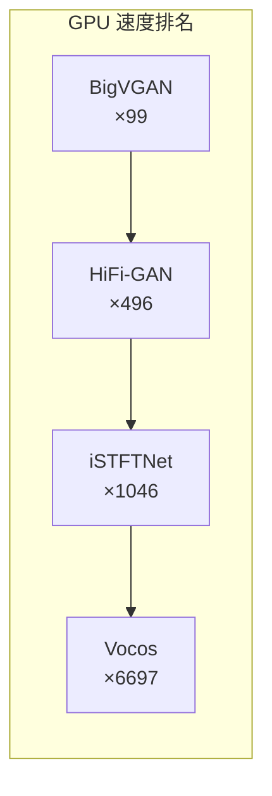

## 前置知识

> [!important]
> 
> 本页展开 [[1.6 频域声码器（Vocos - iSTFTNet）]] 的性能数据。

---

## 1. 客观质量对比

|**模型**|**UTMOS ↑**|**VISQOL ↑**|**PESQ ↑**|**V/UV F1 ↑**|**周期性 ↓**|
|---|---|---|---|---|---|
|HiFi-GAN|3.669|4.57|3.093|0.9457|0.129|
|iSTFTNet|3.564|4.56|2.942|0.9372|0.141|
|BigVGAN|3.749|4.65|3.693|0.9557|0.108|
|**Vocos**|**3.734**|**4.66**|**3.70**|**0.9582**|**0.101**|

---

## 2. 推理速度对比

|**模型**|**GPU xRT ↑**|**CPU xRT ↑**|**参数量**|**vs BigVGAN**|
|---|---|---|---|---|
|HiFi-GAN|495.54|5.84|14.0M|×5|
|BigVGAN|98.61|0.40|14.0M|×1 (基线)|
|iSTFTNet|1045.94|14.44|13.3M|×10.6|
|**Vocos**|**6696.52**|**169.63**|**13.5M**|**×67.9**|

> [!important]
> 
> **帕累托最优：速度和质量同时提升。** Vocos 不是用质量换速度——它在几乎所有指标上持平或超越 BigVGAN，同时快 **68 倍**。这打破了「频域方法牺牲质量换速度」的常见误区。

---

## 3. EnCodec 解码器替换

|**带宽**|**Vocos MOS ↑**|**EnCodec MOS ↑**|**提升**|
|---|---|---|---|
|1.5 kbps|**2.73**|1.09|+1.64|
|3 kbps|**3.50**|1.71|+1.79|
|6 kbps|**3.84**|2.41|+1.43|
|12 kbps|**4.00**|3.08|+0.92|