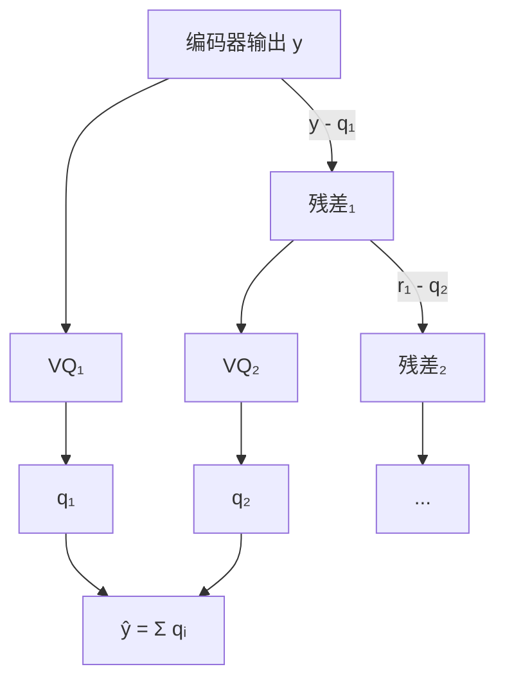

## 前置知识

> [!important]
> 
> 本页展开 [[1.7 端到端神经音频编解码器（SoundStream - EnCodec）]] 的 RVQ 核心机制。

---

## 1. VQ 基础

向量量化将连续向量映射到离散码本中的最近邻：

$$Q(z) = \arg\min_{e_k \in \mathcal{C}} \| z - e_k \|_2$$

训练使用直通估计器（STE）：前向用量化值，反向传原始梯度。

```python
class VectorQuantizer(nn.Module):
    def __init__(self, dim, codebook_size=1024):
        super().__init__()
        self.codebook = nn.Embedding(codebook_size, dim)
    
    def forward(self, x):
        dist = torch.cdist(x, self.codebook.weight)
        indices = dist.argmin(dim=-1)
        quantized = self.codebook(indices)
        quantized = x + (quantized - x).detach()  # STE
        return quantized, indices
```

---

## 2. RVQ：级联量化残差

$$\hat{y} = \sum_{i=1}^{N_q} Q_i(r_i), \quad r_1 = y, \quad r_{i+1} = r_i - Q_i(r_i)$$



$N_q=8, N=1024$ → 每级 10 bit → 总 80 bit/帧 → $80 \times 75 = 6000$ bps。

---

## 3. 码本技巧

- **EMA 更新**：指数移动平均更新码本向量，比梯度下降更稳定

- **死码本重置**：使用率低于阈值的码本向量随机重置为当前 batch 的编码器输出

---

## 4. Quantizer Dropout

训练时随机 $n_q \sim \text{Uniform}[1, N_q]$，单模型支持多比特率推理。

> [!important]
> 
> **思辨：RVQ 的层级结构含义。** 第 1 层 VQ 捕获最粗糙的信号（如基频、能量包络），后续层逐步细化（如谐波细节、噪声纹理）。这与人类感知的层级结构吻合——也是为什么 quantizer dropout 可以工作：低层 token 足以支撑可辨识的语音。

---

## 子页面

> [!important]
> 
> - → 1.7.2.1 VQ 基础与直通估计器
> 
> - → 1.7.2.2 残差 VQ 数学推导
> 
> - → 1.7.2.3 码本技巧（EMA + 死码本重置）
> 
> - → 1.7.2.4 Quantizer Dropout 与多比特率
> 
> - → 1.7.2.5 深度/码本大小权衡

[[1.7.2.1 VQ 基础与直通估计器]]

[[1.7.2.2 残差 VQ 数学推导]]

[[1.7.2.3 码本技巧（EMA + 死码本重置）]]

[[1.7.2.4 Quantizer Dropout 与多比特率]]

[[1.7.2.5 深度-码本大小权衡]]