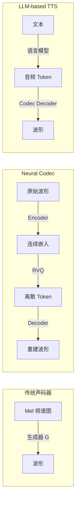
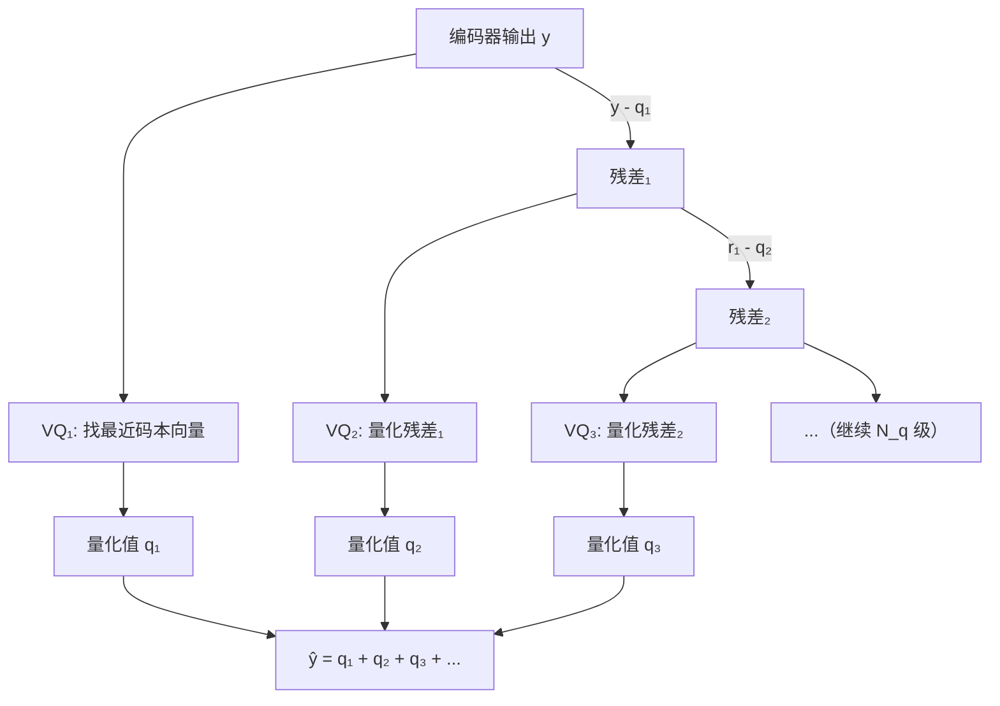

## 前置知识

> [!important]
> 
> 阅读本页前建议先读：
> 
> - [[1.1 声码器共性基础（Vocoder Fundamentals）]]（STFT/Mel、判别器、损失函数、评估指标）
> 
> - 向量量化（Vector Quantization）基本概念有助于理解 RVQ 部分

---

## 0. 定位

> Encoder → RVQ → Decoder 统一框架、压缩+生成+增强一体化、离散 Token 驱动的新范式

**神经音频编解码器（Neural Audio Codec）**不仅仅是声码器——它是一个**编码器-量化器-解码器**的完整框架，能够将音频压缩为离散 token 并高质量重建。代表工作包括 **SoundStream** [Zeghidour et al., 2021] 和 **EnCodec** [Défossé et al., 2022]。这一框架催生了 LLM-based TTS（如 VALL-E、Bark）的新范式——用语言模型预测音频 token。

---

## 1. 从声码器到编解码器：范式升级



|**特性**|**传统声码器（HiFi-GAN）**|**Neural Codec（SoundStream）**|
|---|---|---|
|输入|Mel 频谱图（固定特征）|原始波形（端到端学习）|
|编码器|无（Mel 提取是预处理）|**可学习卷积编码器**|
|量化|无|**残差向量量化（RVQ）**|
|比特率控制|不适用|**3~18 kbps 可调**|
|增强能力|无|**联合压缩 + 去噪**|
|下游应用|TTS 声码器|**音频压缩 + TTS + 语音编辑 + ...**|

> [!important]
> 
> **核心价值：学习编码器带来的效率跃升。** SoundStream 的实验显示，用可学习编码器替代固定 Mel 滤波器组，ViSQOL 从 3.33 提升到 3.96——即使将比特率减半（6kbps→3kbps，ViSQOL 3.76），仍然优于固定特征。这说明端到端学习的表示比手工设计的 Mel 特征**高效得多**。

---

## 2. SoundStream 整体架构

```mermaid
flowchart LR
    subgraph ENC["编码器 Encoder"]
        E1["波形 @24kHz"] --> E2["Conv1D k=7"]
        E2 --> E3["EncoderBlock
×4 (stride 2,4,5,8)"]
        E3 --> E4["Conv1D k=3
→ 嵌入 @75Hz"]
    end
    subgraph RVQ_S["残差向量量化 RVQ"]
        R1["连续嵌入"] --> R2["VQ₁ → 残差₁"]
        R2 --> R3["VQ₂ → 残差₂"]
        R3 --> R4["...
VQ_Nq"]
        R4 --> R5["量化嵌入
= Σ VQᵢ"]
    end
    subgraph DEC["解码器 Decoder"]
        D1["量化嵌入"] --> D2["Conv1D k=7"]
        D2 --> D3["DecoderBlock
×4 (stride 8,5,4,2)"]
        D3 --> D4["Conv1D k=7
→ 波形 @24kHz"]
    end
    E4 --> R1
    R5 --> D1
    style ENC fill:\#3498DB,color:\#fff
    style RVQ_S fill:\#E74C3C,color:\#fff
    style DEC fill:\#2ECC71,color:\#fff
```



### 2.1 编码器：全卷积下采样

编码器由 4 个 EncoderBlock 组成，每个包含 3 个膨胀残差单元（dilation 1, 3, 9）+ 步进卷积下采样。总下采样倍率 = $2 \times 4 \times 5 \times 8 = 320$，即 24kHz 音频每秒产生 75 个嵌入帧。

```python
import torch.nn as nn

class EncoderBlock(nn.Module):
    """SoundStream 编码器块：膨胀残差 + 步进下采样"""
    def __init__(self, in_ch, out_ch, stride):
        super().__init__()
        # 3 个膨胀残差单元
        self.res_units = nn.Sequential(
            ResidualUnit(in_ch, dilation=1),   # dilation=1
            ResidualUnit(in_ch, dilation=3),   # dilation=3
            ResidualUnit(in_ch, dilation=9),   # dilation=9
        )
        # 步进卷积下采样
        self.downsample = nn.Conv1d(
            in_ch, out_ch,
            kernel_size=2 * stride,  # kernel = 2 × stride
            stride=stride,
            padding=stride // 2      # 因果填充
        )
        self.act = nn.ELU()
    
    def forward(self, x):
        x = self.res_units(x)
        x = self.act(self.downsample(x))
        return x

class ResidualUnit(nn.Module):
    """膨胀残差单元"""
    def __init__(self, channels, dilation):
        super().__init__()
        self.conv = nn.Sequential(
            nn.ELU(),
            nn.Conv1d(channels, channels, 7,
                      dilation=dilation,
                      padding=3 * dilation),  # 因果填充
            nn.ELU(),
            nn.Conv1d(channels, channels, 1),
        )
    
    def forward(self, x):
        return x + self.conv(x)  # 残差连接
```

### 2.2 解码器：镜像上采样

解码器镜像编码器结构，使用**转置卷积**上采样，stride 顺序反转为 (8, 5, 4, 2)。通道数随上采样逐步减半。

> [!important]
> 
> **工程判断：轻编码器 + 重解码器。** SoundStream 实验发现，$C_{\text{enc}}=8, C_{\text{dec}}=32$ 时编码器 RTF 达 18.6×（极快），ViSQOL 仅降 0.02。但反过来缩小解码器（$C_{\text{enc}}=32, C_{\text{dec}}=8$）则 ViSQOL 降 0.12。因此在实际部署中，应**优先压缩编码器**（发送端），保留解码器容量（接收端）。

---

## 3. 残差向量量化（RVQ）核心机制

RVQ 是 SoundStream 的核心创新，解决了高比特率下向量量化码本爆炸的问题。

### 3.1 普通 VQ 的困境

以 6kbps、帧率 75Hz 为例：每帧需要 $r = 6000/75 = 80$ 比特。普通 VQ 需要 $N = 2^{80}$ 个码本向量——这是天文数字。

### 3.2 RVQ 解决方案

RVQ 将 $N_q$ 个小型 VQ **级联**，每级量化前一级的**残差**：

$$\hat{y} = \sum_{i=1}^{N_q} Q_i(\text{residual}_i), \quad \text{residual}_1 = y, \quad \text{residual}_{i+1} = \text{residual}_i - Q_i(\text{residual}_i)$$

例如 $N_q=8$，每个 VQ 码本大小 $N=1024$，每级 10 比特，总共 80 比特——完美达标。



```python
import torch
import torch.nn as nn

class ResidualVQ(nn.Module):
    """残差向量量化器：N_q 级 VQ 级联"""
    def __init__(self, dim, n_codebooks=8, codebook_size=1024):
        super().__init__()
        self.quantizers = nn.ModuleList([
            VectorQuantizer(dim, codebook_size)
            for _ in range(n_codebooks)
        ])
    
    def forward(self, x, n_q=None):
        # x: [B, D, T] 编码器输出
        n_q = n_q or len(self.quantizers)
        quantized = torch.zeros_like(x)
        residual = x
        indices = []
        for i in range(n_q):
            q_i, idx = self.quantizers[i](residual)  # 量化当前残差
            quantized = quantized + q_i               # 累加量化值
            residual = residual - q_i                  # 更新残差
            indices.append(idx)
        return quantized, indices  # indices 即为离散 token

class VectorQuantizer(nn.Module):
    """单级向量量化器"""
    def __init__(self, dim, codebook_size):
        super().__init__()
        self.codebook = nn.Embedding(codebook_size, dim)
    
    def forward(self, x):
        # x: [B, D, T]
        x_flat = x.permute(0, 2, 1).reshape(-1, x.shape[1])  # [B*T, D]
        # 最近邻查找
        dist = torch.cdist(x_flat, self.codebook.weight)  # [B*T, N]
        indices = dist.argmin(dim=-1)                      # [B*T]
        quantized = self.codebook(indices)                  # [B*T, D]
        quantized = quantized.reshape(x.shape[0], -1, x.shape[1]).permute(0, 2, 1)
        # 直通估计器（STE）：前向用量化值，反向传原始梯度
        quantized = x + (quantized - x).detach()
        return quantized, indices
```

### 3.3 量化器 Dropout：单模型多比特率

SoundStream 的一个巧妙设计：训练时随机 dropout 部分 VQ 层（$n_q \sim \text{Uniform}[1, N_q]$），使单个模型可以在推理时通过调整 $n_q$ 实现**多比特率**。实验显示，这种 dropout 策略不仅实现了比特率可伸缩性，还可能起到**正则化**作用。

---

## 4. SoundStream 训练目标

$$\mathcal{L}_G = \underbrace{\lambda_{\text{adv}} \cdot \mathcal{L}_{\text{adv}}}_{=1} + \underbrace{\lambda_{\text{feat}} \cdot \mathcal{L}_{\text{feat}}}_{=100} + \underbrace{\lambda_{\text{rec}} \cdot \mathcal{L}_{\text{rec}}}_{=1}$$

|**损失**|**公式**|**判别器**|
|---|---|---|
|对抗损失|Hinge Loss（生成器侧）|波形 MSD + STFT-D|
|特征匹配|$\frac{1}{KL}\sum_{k,l}\\|D_k^{(l)}(x) - D_k^{(l)}(\hat{x})\\|_1$|与对抗损失共用|
|重建损失|多尺度频谱 L1 + log L2（窗长 $2^6$ 到 $2^{11}$）|—|

---

## 5. 联合压缩与增强

SoundStream 通过 **FiLM 条件层（Feature-wise Linear Modulation）**实现可控的背景噪声抑制：

$$\tilde{a}_{n,c} = \gamma_{n,c} \cdot a_{n,c} + \beta_{n,c}$$

其中 $\gamma, \beta$ 由去噪模式的 one-hot 编码通过线性层计算。FiLM 层插入在编码器或解码器的残差单元之间。

> [!important]
> 
> **工程判断：编码端去噪更省比特。** 在编码端去噪时，去噪后的信号更紧凑，量化后的码本利用率更高，empirical entropy 更低——意味着相同比特率下质量更好，或相同质量下比特率更低。

---

## 6. SoundStream vs 传统编解码器

|**编解码器**|**比特率**|**MUSHRA ↑**|**类型**|
|---|---|---|---|
|Opus|6 kbps|~25|传统波形编码|
|EVS|5.9 kbps|~47|传统参数编码|
|Lyra|3 kbps|~35|神经网络 (WaveGRU)|
|**SoundStream**|**3 kbps**|**~72**|**神经网络 (端到端)**|
|EVS|9.6 kbps|~73|传统参数编码|
|Opus|12 kbps|~65|传统波形编码|

数据来源：[Zeghidour et al., 2021, Fig. 5]

> [!important]
> 
> **SoundStream @3kbps 超越了 Opus @12kbps 和 EVS @5.9kbps。** 要达到 SoundStream 的质量，EVS 至少需要 9.6kbps（3.2× 更多比特），Opus 至少需要 12kbps（4× 更多比特）。这是神经网络编解码器首次在如此广泛的比特率范围内超越传统编解码器。

---

## 7. 思辨：Neural Codec 的深远影响

> [!important]
> 
> **Neural Codec 不仅是更好的编解码器，更是 LLM-TTS 的基石。**
> 
> SoundStream/EnCodec 的真正革命性在于它将**连续的音频信号转化为离散 token 序列**——这与 NLP 中的 tokenization 如出一辙。这使得：
> 
> 1. **语言模型可以直接建模音频**：VALL-E、Bark、MusicGen 等 LLM-based 音频生成系统都以 Codec token 作为词汇表
> 
> 1. **音频理解与生成统一**：编码器产生的 token 可同时用于分类、检索、生成
> 
> 1. **多模态融合**：文本 token + 音频 token 可以放入同一个 Transformer 处理
> 
> **但也要看到局限：**
> 
> - RVQ 的级联结构导致 token 之间存在层级依赖——不同层的 token 重要性不同（第 1 层承载最粗糙的信息，后续层是细化）
> 
> - 码本利用率是实际难题——死码本替换策略（EMA + 重置）是经验性的，缺乏理论保证
> 
> - Vocos 作为解码器替换 EnCodec 后 MOS 提升巨大（1.09→2.73 @1.5kbps），说明**解码器质量仍是瓶颈**

---

## 延伸阅读

> [!important]
> 
> **子页面详解：**
> 
> - → 1.7.1 SoundStream 整体架构
> 
> - → 1.7.2 残差向量量化（RVQ）
> 
> - → 1.7.3 SoundStream 训练目标
> 
> - → 1.7.4 联合压缩与增强
> 
> - → 1.7.5 SoundStream vs Opus/EVS 评测
> 
> - → 1.7.6 EnCodec 与 Vocos 解码器替换
> 
> **跨页面引用：**
> 
> - → [[1.1 声码器共性基础（Vocoder Fundamentals）]]（判别器和损失函数细节）
> 
> - → 1.6 频域声码器（Vocos）（Vocos 作为 Codec 解码器替换）

## 参考文献

- [1] Zeghidour, N., Luebs, A., Omran, A., Skoglund, J., & Tagliasacchi, M. (2021). "SoundStream: An End-to-End Neural Audio Codec." IEEE/ACM TASLP.

- [2] Défossé, A., Copet, J., Synnaeve, G., & Adi, Y. (2022). "High Fidelity Neural Audio Compression." arXiv:2210.13438.

- [3] van den Oord, A. et al. (2017). "Neural Discrete Representation Learning." NeurIPS 2017.

- [4] Siuzdak, H. (2024). "Vocos." ICLR 2024.

- [5] Perez, E. et al. (2018). "FiLM: Visual Reasoning with a General Conditioning Layer." AAAI 2018.

[[1.7.1 SoundStream 编码器-解码器架构]]

[[1.7.2 残差向量量化（RVQ）详解]]

[[1.7.3 SoundStream 训练目标详解]]

[[1.7.4 FiLM 联合压缩与增强]]

[[1.7.5 SoundStream vs Opus-EVS 评测分析]]

[[1.7.6 EnCodec 与 Vocos 解码器替换]]