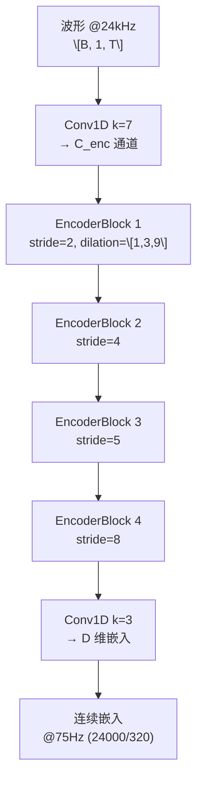

## 前置知识

> [!important]
> 
> 本页展开 [[1.7 端到端神经音频编解码器（SoundStream - EnCodec）]] 的编解码器架构。

---

## 1. SEANet 编码器

编码器由 4 个 EncoderBlock 级联组成，每个包含 3 个膨胀残差单元 + 步进下采样：



总下采样 = $2 \times 4 \times 5 \times 8 = 320$。

```python
import torch.nn as nn

class EncoderBlock(nn.Module):
    def __init__(self, in_ch, out_ch, stride):
        super().__init__()
        self.res_units = nn.Sequential(
            ResidualUnit(in_ch, dilation=1),
            ResidualUnit(in_ch, dilation=3),
            ResidualUnit(in_ch, dilation=9),
        )
        self.downsample = nn.Conv1d(
            in_ch, out_ch, kernel_size=2*stride,
            stride=stride, padding=stride//2
        )
    
    def forward(self, x):
        return nn.functional.elu(self.downsample(self.res_units(x)))
```

---

## 2. 解码器：镜像结构

解码器镜像编码器，用**转置卷积**上采样，stride 顺序反转为 (8, 5, 4, 2)，通道数逐步减半。

> [!important]
> 
> **工程判断：轻编码器 + 重解码器。** $C_{\text{enc}}=8, C_{\text{dec}}=32$ 时编码器极快（RTF 18.6×），ViSQOL 仅降 0.02。反之缩小解码器则降 0.12。**优先压缩编码器**（发送端），保留解码器容量（接收端）。