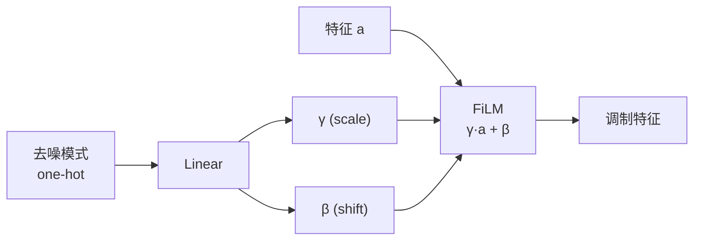

## 前置知识

> [!important]
> 
> 本页展开 [[1.7 端到端神经音频编解码器（SoundStream - EnCodec）]] 的联合增强部分。

---

## 1. FiLM 条件层原理

Feature-wise Linear Modulation 通过仿射变换注入条件信息：

$$\tilde{a}_{n,c} = \gamma_{n,c} \cdot a_{n,c} + \beta_{n,c}$$

其中 $\gamma, \beta$ 由去噪模式的 one-hot 编码通过线性层计算。

```python
class FiLMLayer(nn.Module):
    def __init__(self, feature_dim, condition_dim):
        super().__init__()
        self.gamma_proj = nn.Linear(condition_dim, feature_dim)
        self.beta_proj = nn.Linear(condition_dim, feature_dim)
    
    def forward(self, features, condition):
        gamma = self.gamma_proj(condition).unsqueeze(-1)  # [B, C, 1]
        beta = self.beta_proj(condition).unsqueeze(-1)
        return gamma * features + beta
```



---

## 2. 编码端 vs 解码端去噪

|**FiLM 位置**|**ViSQOL @3kbps**|**优势**|
|---|---|---|
|编码端|更高|去噪后信号更紧凑，量化效率更高|
|解码端|稍低|噪声信息也被编码，浪费码本|

> [!important]
> 
> **编码端去噪 = 更低的 empirical entropy = 相同比特率下更高质量**