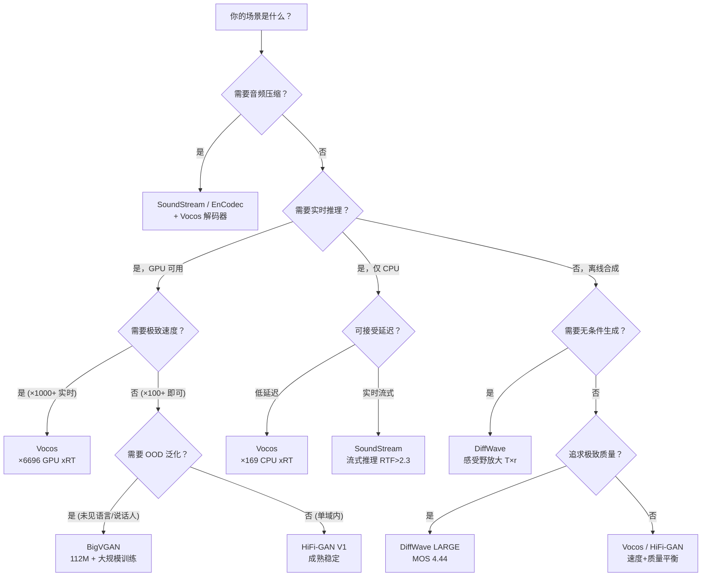

## 前置知识

> [!important]
> 
> 阅读本页前建议先读完前面所有范式页面：
> 
> - [[1.1 声码器共性基础（Vocoder Fundamentals）]]
> 
> - [[1.2 自回归声码器（WaveNet - WaveRNN）]]
> 
> - [[1.3 Flow-based 声码器（WaveGlow - WaveFlow）]]
> 
> - [[1.4 时域 GAN 声码器概述（MelGAN → HiFi-GAN → BigVGAN）]]
> 
> - [[1.5 扩散模型声码器（DiffWave - WaveGrad）]]
> 
> - [[1.6 频域声码器（Vocos - iSTFTNet）]]
> 
> - [[1.7 端到端神经音频编解码器（SoundStream - EnCodec）]]

---

## 0. 定位

> 六大范式系统对比 + 按工程场景的选型决策树 + 演进时间线与趋势

本页是「1. 神经声码器技术背景」的收束篇。读完前面六大范式后，本页提供一站式的对比矩阵和工程选型指南，帮助读者在实际项目中做出明确的技术选型。

---

## 1. 六大范式横向对比矩阵

|**维度**|**AR (WaveNet)**|**Flow (WaveGlow)**|**时域 GAN (HiFi-GAN)**|**Diffusion (DiffWave)**|**频域 GAN (Vocos)**|**Codec (SoundStream)**|
|---|---|---|---|---|---|---|
|**生成方式**|串行、逐样本|并行、单次|并行、单次|并行、多步迭代|并行、单次|并行、单次|
|**架构约束**|因果卷积|可逆变换|无|无|无|无|
|**训练目标**|最大似然|最大似然|对抗+辅助|单一 ELBO|对抗+辅助|对抗+辅助|
|**质量 (MOS)**|★★★★☆ (4.43)|★★★☆☆ (3.81)|★★★★☆ (4.36)|★★★★☆ (4.44)|★★★★☆ (≈42)|★★★★☆ (3kbps MUSHRA≈72)|
|**GPU 速度**|×0.003 实时|×22 实时|×168 实时 (V1)|×5.6 实时 (Fast)|**×6696 实时**|×2.3 实时 (RTF)|
|**CPU 速度**|不可用|×0.21|×1.43 (V1)|—|**×169**|×2.3 (Pixel4)|
|**参数量**|4.57M|87.88M|13.92M (V1)|2.64M (BASE)|13.5M|8.4M|
|**训练稳定性**|★★★★★|★★★★☆|★★★☆☆|★★★★★|★★★☆☆|★★★☆☆|
|**OOD 泛化**|差|差|BigVGAN 优秀|中等|优秀|优秀（语音+音乐）|
|**无条件生成**|很差|—|很差|**优秀**|—|—|
|**压缩能力**|无|无|无|无|无|**3~18 kbps**|
|**代表论文**|[Oord 2016]|[Prenger 2019]|[Kong 2020]|[Kong 2021]|[Siuzdak 2024]|[Zeghidour 2021]|

---

## 2. 工程选型决策树

> [!important]
> 
> **工程判断总结：**
> 
> - **默认选择：Vocos。** 除非你有特殊需求，Vocos 在速度和质量上都是帕累托最优
> 
> - **OOD 场景：BigVGAN。** 需要处理未见说话人/语言/器乐时，BigVGAN 的大规模训练提供了最强泛化
> 
> - **音频压缩/Codec：SoundStream + Vocos 解码器。** SoundStream 做编码和量化，Vocos 做解码
> 
> - **无条件/极致质量：DiffWave。** 扩散模型在无条件生成和极致质量上仍有不可替代的优势
> 
> - **避免使用：WaveNet / WaveGlow。** AR 太慢，Flow 参数太多，均已被后续范式全面超越

---

## 3. 演进时间线

```mermaid
flowchart LR
    W16["2016
WaveNet
自回归开创"] --> W19a["2019
WaveGlow
Flow 并行化"]
    W19a --> W19b["2019
MelGAN
GAN 开创"]
    W19b --> W20a["2020
HiFi-GAN
GAN 质量突破"]
    W20a --> W21a["2021
DiffWave
扩散范式"]
    W21a --> W21b["2021
SoundStream
Codec 范式"]
    W21b --> W22["2022
EnCodec
iSTFTNet"]
    W22 --> W23["2023
BigVGAN
通用声码器"]
    W23 --> W24["2024
Vocos
频域突破"]
    W24 --> FUTURE["未来
频域+Codec
+LLM 融合"]
    style W16 fill:\#95A5A6,color:\#fff
    style W20a fill:\#E74C3C,color:\#fff
    style W21a fill:\#9B59B6,color:\#fff
    style W21b fill:\#E67E22,color:\#fff
    style W23 fill:\#3498DB,color:\#fff
    style W24 fill:\#2ECC71,color:\#fff
    style FUTURE fill:\#1ABC9C,color:\#fff
```

---

## 4. 思辨：技术演进的规律与未来方向

> [!important]
> 
> **声码器演进的三个规律：**
> 
> **规律一：判别器创新驱动质量跃升。**
> 
> MelGAN（MOS 3.79）→ HiFi-GAN（MOS 4.36）的核心区别不在生成器，而在 MPD 判别器。生成器架构的影响远小于判别器 [You et al., 2021]。
> 
> **规律二：上采样策略决定速度天花板。**
> 
> 转置卷积×256 → HiFi-GAN GPU ×168。转置卷积×4 + ISTFT → iSTFTNet GPU ×1046。零转置卷积 + ISTFT → Vocos GPU ×6696。**消除转置卷积是速度提升的核心斗争。**
> 
> **规律三：表示形式决定归纳偏置。**
> 
> 时域需要 Snake 激活引入周期性，频域则通过傅里叶基函数天然获得。空间域的选择（时域 vs 频域 vs 潜空间）比具体架构更重要。
> 
> **未来三大趋势：**
> 
> 1. **频域主流化**：Vocos 证明频域方案可以同时提升速度和质量，预计更多工作会转向频域
> 
> 1. **Codec + LLM 融合**：SoundStream/EnCodec 为 LLM-TTS 提供了离散 token 基础，VALL-E/Bark/MusicGen 是第一波应用
> 
> 1. **扩散+GAN 混合**：用扩散模型做粗化生成 + GAN 做精细化，或在 Codec 框架中用扩散解码器

---

## 5. 不同场景下的最佳实践

|**场景**|**推荐方案**|**原因**|**备选**|
|---|---|---|---|
|实时 TTS（GPU）|**Vocos**|×6696 实时，质量匹敌 BigVGAN|HiFi-GAN V1|
|实时 TTS（CPU/移动端）|**Vocos**|×169 CPU 实时，远超其他方案|HiFi-GAN V2 (轻量)|
|多语言/多说话人 TTS|**BigVGAN 112M**|zero-shot OOD 泛化最强|Vocos（OOD 也不错）|
|音频压缩传输|**SoundStream + Vocos 解码**|3kbps 超越 Opus@12kbps|EnCodec|
|LLM-based TTS (Bark/VALL-E)|**EnCodec + Vocos 解码**|离散 token + drop-in 替换解码器|原生 EnCodec 解码器|
|无条件音频生成|**DiffWave**|感受野 T×r 放大，MOS 3.39 vs WaveGAN 2.03|无明显替代|
|极致质量离线合成|**DiffWave LARGE**|MOS 4.44 匹敌 WaveNet|BigVGAN|
|流式实时通信|**SoundStream**|因果卷积 + 流式推理 + 去噪|Lyra v2|

---

## 6. 一句话总结每个范式

> [!important]
> 
> - **WaveNet**：质量天花板的历史地标，但推理速度让它永远停留在论文里
> 
> - **WaveGlow**：证明了并行生成的可能性，但 87M 参数换来 MOS 3.81 的性价比太低
> 
> - **HiFi-GAN**：GAN 声码器的里程碑，MPD+MRF 的设计被所有后续工作继承
> 
> - **BigVGAN**：通用声码器的标杆，大规模训练 + Snake + 抗混叠 解锁了 zero-shot 泛化
> 
> - **DiffWave**：扩散模型的音频先驱，无条件生成和极致质量的不可替代者
> 
> - **Vocos**：频域范式的开创者，证明了“上采样应该是数学的”
> 
> - **SoundStream**：Codec 范式的基石，RVQ 离散 token 开启了 LLM-TTS 时代

---

## 参考文献

- [1] van den Oord, A. et al. (2016). "WaveNet." arXiv:1609.03499.

- [2] Prenger, R. et al. (2019). "WaveGlow." ICASSP 2019.

- [3] Kumar, K. et al. (2019). "MelGAN." NeurIPS 2019.

- [4] Kong, J. et al. (2020). "HiFi-GAN." NeurIPS 2020.

- [5] Kong, Z. et al. (2021). "DiffWave." ICLR 2021.

- [6] Zeghidour, N. et al. (2021). "SoundStream." IEEE/ACM TASLP.

- [7] Lee, S. et al. (2023). "BigVGAN." ICLR 2023.

- [8] Siuzdak, H. (2024). "Vocos." ICLR 2024.

- [9] You, J. et al. (2021). "GAN Vocoder: Multi-Resolution Discriminator Is All You Need." arXiv:2103.05236.

[[1.8.1 六大范式横向对比矩阵]]

[[1.8.2 工程选型决策树详解]]

[[1.8.3 声码器演进时间线与未来趋势]]