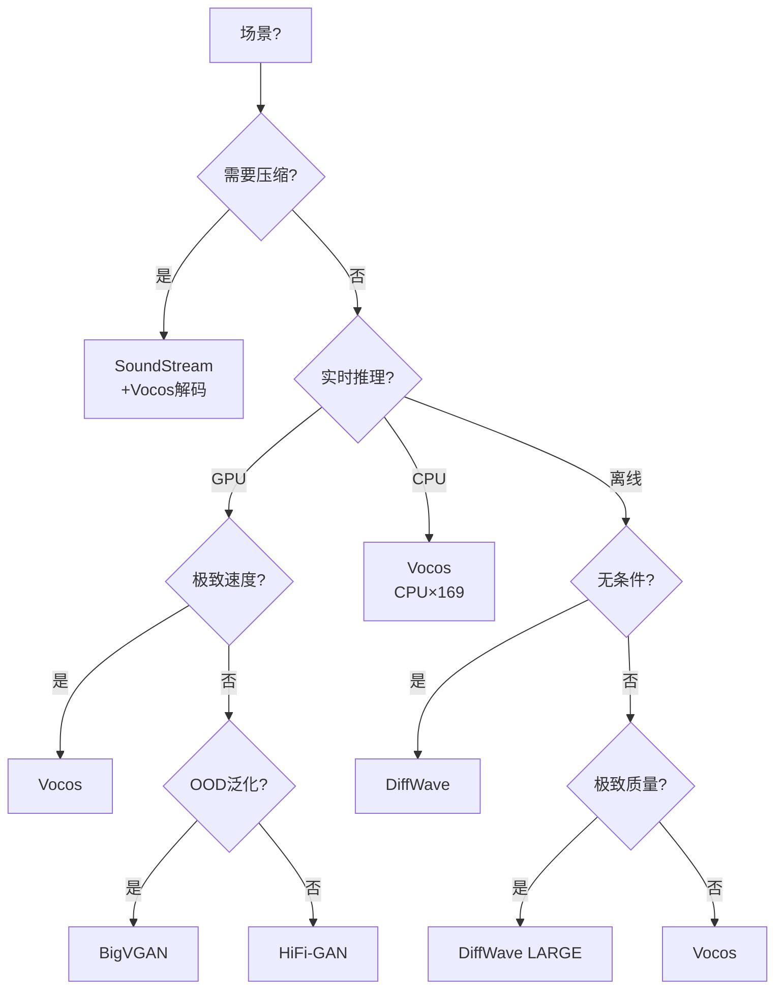

## 前置知识

> [!important]
> 
> 本页展开 [[1.8 声码器范式对比与选型指南]] 的决策树。

---

## 1. 决策树

---

## 2. 决策逻辑详解

|**决策节点**|**判断标准**|**推荐**|
|---|---|---|
|需要压缩?|是否需要将音频压缩为离散 token 传输|是 → Codec|
|极致速度?|是否需要 GPU ×1000+ 实时|是 → Vocos|
|OOD 泛化?|是否处理未见说话人/语言|是 → BigVGAN|
|无条件生成?|是否需要无条件音频生成|是 → DiffWave|

> [!important]
> 
> **默认选择：Vocos。** 除非有特殊需求（OOD、压缩、无条件生成），Vocos 在速度和质量上都是帕累托最优。