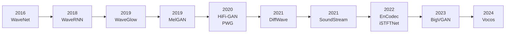

## 前置知识

> [!important]
> 
> 本页展开 [[1.8 声码器范式对比与选型指南]] 的演进时间线。

---

## 1. 时间线

---

## 2. 演进规律

> [!important]
> 
> **规律一：判别器创新 > 生成器创新。** MelGAN → HiFi-GAN 的跃升主要来自 MPD 判别器。
> 
> **规律二：上采样策略决定速度天花板。** 转置卷积 ×256 → ×168 xRT。ISTFT 替代 → ×6696 xRT。消除转置卷积是速度提升的核心。
> 
> **规律三：表示空间决定归纳偏置。** 时域需要 Snake 引入周期性，频域通过傅里叶基天然获得。

---

## 3. 未来三大趋势

### 3.1 频域主流化

Vocos 证明频域方案可同时提升速度和质量。

### 3.2 Codec + LLM 融合

SoundStream/EnCodec 的离散 token 使音频可以被语言模型处理：VALL-E、Bark、MusicGen。

### 3.3 扩散+GAN 混合

用扩散做粗化 + GAN 精细化，或在 Codec 中用扩散解码器。

> [!important]
> 
> **终极方向：频域 Codec + LLM token 预测 + Vocos 解码 = 统一的音频 AI 管线。**