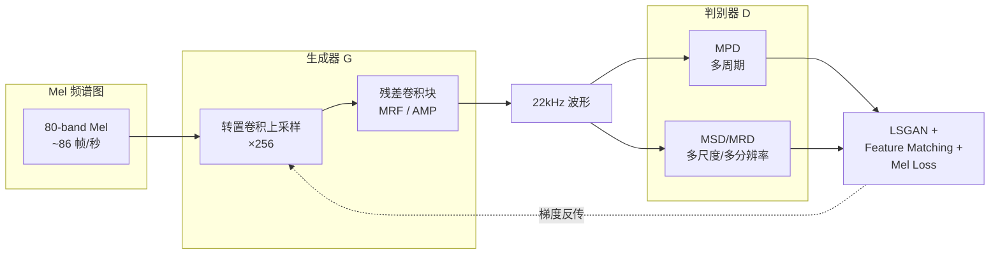

## 前置知识

> [!important]
> 
> 阅读本页前建议先读：基本的数字信号处理概念（采样率、波形）、深度学习基础（卷积神经网络）

---

## 0. 定位

> 声码器在 TTS 两阶段管线中的角色、从 WaveNet → WaveGlow → MelGAN → HiFi-GAN → BigVGAN 的演进、各范式优劣对比

---

## 1. 声码器的任务定义

**神经声码器（Neural Vocoder）** 的核心任务是将低维的声学特征（通常是 Mel 频谱图）转换为高维的原始音频波形。这是一个极度不对称的上采样问题：

|**维度**|**输入（Mel 频谱图）**|
|---|---|
|时间分辨率|~86 帧/秒（hop_size=256, sr=22kHz）|
|频率分辨率|80~100 Mel 频带|
|上采样倍率|×256（即 hop_size，每个 Mel 帧对应 256 个波形采样点）|

这意味着声码器必须从每个 Mel 帧中“幻视”出 256 个精确的采样点，包括细节丰富的相位信息和高频谐波。

---

## 2. 自回归声码器（Autoregressive Vocoder）

### 2.1 WaveNet（2016）

**WaveNet** 是 DeepMind 提出的开创性工作 [van den Oord et al., 2016]，它首次证明神经网络可以生成超越传统方法的语音质量。

**核心机制**：将波形生成建模为自回归过程，每个采样点的生成依赖于所有历史采样点：

$$p(\mathbf{x}) = \prod_{t=1}^{T} p(x_t \mid x_1, x_2, \dots, x_{t-1})$$

其中 $\mathbf{x} = (x_1, x_2, \dots, x_T)$ 是全部采样点序列，每个 $x_t$ 的条件概率由因果**膨胀卷积（Dilated Causal Convolution）**堆叠建模。

> [!important]
> 
> **致命缺陷：推理速度**。生成 1 秒 22 kHz 音频需要 22,000 次前向传播，在 V100 GPU 上仅达实时的 ×0.003，完全无法实时使用。

### 2.2 WaveRNN（2018）

**WaveRNN** [Kalchbrenner et al., 2018] 通过将每个采样点拆分为高 8 位和低 8 位（Dual Softmax）并使用轻量 GRU 架构，将推理速度提升到接近实时。但仍然是串行生成，无法充分利用 GPU 并行计算能力。

---

## 3. 流模型声码器（Flow-based Vocoder）

流模型的核心思想是通过**可逆变换（Invertible Transformation）**将简单分布（高斯噪声）映射为复杂的波形分布，实现并行生成。

### 3.1 WaveGlow（2019）

**WaveGlow** [Prenger et al., 2019] 基于 Glow 架构，通过最大似然估计训练，无需蒸馏教师模型。

|**指标**|**WaveGlow**|**WaveFlow**|
|---|---|---|
|参数量|87.73M（96 层）|22.58M|
|GPU 速度|×22.75 实时 (V100)|×19.59 实时|
|MOS|3.81 ± 0.08|3.85 ± 0.10|
|局限|参数量巨大，多说话人质量下降|部分自回归，速度受限|

> [!important]
> 
> **思辨：为什么流模型不适合通用声码器？**
> 
> 流模型的**双射约束（Bijection Constraint）**要求生成器的每一层必须是可逆的（如仿射耦合层 Affine Coupling Layer），这严重限制了架构设计的自由度。相同参数量下，流模型的有效容量远低于无约束的 GAN 生成器 [Ping et al., 2020]。而且 WaveGlow 需要 96 层（87.73M 参数）才能达到可用质量，多说话人场景下质量严重下降。

---

## 4. GAN 声码器（GAN-based Vocoder）

GAN 声码器的核心优势：

1. **全并行生成**：单次前向传播即可生成全部采样点

1. **无架构约束**：不需要可逆性，设计自由度高

1. **对抗训练**：判别器提供细粒度的感知质量反馈

### 4.1 MelGAN（2019）——开创性工作

**MelGAN** [Kumar et al., 2019] 首次证明 GAN 可以用于快速声码器，引入了两个关键设计：

- **多尺度判别器（Multi-Scale Discriminator, MSD）**：在原始、×2 和 ×4 平均池化下采样后分别判别

- **特征匹配损失（Feature Matching Loss）**：从判别器中间层提取特征，计算真实样本与生成样本的 L1 距离

但 MelGAN 质量较差（MOS 3.79），与 AR/Flow 模型仍有明显差距。

### 4.2 Parallel WaveGAN（2020）

**Parallel WaveGAN** [Yamamoto et al., 2020] 引入**多分辨率 STFT 损失（Multi-Resolution STFT Loss）**作为辅助训练信号，显著提升了训练稳定性和参数效率。

### 4.3 HiFi-GAN（2020）——里程碑

**HiFi-GAN** [Kong et al., 2020] 实现了 GAN 声码器的质量突破，首次在 MOS 上超越 AR 和 Flow 模型。核心创新：

- **多周期判别器（MPD）**：捕获音频中的多种周期模式

- **多感受野融合（MRF）**：生成器并行观察不同长度的模式

### 4.4 BigVGAN（2023）——通用声码器

**BigVGAN** [Lee et al., 2023] 在 HiFi-GAN 基础上引入：

- **Snake 周期激活函数**：提供周期性归纳偏置

- **抗混叠多周期组合模块（AMP）**：低通滤波抑制高频伪影

- **大规模训练**：扩展到 112M 参数

实现了在未见说话人、语言、录音环境、歌声、器乐等 OOD 场景下的 zero-shot 泛化。

---

## 5. GAN 范式成为主流的原因

> [!important]
> 
> **为什么 GAN 胜出？** 三个结构性优势：
> 
> 1. **全并行**：与 AR 不同，GAN 生成器单次前向传播即可输出全部采样点
> 
> 1. **无架构约束**：与 Flow 不同，GAN 生成器不需保持可逆性，相同参数量下有效容量更高
> 
> 1. **对抗判别器提供感知反馈**：判别器学习人耳敏感的音频特征，提供比像素级 L1/L2 损失更精细的梯度信号

---

## 6. 核心指标横向对比

以下数据来自两篇原始论文的实验结果：

|**模型**|**MOS ↑**|**CPU 速度 (kHz)**|**GPU 速度 (kHz)**|**参数量 (M)**|**来源**|
|---|---|---|---|---|---|
|Ground Truth|4.45|—|—|—|[1]|
|WaveNet (MoL)|4.02|—|0.07 (×0.003)|24.73|[1]|
|WaveGlow|3.81|4.72 (×0.21)|501 (×22.75)|87.73|[1]|
|MelGAN|3.79|145.52 (×6.59)|14,238 (×645)|4.26|[1]|
|**HiFi-GAN V1**|**4.36**|31.74 (×1.43)|3,701 (×167.9)|13.92|[1]|
|HiFi-GAN V2|4.23|214.97 (×9.74)|16,863 (×764.8)|0.92|[1]|
|**BigVGAN-base**|**SMOS 4.20**|—|×70.18 实时 (24kHz)|14.01|[2]|
|**BigVGAN 112M**|**SMOS 4.26**|—|×44.72 实时 (24kHz)|112.4|[2]|

---

## 延伸阅读

> [!important]
> 
> 相关子页面：
> 
> - 1.1.1 自回归声码器（WaveNet / WaveRNN）
> 
> - 1.1.2 Flow-based 声码器（WaveGlow / WaveFlow）
> 
> - 1.1.3 GAN-based 声码器概述（MelGAN / Parallel WaveGAN）

## 参考文献

- [1] Kong, J., Kim, J., & Bae, J. (2020). "HiFi-GAN: Generative Adversarial Networks for Efficient and High Fidelity Speech Synthesis." NeurIPS 2020.

- [2] Lee, S. et al. (2023). "BigVGAN: A Universal Neural Vocoder with Large-Scale Training." ICLR 2023.

- [3] van den Oord, A. et al. (2016). "WaveNet: A Generative Model for Raw Audio." arXiv:1609.03499.

- [4] Kumar, K. et al. (2019). "MelGAN: Generative Adversarial Networks for Conditional Waveform Synthesis." NeurIPS 2019.

- [5] Prenger, R. et al. (2019). "WaveGlow: A Flow-Based Generative Network for Speech Synthesis." ICASSP 2019.

- [6] Ping, W. et al. (2020). "WaveFlow: A Compact Flow-Based Model for Raw Audio." ICML 2020.

---

## 🗺️ 章节导航：八大范式全景

> [!important]
> 
> **基础层：**
> 
> - [[1.1 声码器共性基础（Vocoder Fundamentals）]] — STFT/Mel、判别器、损失函数、评估指标
> 
> **四大生成范式：**
> 
> - [[1.2 自回归声码器（WaveNet - WaveRNN）]] — 串行生成、极致质量
> 
> - [[1.3 Flow-based 声码器（WaveGlow - WaveFlow）]] — 可逆变换、并行生成
> 
> - [[1.4 时域 GAN 声码器概述（MelGAN → HiFi-GAN → BigVGAN）]] — 对抗训练、实时推理
> 
> - [[1.5 扩散模型声码器（DiffWave - WaveGrad）]] — 扩散去噪、无条件生成
> 
> **新范式：**
> 
> - [[1.6 频域声码器（Vocos - iSTFTNet）]] — ISTFT 替代转置卷积、速度×68
> 
> - [[1.7 端到端神经音频编解码器（SoundStream - EnCodec）]] — RVQ 离散 token、LLM-TTS 基石
> 
> **总结：**
> 
> - [[1.8 声码器范式对比与选型指南]] — 对比矩阵、决策树、演进时间线

---

[[1.2 自回归声码器（WaveNet - WaveRNN）]]

[[1.3 Flow-based 声码器（WaveGlow - WaveFlow）]]

[[1.4 时域 GAN 声码器概述（MelGAN → HiFi-GAN → BigVGAN）]]

[[1.1 声码器共性基础（Vocoder Fundamentals）]]

[[1.5 扩散模型声码器（DiffWave - WaveGrad）]]

[[1.6 频域声码器（Vocos - iSTFTNet）]]

[[1.7 端到端神经音频编解码器（SoundStream - EnCodec）]]

[[1.8 声码器范式对比与选型指南]]